# 商家店铺管理

## 店铺类型管理

### 什么是店铺类型

店铺类型用来定义平台店铺类型及配置，便于供应商入驻时申请符合自身情况的店铺，实现针对店铺的差异化管理和服务

### 店铺类型在哪里？

登陆后台，依次点击导航菜单的 商家-店铺类型列表

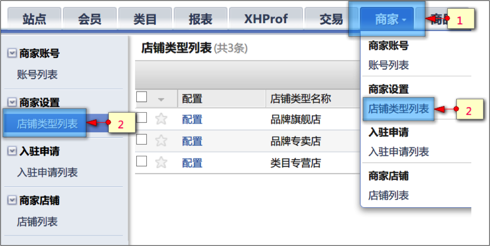

### 店铺类型如何配置？

进入店铺类型列表即可看到系统预设的三种店铺类型，分别为：品牌旗舰店、品牌专卖店、类目专营店。
店铺类型不可增加，不可删除，点击各店铺类型左侧的“配置”按钮，可对店铺类型的配置项进行修改。

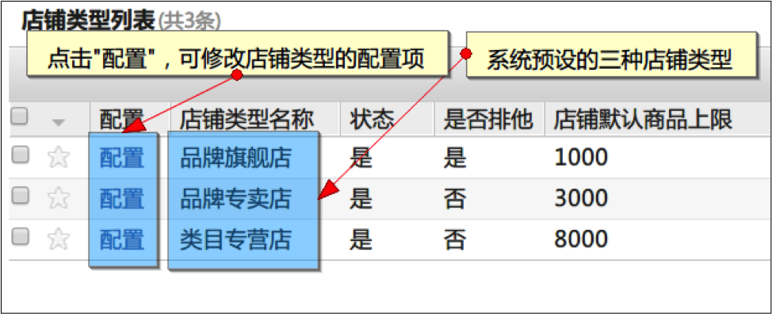

类型配置项说明：
预设的三种店铺类型配置项基本无二，主要区别在于：品牌的旗舰店具有唯一性，所以配置为排他。品牌专卖店
和类目专营店则为不排他。

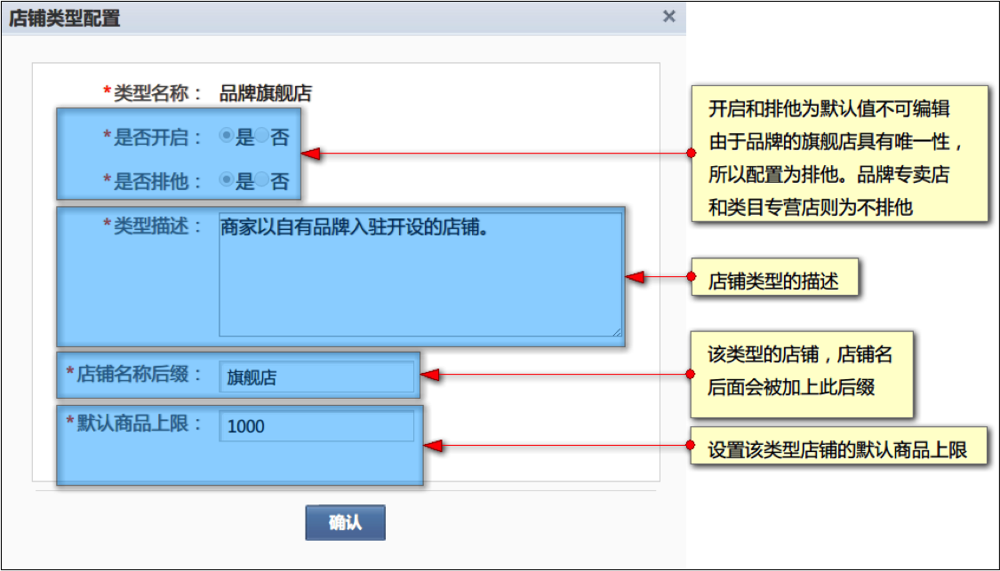

## 入驻审核

### 什么是入驻审

管理员可以对供应商入驻申请进行审核，以确保入驻的供应商拥有相匹配的资质，保证平台所售商品有品牌及质量保障

### 在哪里可以查看到商家提交的入驻申请？

登陆后台，依次点击导航菜单的 商家-入驻申请列表

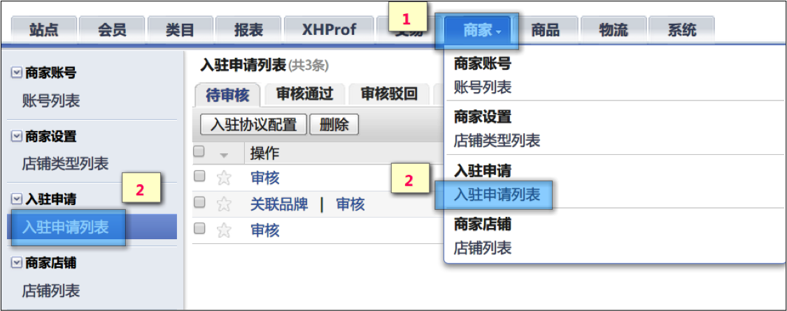

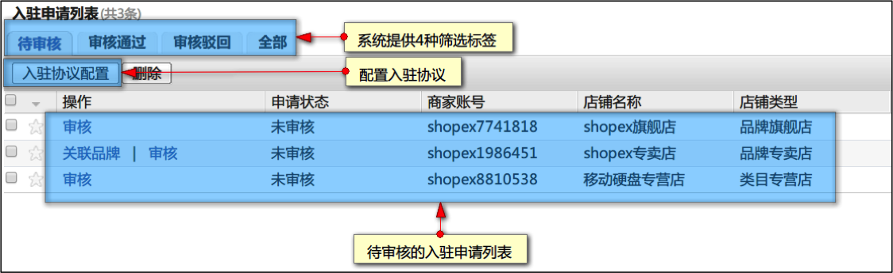

### 如何对入驻申请进行审核？

点击待审核的入驻申请左侧的“审核”按钮即可进行审核操作。

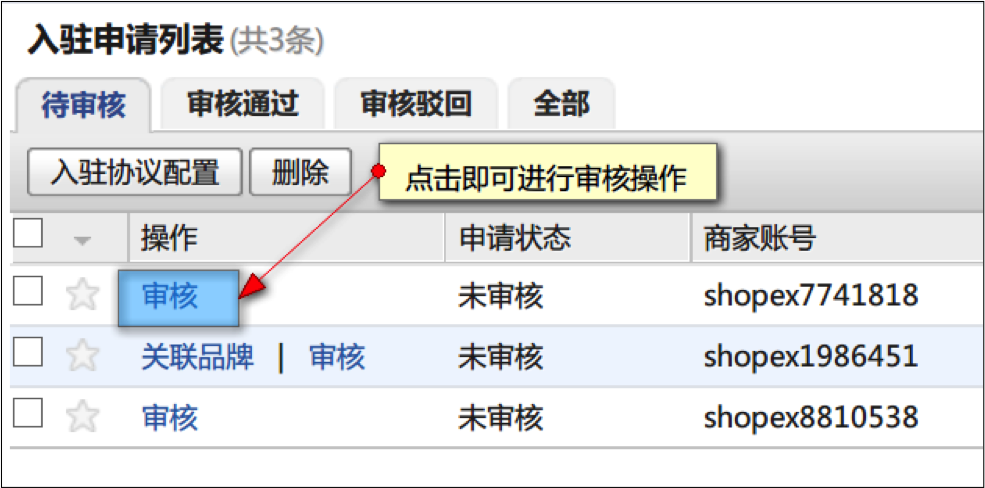

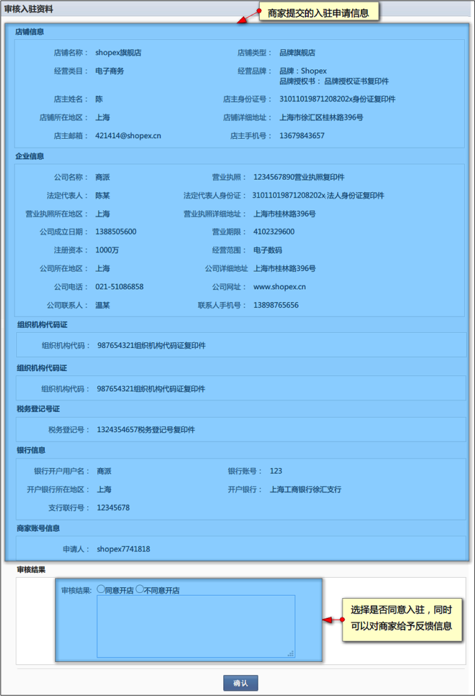

管理员可以在“审核通过”及“审核驳回”筛选标签页中查看到通过的入驻申请与被驳回的入驻申请。商家的入驻申请被驳回后，可以修改申请信息再次提交申请，管理员也可以在待审核中重新对申请进行审核。

## 店铺开关

### 如何为通过入驻审核的商家开通店铺？

管理员可在“入驻申请列表”中的“审核通过”筛选标签页查看到具备开通店铺资格的商家，并且帮他们开通店铺。

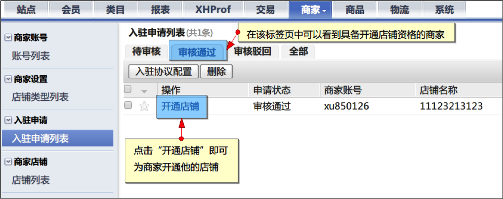

### 如何关闭商家的店铺？

管理员可在“商家”-“店铺列表”中关闭当前已开启的店铺。

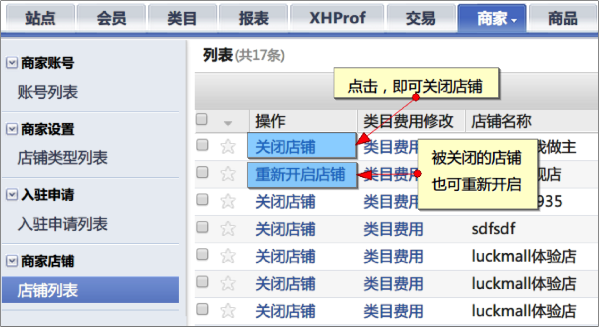

> 注：店铺开通后，必须在店铺列表修改类目费用后，该类目下的商品才可进行下单

## 商家入驻信息管理

商家的入驻申请一旦通过审核便无法自行修改，商家可以通过向管理员申请修改入驻信息。

### 如何帮助商家修改入驻信息？

管理员可在“商家”-“店铺列表”中对商家的入驻信息进行修改

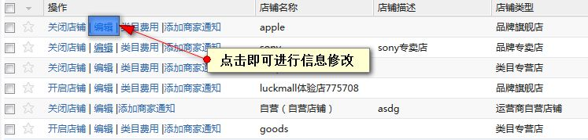
 
## 商家帐号密码修改

商家的账号登陆密码无法自行修改，一旦商家忘记密码，可以联系管理员修改密码。

### 如何帮助商家修改密码？

管理员可在“商家”-“账号列表”中对商家的入驻信息进行修改。

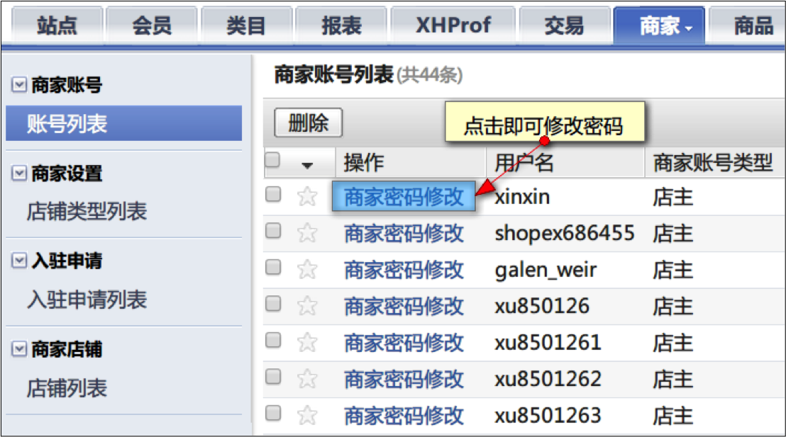
