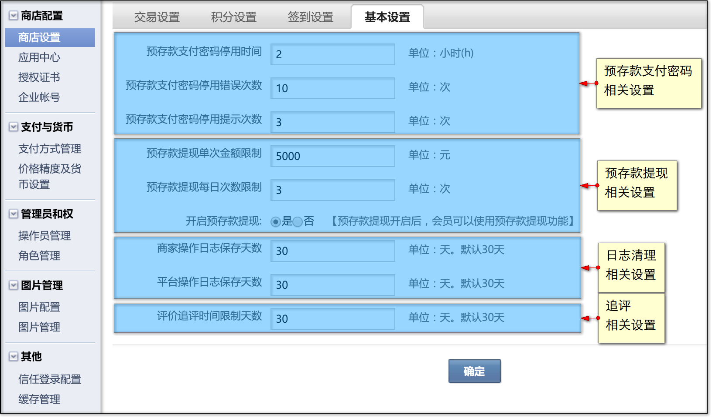
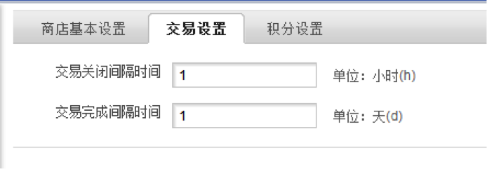
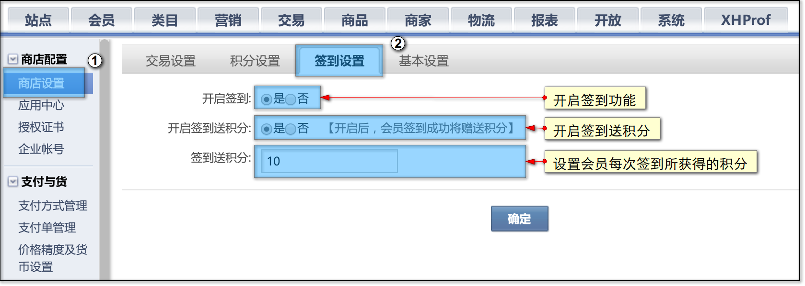

# 商店设置

* [1 商店基本配置](#1)
* [2 交易设置](#2)
* [3 积分设置](#3)
* [4 签到设置](#4)

## <a id="1">商店基本配置</a>

此处包含商城运营方面的一些常用设置。主要包含：预存款支付相关设置、预存款提现相关设置、日志清理相关设置、追评相关设置。

1、预存款支付相关设置

配置会员支付密码何时被冻结、冻结时长。具体详见[此处](../200.platform/2200.pre-deposits.md#3)。

2、预存款提现相关设置

配置是否开启提现功能、会员单笔提现限额、每日提现次数。具体详见[此处](../200.platform/2200.pre-deposits.md#4)。

3、日志清理相关设置

设定商家及平台相关的操作日志保留期限，超过期限的日志系统将会定时清理。

4、追评相关设置

配置会员追评的有效期限，超出期限无法追评。具体详见[此处](../400.mall/100.rate.md)。
 
## <a id="2">交易设置</a>

此处设置商城订单交易自动关闭与完成时间间隔，如图

交易关闭间隔时间设置单位（小时h）

交易完成间隔时间设置单位（天d）
 
## <a id="3">积分设置</a>

积分设置请前往[此处](../200.platform/2500.points-setting.md)查阅。

## <a id="4">签到设置</a>

此处可以开启会员签到功能，您可以给予一定的积分作为签到奖励，来提高会员的活跃度。

