# 营销管理
* [1 平台活动管理](#1)
* [2 审核商家营销活动](#2)
* [3 转盘抽奖管理](#3)
* [4 购物券管理](#4)
* [5 刮刮卡](#5)
* [6 尾随营销](#6)

## <h2 id="1">平台活动管理</h2>

* [1.1 添加平台活动](#1.1)
* [1.2 编辑活动](#1.2)
* [1.3 删除活动](#1.3)
* [1.4 开售提醒的短信设置](#1.4)
* [1.5 平台活动页面模版](#1.5)
* [1.6 商家报名](#1.6)
* [1.7 会员参加平台活动](#1.7)

- - -

### <h2 id="1.1">添加平台活动</h2>
运营商可在营销模块，活动列表内添加活动，符合条件的商家可报名参加运营商举办的活动

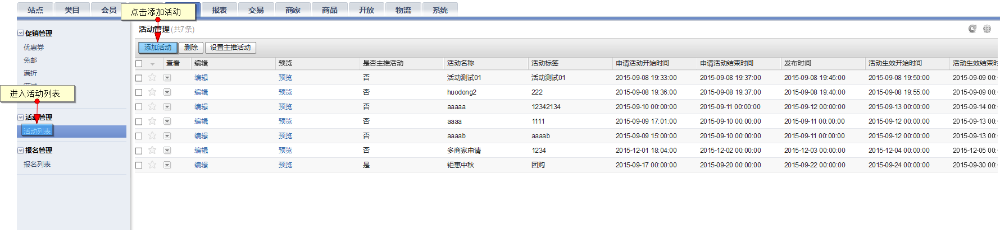

点击“添加活动”

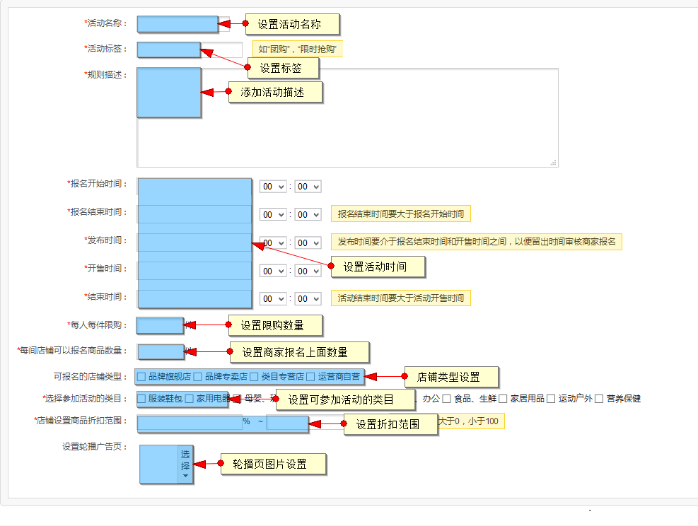

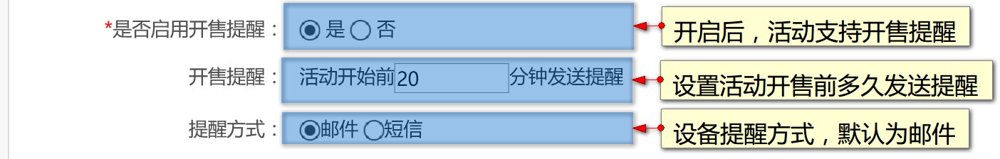

设置活动数据并发布活动

报名开始时间需大于当前时间

发布时间需要介于报名结束时间和开售时间之间，以便留出时间来审核商家的报名

店铺的商品折扣范围需介于0至100之间

设置完数据后便可保存并发布活动

### <h2 id="1.2">编辑活动</h2>
平台活动在不同阶段可编辑项会有所不同，以下是各阶段的可编辑项：

未报名阶段（报名开始时间前）：

此阶段可编辑项：所有项均可以编辑

报名阶段（报名开始后—报名结束前）：

此阶段可编辑项：'报名结束时间'、'发布时间'、'开售时间'、'结束时间'、'活动宣传图'、'开售提醒'

审核阶段（报名结束后—发布时间到达前）：

此阶段可编辑项：'报名结束时间'、'发布时间'、'开售时间'、'结束时间'、'活动宣传图'、'开售提醒'

发布阶段（发布时间到达后—开售时间到达前）：

此阶段可编辑项：'结束时间'

开售阶段（开售时间到达后—活动结束前）：

此阶段可编辑项：'结束时间'

活动结束（活动结束时间到达后）：

此阶段可编辑项：所有项均不可编辑

### <h2 id="1.3">删除活动</h2>
管理员可以对尚未开售的活动进行删除，一旦活动进入开售阶段，就不再允许删除了，需要注意。

### <h2 id="1.4">开售提醒的短信设置</h2>
由于短信较为昂贵，管理员可以对每个会员每天设置短信提醒的上限进行控制。

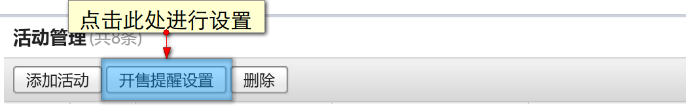

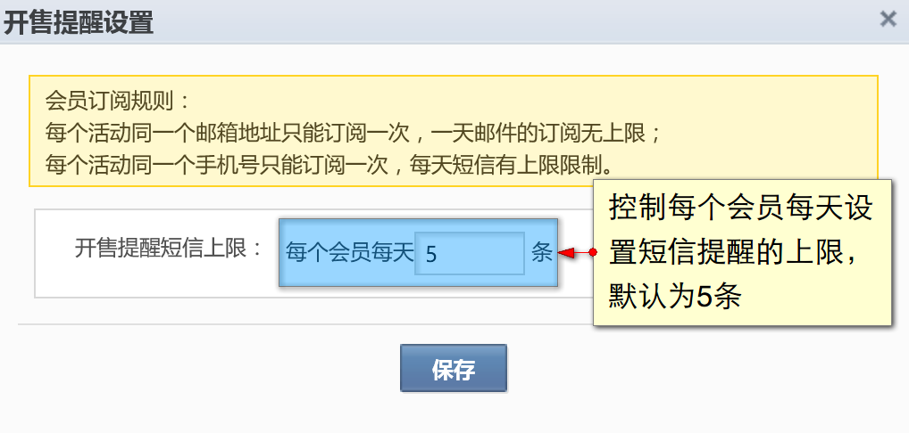

管理员设置的短信上限会在会员设置开售提醒时显示。

**PC端**

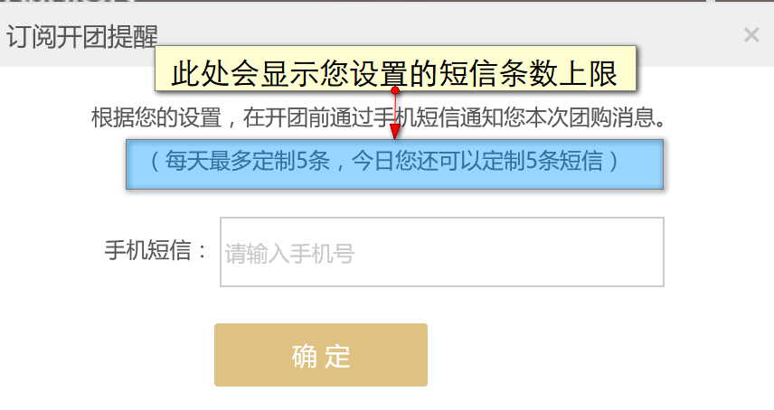

**WAP端**

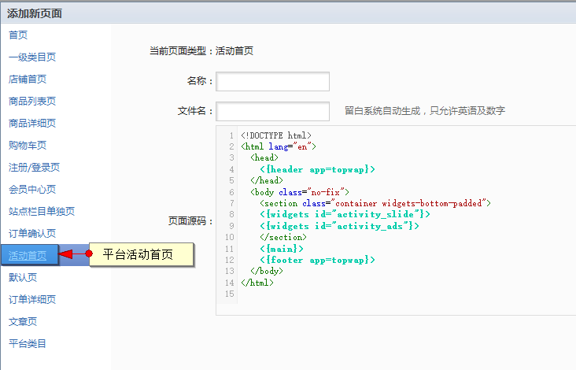

当会员当天设置的短信开售提醒达到上限时，系统会拒绝他再次使用短信提醒。

**PC端**

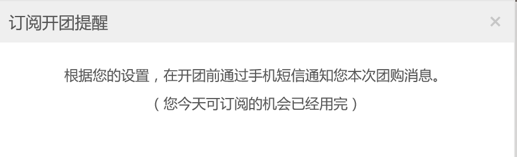

**WAP端**

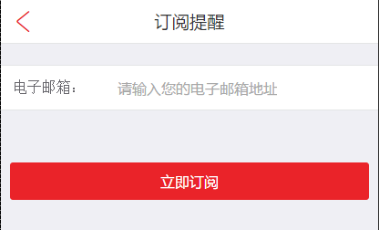

### <h2 id="1.5">平台活动页面模版</h2>

系统提供平台活动的首页的模版编辑（PC、WAP均有），管理员可以在模版的页面管理中找到此页面。

### <h2 id="1.6">商家报名</h2>

详见此[页面](../300.shopCenter/800.marketing.md)的‘参加平台活动’

### <h2 id="1.7">会员参加平台活动</h2>

详见此[页面](../400.mall/1100.activity-user.md)

## <h2 id="2">审核商家营销活动</h2>

*此处为平台方的审核操作，商家提交审核请详见[此处](../300.shopCenter/800.marketing.md)*

管理员可以在【控制面板】-【商店设置】-【基本设置】中开启商家营销审核功能（系统默认关闭）。

商家营销审核功能一旦开启，商家发布的店铺促销活动必须经过平台审核才允许正式进行，不过开启此功能前就已发布的活动不受影响。

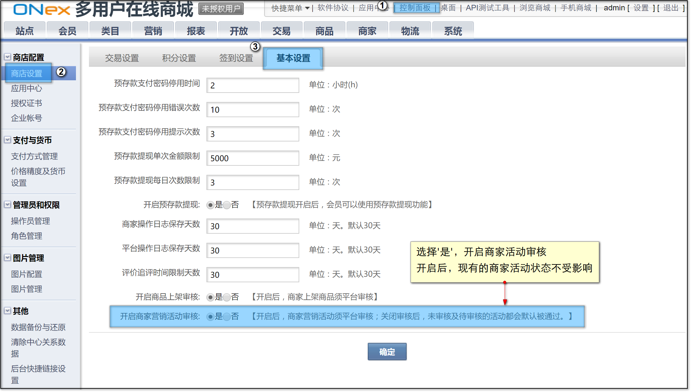

**下面我们以【满减】类型活动为例：**

开启商品审核功能后，促销列表页面会出现一个【未审核】标签，各商家提交审核的活动便会显示在此页面内。

点击任意活动的【审核】按钮即可对商品进行审核操作。

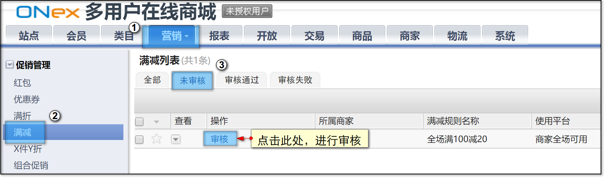

在弹出的审核界面中，您可以通过查阅【促销基本信息】、【店铺信息】、【商品信息】来快速定位活动内容是否违规。

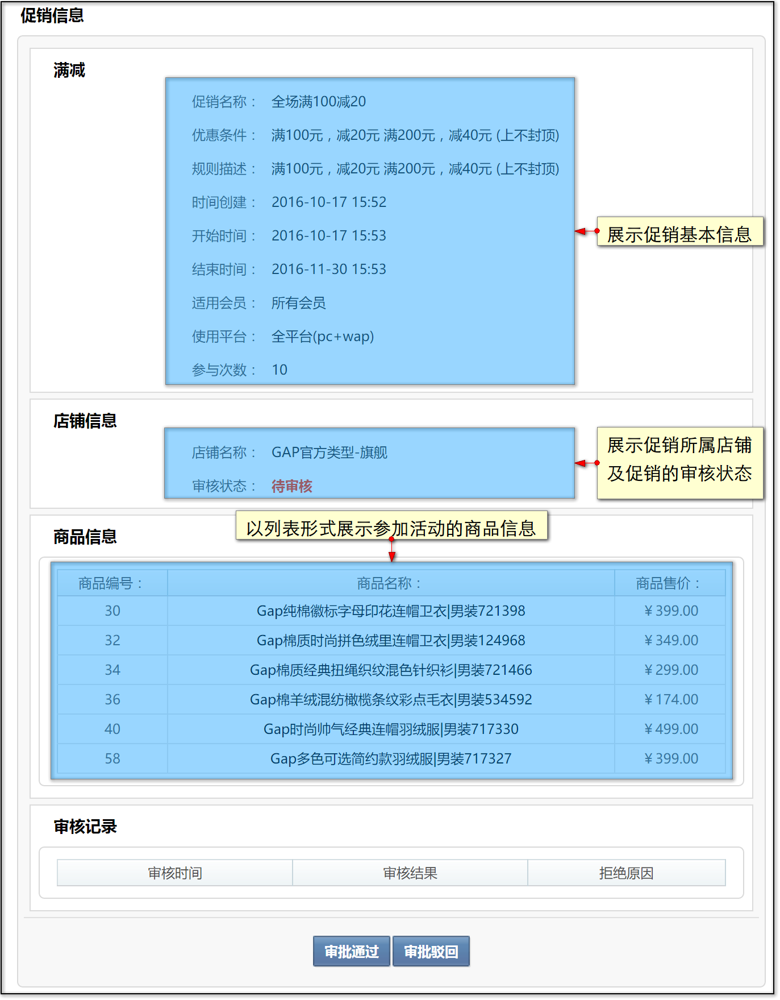

当发现活动含有违规信息时，您可以点击来拒绝活动通过，输入驳回原因后，点击【确定】，活动的审核请求便被成功驳回。

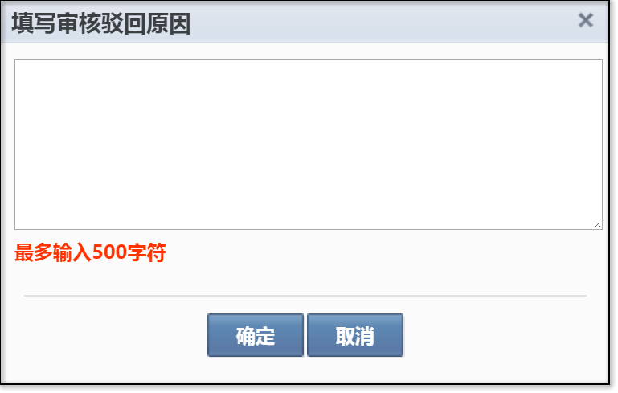

商家通过您给予的驳回原因，重新修改活动信息并再次提交审核，此时您可以通过活动审核界面中的【审核记录】来查看之前拒绝的原因

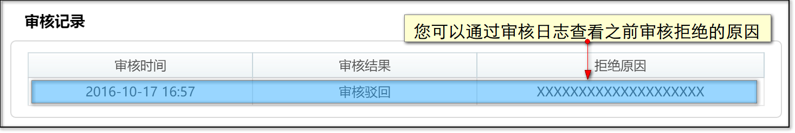

在确认商家修改了违规内容并且活动无其他违规内容后，您可以点击来确认审核，审核通过后，活动便会正式发布。

## <h2 id="3">转盘抽奖管理</h2>

* [3.1 添加转盘抽奖活动](#3.1)
* [3.2 编辑转盘抽奖活动](#3.2)
* [3.3 查看获奖记录](#3.3)

- - -

管理员可以在后台【营销】-【转盘抽奖】中管理转盘抽奖活动。

## <h3 id="3.1">添加转盘抽奖活动</h3>

点击页面中的【添加转盘抽奖】即可新增活动。

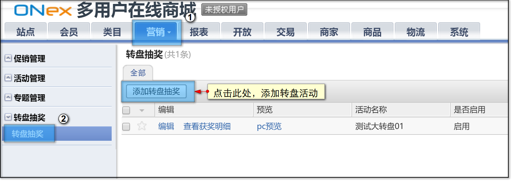

活动中管理员可以设置奖项、概率、会员抽奖次数等，详细见下图及对应的说明。

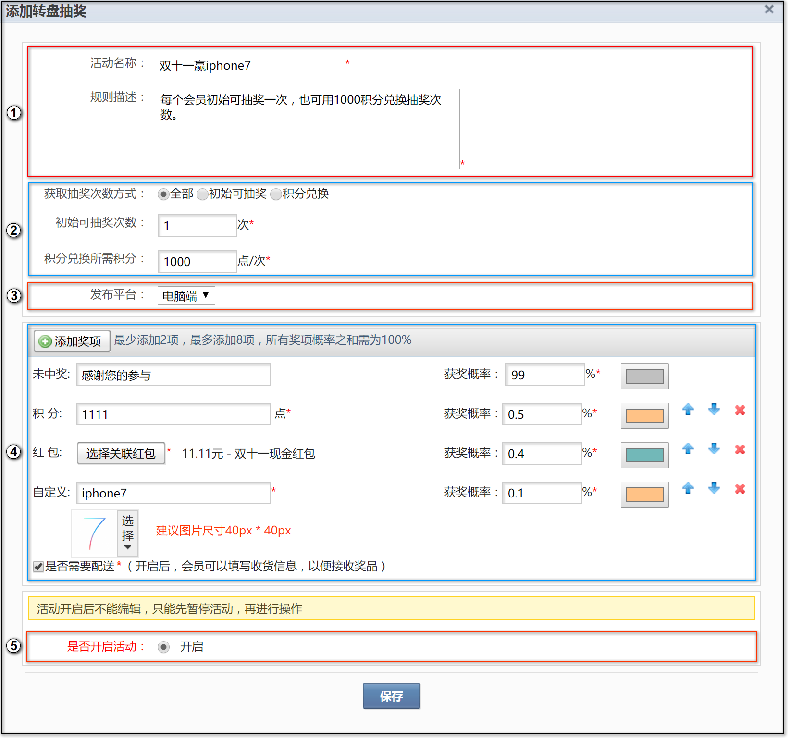

**1**.设置【活动名称】与【规则描述】。

**2**.设置【会员获取抽奖次数的方式】。

初始可抽奖：会员只拥有管理员设置的抽奖次数,用完后无法通过其他途径获得。

积分兑换：会员没有初始抽奖次数，只可通过积分兑换抽奖次数。

全部：会员即拥有初始抽奖次数，也可通过积分兑换。

**3**.设置活动的发布平台。

**4**.设置转盘奖项，奖项最多可以设置8个，最少需要2个，每个奖项可以单独设置转盘背景色。点击【添加奖项】可以选择奖项类型进行新增。

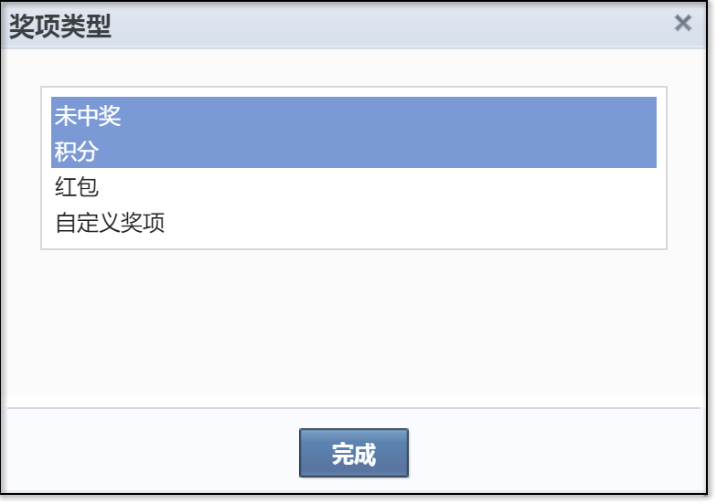

奖项类型有未中奖、红包、积分和自定义奖项。每个奖项可以单独设置中奖概率，合计为100，概率支持小数位数，最大为3位小数（整数位为1位时）。

积分：中奖的会员获得相应的积分。

红包：可选择系统内已添加的红包，中奖的会员可获得对应红包，若会员不符合对应红包的规则要求，即便抽中也会不会获奖，系统会自动转变为【未中奖】。

自定义：此类型为线下奖项类型，管理员可随意命名，如果奖品需要寄送，请勾选【是否需要配送】，勾选后获得此类型奖项的会员可以填写收货地址，以便接收奖品。

**5**.活动开关。系统默认不选，不选状态下保存，活动不会激活，只有选择【开启】时，活动才会激活。

保存转盘活动后，列表中会出现对应的活动。

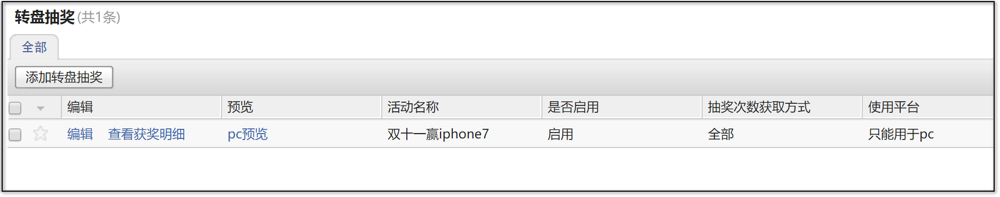

在转盘活动开启的情况下，点击【PC浏览】就可以访问到对应的转盘活动页，管理员可以将活动页的url挂到商城前台（比如将url添加至模版挂件中），以便推广活动。

下图为转盘活动页效果图：

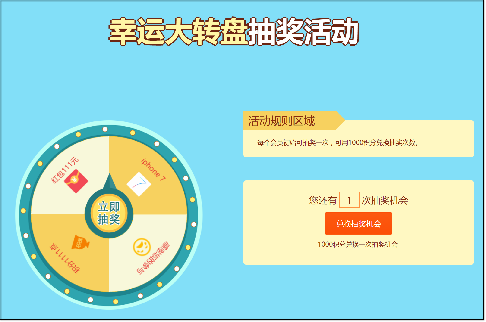

## <h3 id="3.2">编辑转盘抽奖活动</h3>

管理员可以对现有的转盘活动进行编辑，需要注意的是，正在进行的活动需要先将其【暂停】才能编辑。

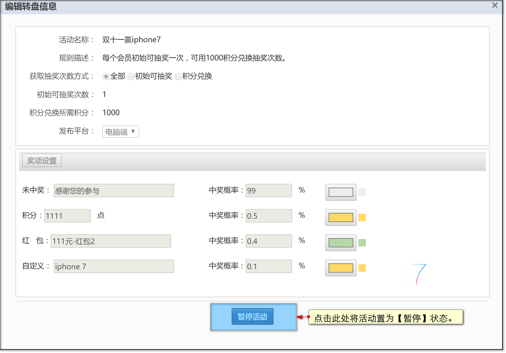

在转盘活动编辑页面中， 管理员可以对活动的奖项、概率进行修改，但是活动的基本信息和规则（活动名称、抽奖方式、发布平台）是无法编辑的。

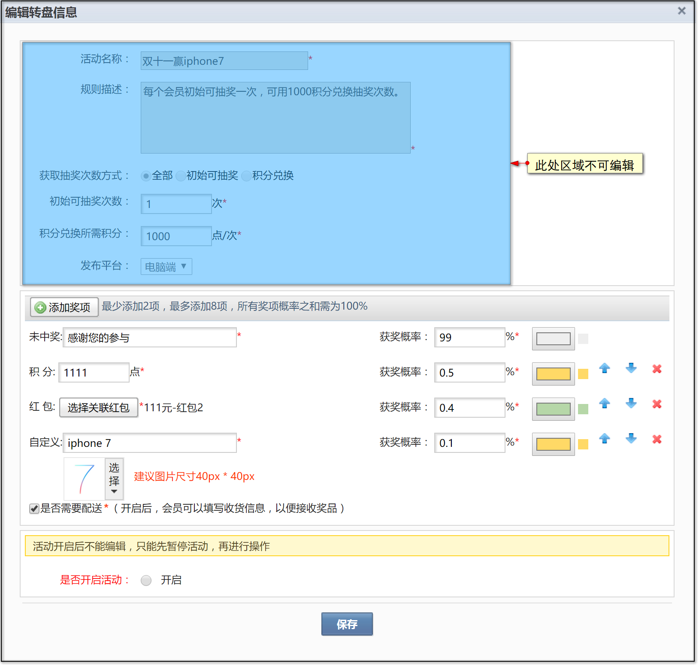

## <h3 id="3.3">查看获奖记录</h3>

在转盘抽奖活动列表中，任意活动均会有一个【查看获奖明细】，进入可查看到对应活动的所有中奖记录，管理员可以通过筛选来统计出各个奖项的获奖数，如果奖项中含有线下奖品需要发货， 管理员也可以在中奖纪录中查看到会员填写的收货地址。

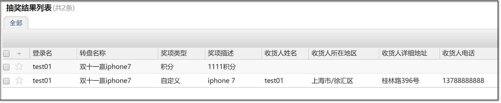

## <a id="4">购物券管理</a>

* [4.1 添加购物券](#4.1)
* [4.2 审核商家报名](#4.2)
* [4.3 购物券结算](#4.3)
* [4.4 商家报名](#4.4)
* [4.5 会员使用购物券](#4.5)

- - -

本文针对运营平台对于购物券的管理，商家如何报名参加购物券，详见此页面。

管理员可以在后台发起购物券。发起活动后，等待商家报名，对于已报名商家进行审核。活动进行过程中，管理员有权利终止任何商家的参与资格。

### <a id="4.1">添加购物券</a>

进入后台【营销】-【购物券列表】，再页面中点击‘新增购物券’即可添加购物券。

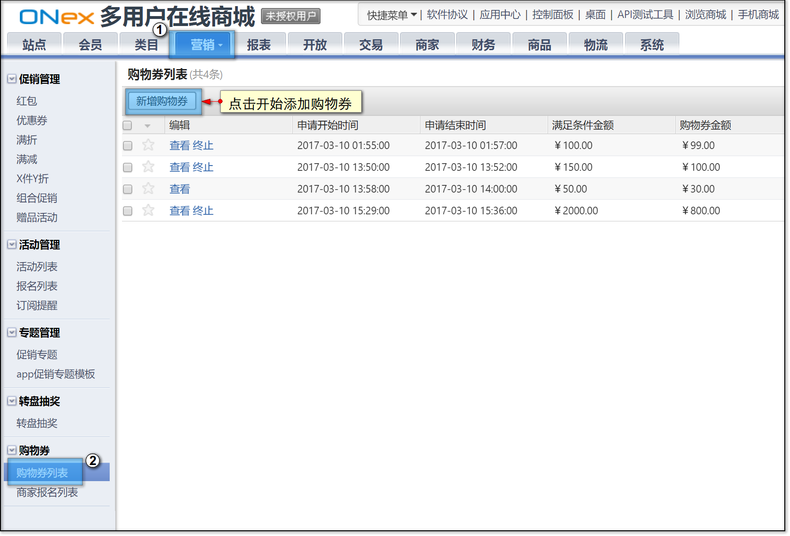

设置完相关内容后，点击发布就能发布此优惠券了。

具体参数配置见下图。

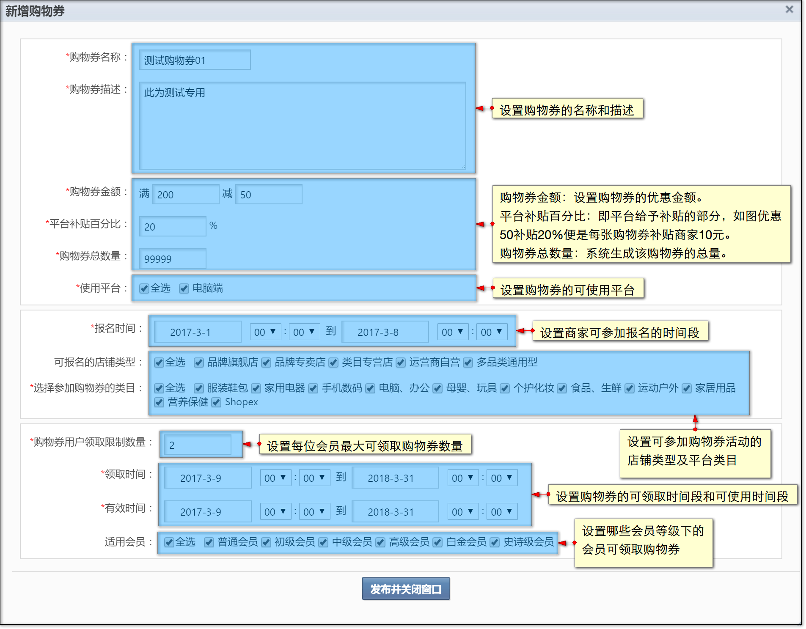

当购物券的报名时间还未开始时，管理员可以对购物券进行编辑，一旦购物券进入报名时间，编辑入口将会关闭。

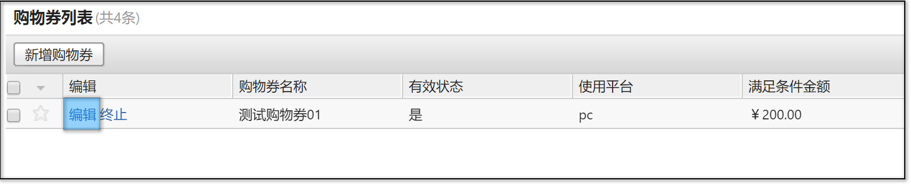

### <a id="4.2">审核商家报名</a>

当商家提交活动报名后，管理员便可以对报名进行审核。

进入【营销】-【商家报名列表】可以看到商家提交的活动报名。点击任意报名的‘审核’按钮可对其进行审核。

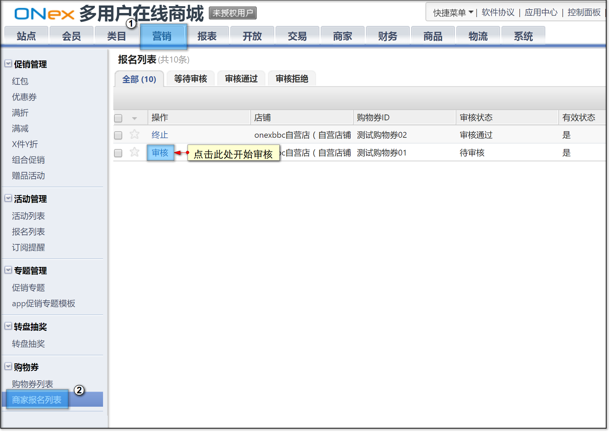

查看商家的报名信息,选择是否同意审核.

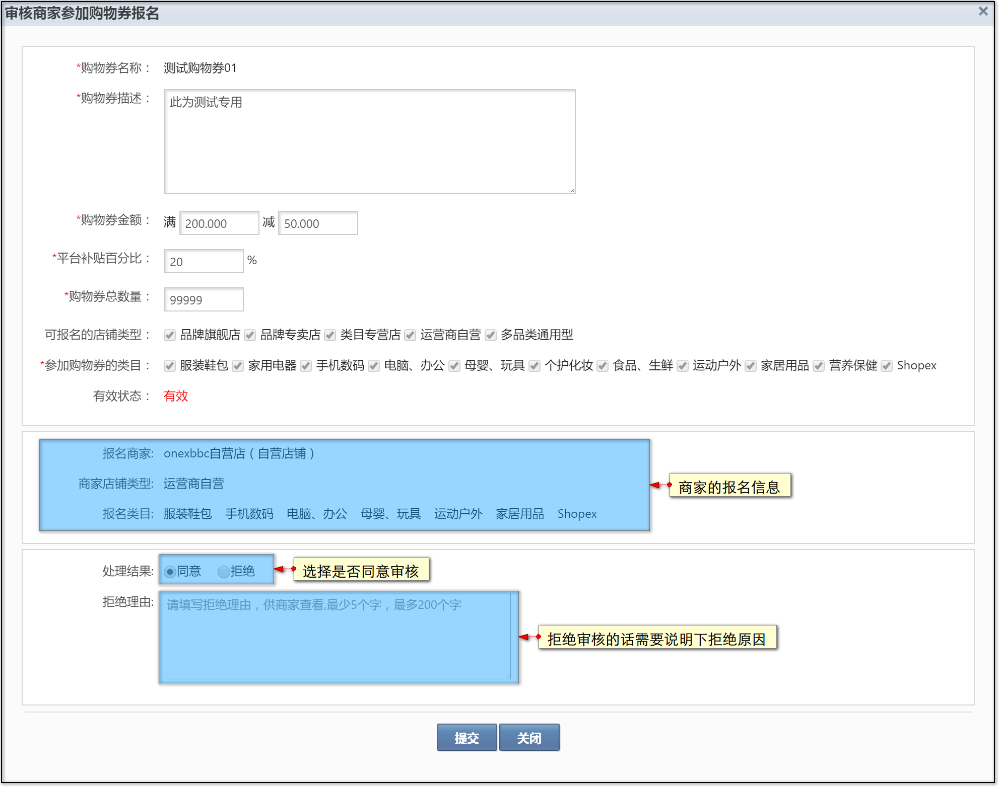

### <a id="4.3">购物券结算</a>

当用户在前台使用购物券下单并完成订单后,系统会根据购物券的补贴比例生成补贴明细.

进入【财务】-【购物券补贴明细】,管理员可以通过补贴明细列表来查询购物券的使用情况.

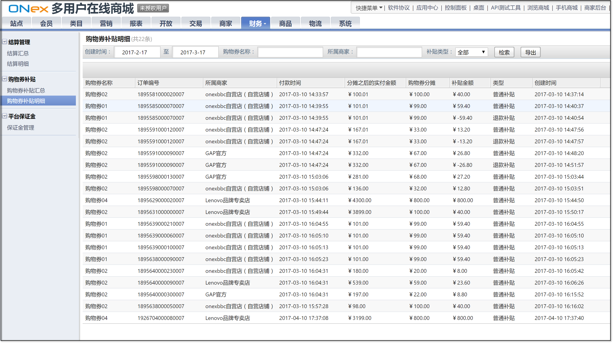

每月初系统会自动生成上个月的补贴汇总.

进入【财务】-【购物券补贴汇总】,管理员可以对某一店铺下各个优惠券的补贴总额进行确认.

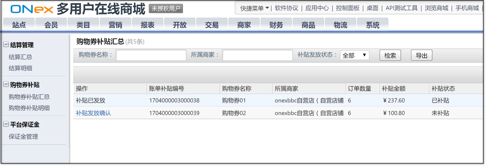

### <h2 id="4.4">商家报名</h2>

详见此[页面](../300.shopCenter/800.marketing.md)的‘购物券管理’

### <h2 id="4.5">会员使用购物券</h2>

详见此[页面](../400.mall/500.member-center.md)的'我的购物券'

## <h2 id="5">刮刮卡抽奖</h2>

管理员可以在后台【营销】-【刮刮卡抽奖】中管理刮刮卡抽奖活动。

## <h3 id="5.1">添加刮刮卡抽奖</h3>

点击页面中的【添加刮刮卡抽奖】即可新增活动。

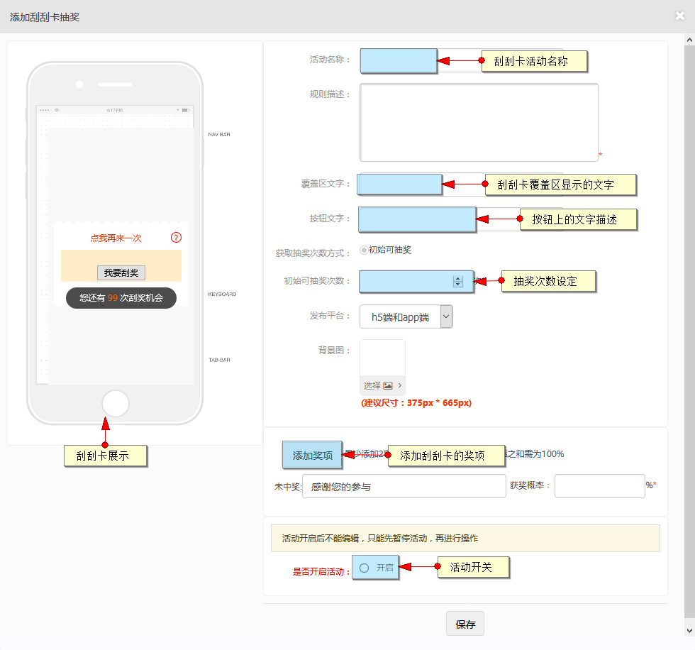

### <h2 id="5.2">编辑活动</h2>

添加刮刮卡抽奖后可对活动进行编辑，但需要先暂停该活动才能进行编辑。

### <h2 id="5.3">刮刮卡活动展示</h2>

在wap或app端可参与刮刮卡活动，点击文字后可显示刮刮卡涂层。

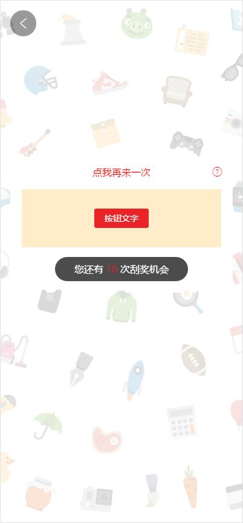

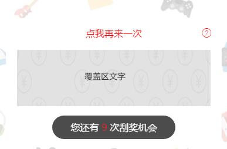

刮开涂层即可显示抽奖结果。

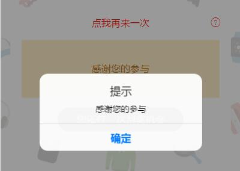

## <h2 id="6">尾随营销</h2>

管理员可以在后台【营销】-【尾随营销】中设置尾随营销的内容。

## <h3 id="6.1">尾随营销设置</h3>

点击进入尾随营销设置。

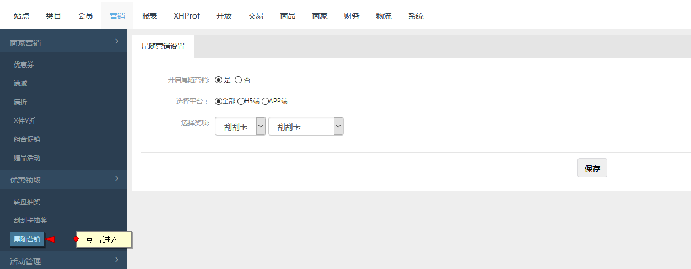

可设置开启关闭，选择尾随营销适用的平台，目前的奖项支持的是刮刮卡营销。

## <h3 id="6.2">尾随营销展示</h3>

当用户在适用的平台下单支付完成后，可进行尾随营销（仅支持在线支付的订单，不包含货到付款订单）

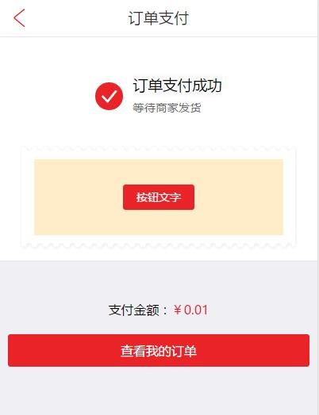

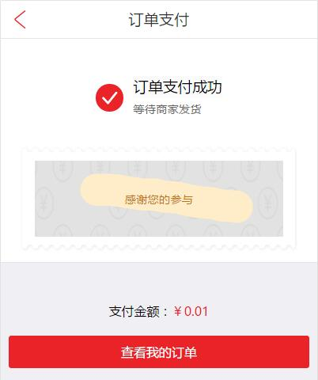
