# 品牌与属性管理

* [ 品牌管理](#1)
* [ 属性管理](#2)

## <a id='1'>品牌管理</a>

### 品牌的作用？

品牌可以方便顾客使用品牌寻找商品以及品牌相关店铺，商家可以在入驻申请中提交品牌申请，设立品牌旗舰店或品牌专营店。品牌可以与三级分类进行绑定。

### 如何添加品牌？

后台依次点击“类目”-“品牌列表”进入品牌列表页，再点击“添加品牌”即可添加品牌。

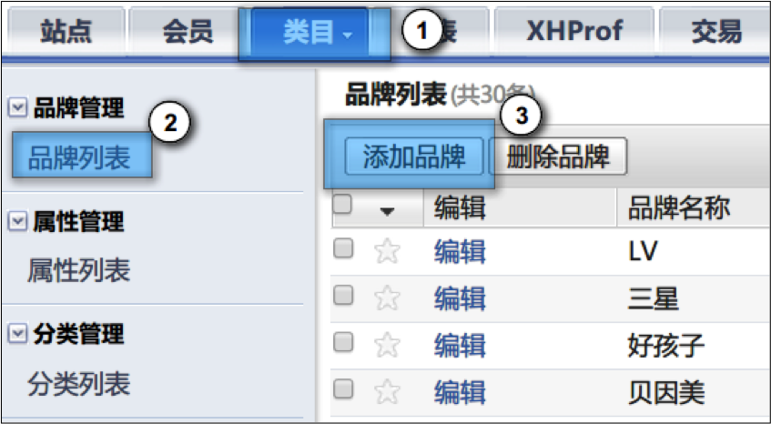

添加品牌配置项说明：

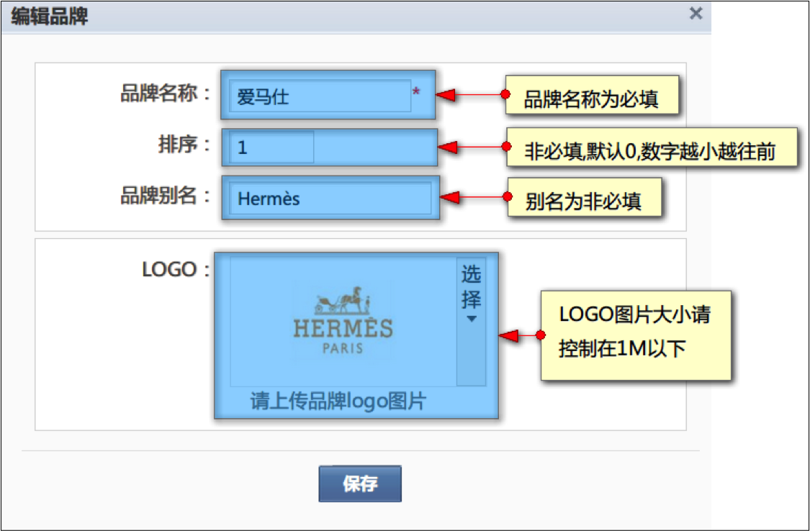

### 如何编辑品牌？

在品牌列表页中点击任意品牌的“编辑”按钮即可对品牌进行编辑。

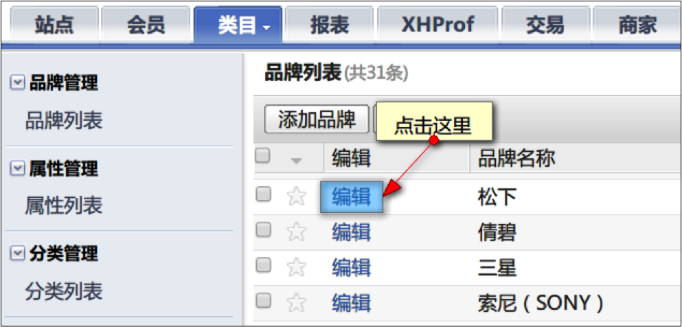

### 如何删除品牌？

在品牌列表页中勾选需要删除的品牌，点击上方的“删除品牌”按钮即可对品牌进行删除。

> **注意** 已经与三级分类绑定的品牌是无法被删除的，必须先解除绑定才能删除。

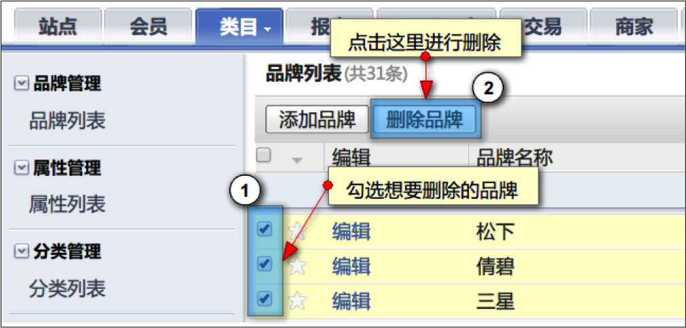

### 如何为商家进行新品牌关联？

商家可以在入驻申请中提交新品牌申请，新品牌在线下通过审核后，管理员可以将新商品添加入系统。

在入驻申请表中，如果商家申请了新品牌，他提交的申请表会出现“关联品牌”按钮。

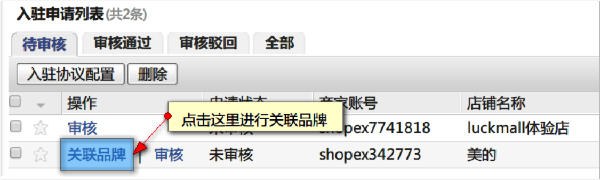

点击关联品牌可以商家提交的新品牌与需要关联的分类，前往品牌列表添加新品牌并与所需的分类绑定。

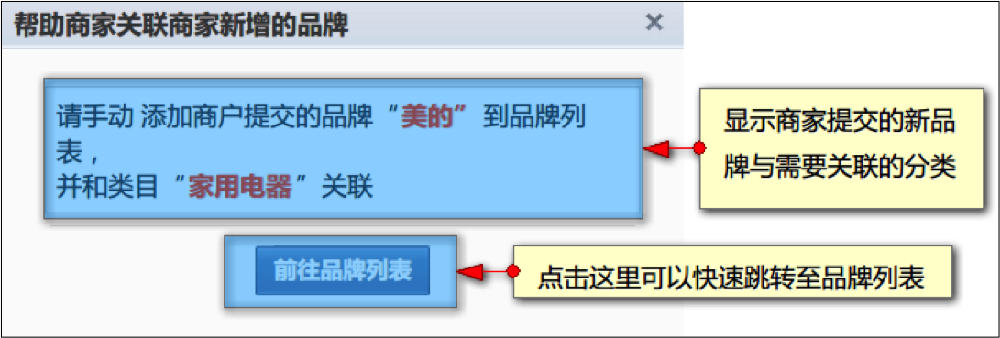

添加完新品牌后，再次点击之前入驻申请表的 “关联品牌”按钮

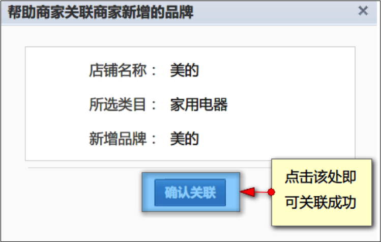
 
## <a id='2'>属性管理</a>

### 属性的作用

属性分为销售属性与自然属性。销售属性等同于规格，定义具体的最小销售单元；自然属性等同于扩展属性，做产品特性的介绍展示所用。属性可以与三级分类进行绑定。

### 如何添加属性

后台依次点击“类目”-“属性列表”进入属性列表页，再点击“添加属性”即可添加属性。

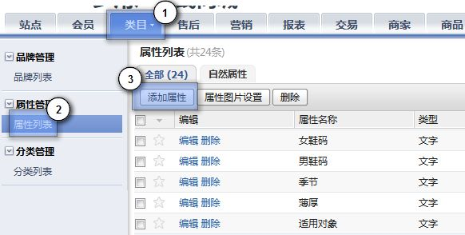

添加属性配置项说明：

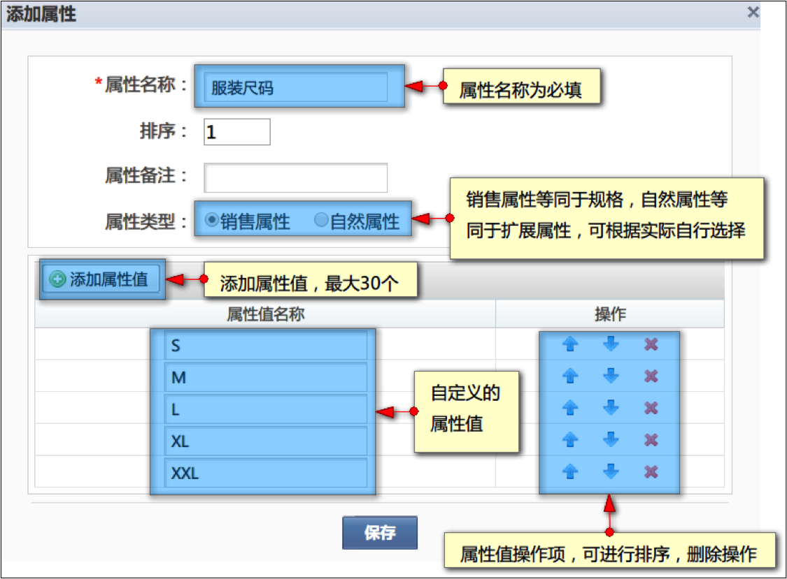

> 需要注意的是系统预设了一个，同时也是唯一一个图片展示的属性——颜色。该属性提供属性图片配置，可以在前台展示属性图片。管理员也可以自行编辑属性配置，包括属性名称，属性值，属性图片等等（除属性类型外）

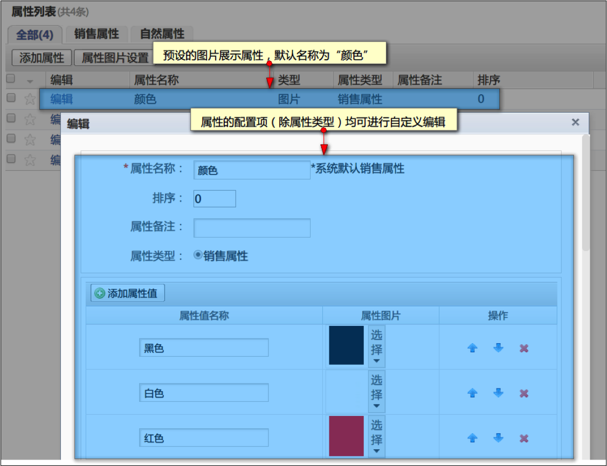
 
### 如何编辑属性

在属性列表页中点击任意属性的“编辑”按钮即可对属性进行编辑。 进行编辑。

### 如何删除属性

在属性列表页中点击任意想要删除属性的“编辑”按钮即可对属性进行删除。
> 需要注意的是，已经与三级分类绑定的属性是无法被删除的，必须先解除绑定才能删除。另外默认的图片展示属性，也无法被删除

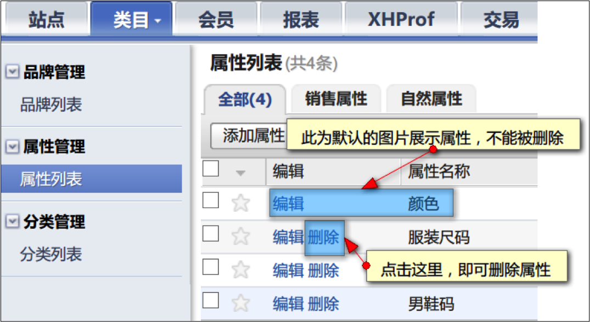
