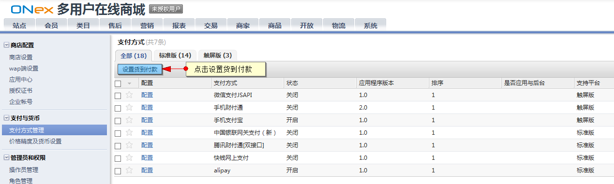
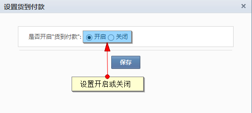
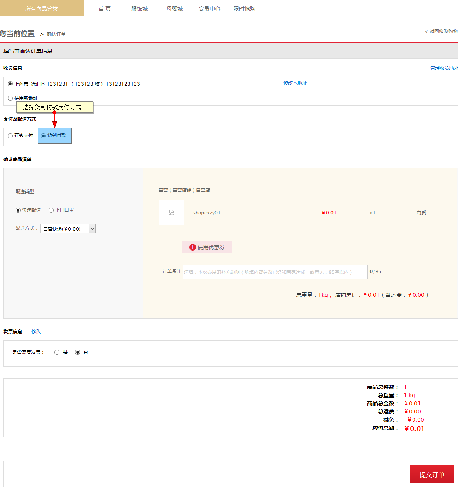
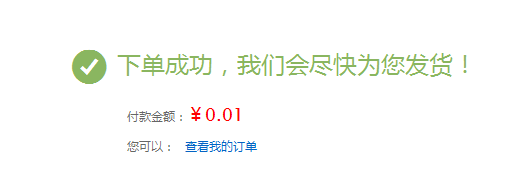
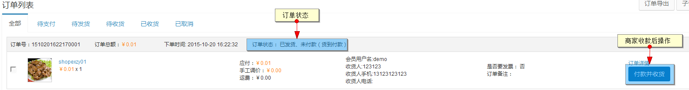

# 货到付款

运营商可在控制面板－支付方式管理内设置货到付款配置，目前货到付款功能只对自营店铺生效。

 
点击“设置货到付款”

将货到付款功能开启，点击确定保存

在商城的自营店铺下单，在订单确认页面可选择“货到付款”支付方式

下单完成后，订单无需支付，在会员订单列表显示状态为“未付款（货到付款）”

当商家进行发货后，商家处的订单状态为“已发货，未付款（货到付款）”

当商家收到买家的货到款后，执行“付款并收货”来完成订单状态
