# 预存款管理

* [1 预存款添加](#1)
* [2 会员预存款消费](#2)
* [3 冻结会员预存款支付密码配置](#3)
* [4 会员预存款提现](#4)

## <h2 id="1">预存款添加</h2>

运营商给会员添加预存款，进入会员模块添加

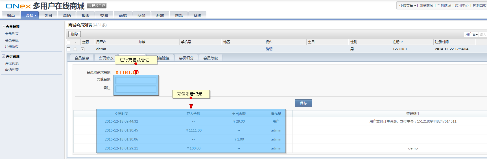

添加后会员可在会员中心首页查看自己的预存款余额

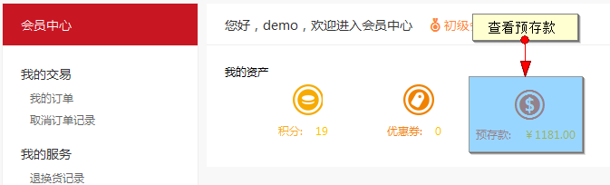

## <h2 id="2">会员预存款消费</h2>

拥有预存款后会员可对订单使用预存款进行支付

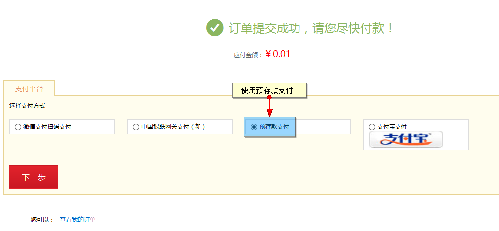

使用预存款支付成功

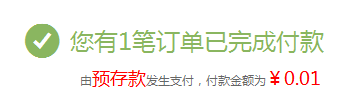

## <h2 id="3">冻结会员预存款支付密码配置</h2>

为确保会员的预存款支付密码安全，您可以在后台设置会员支付密码的冻结时间，以及错误次数。

当会员输入的错误次数超过您设置的次数，会员的支付密码就会被系统冻结，在您所设置的冻结时间段内，会员将无法在使用支付密码。

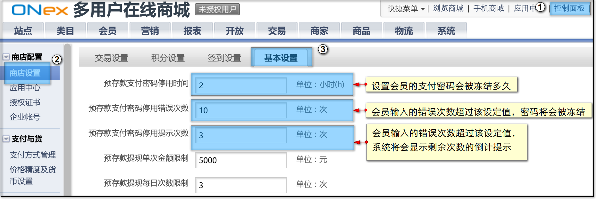

会员支付密码被冻结后，您可以通过【重置支付密码】帮助会员解除冻结

在会员列表中找到求助的会员，在下拉功能项中点击【重置支付密码】

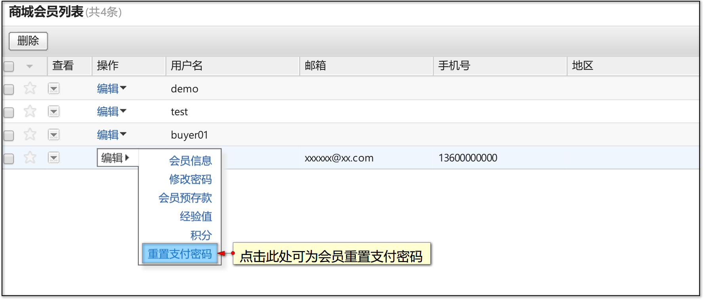

会员端支付密码冻结，请查看[此处](../400.mall/1200.member-deposit.md)。

## <a id="4">会员预存款提现</a>

管理员可以在【控制面板】-【商店设置】-【基本设置】中开启会员预存款提现功能

开启后，会员就可以对自己的预存款余额进行提现操作，关于会员如何对预存款余额进行提现，详见[此处](../400.mall/1200.member-deposit.md#3)。

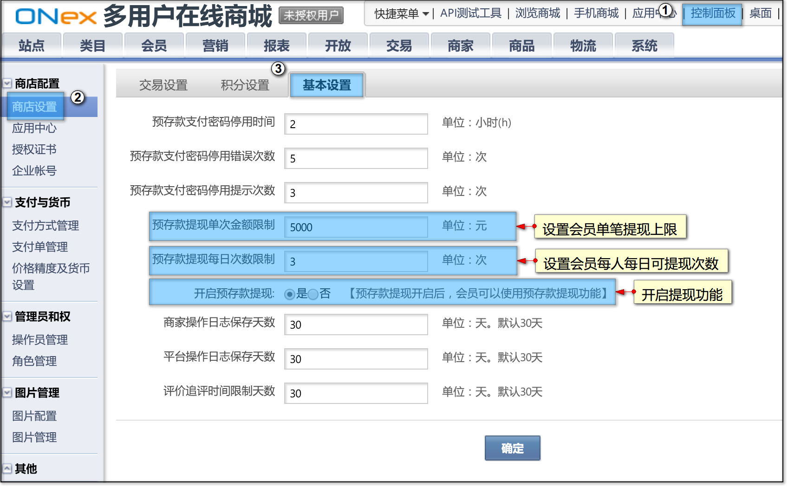

当会员提交预存款体现申请后，管理员可以在【交易】-【预存款提现列表】中查看到会员的提现申请。

管理员可以根据实际状况，审核或驳回会员的提现申请。

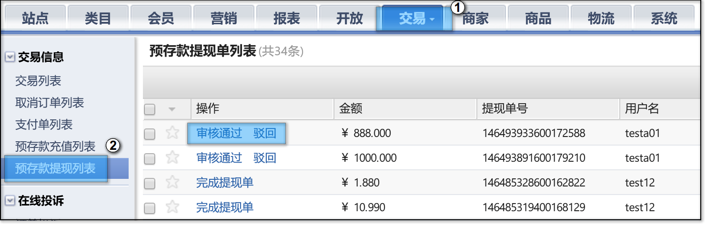

当管理员【审核通过】会员的提现申请后，可通知相关人员（如财务）将提现金额打款到会员的银行卡帐号

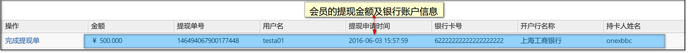

相关人员打款完毕后，管理员可以从相关人员处获得银行的转账流水单号

点击【完成提现单】

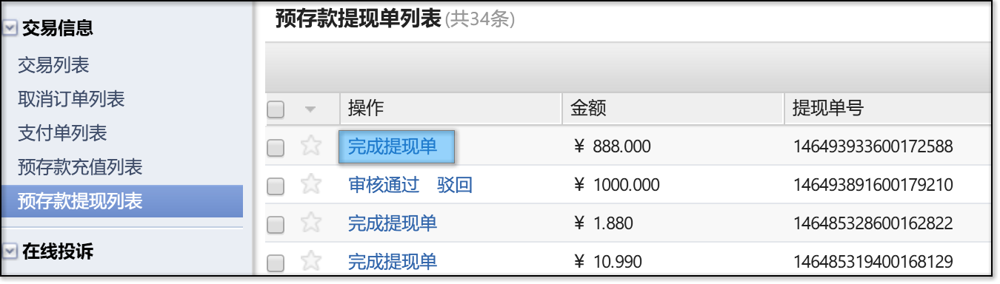

输入转账流水单号，完成提现单。

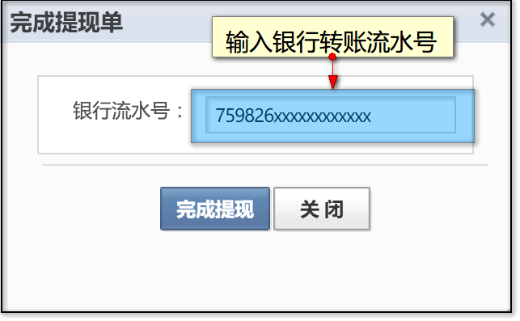

