# 信任登录 及 社交化分享

* [1 信任登录](#1)
* [1.1 微信扫码登录](#1.1)
* [1.2 微信客户端免登](#1.2)
* [1.3 APP-微信登录](#1.3)
* [1.4 APP-QQ登录](#1.4)
* [1.5 APP-新浪微博登录](#1.5)
* [2 社交化分享](#2)
* [2.1 微信内分享](#2.1)
* [2.2 APP分享](#2.2)

## <a id="1">信任登录</a>

_ _ _

> 本段针对运营平台的信任登录配置，前台会员如何进行登录，详见此[页面](../400.mall/1000.trustlogin-user.md)：

### <a id="1.1">微信扫码登录</a>

首先请访问 https://open.weixin.qq.com/，登录您的微信开放平台帐号。

如果已有审核通过的微信应用，请点击[此处](#bbc配置)

1、进入上方导航菜单的‘管理中心’，在‘网站应用’页面中创建一个应用

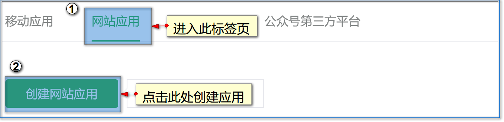

2、输入相关信息提交审核

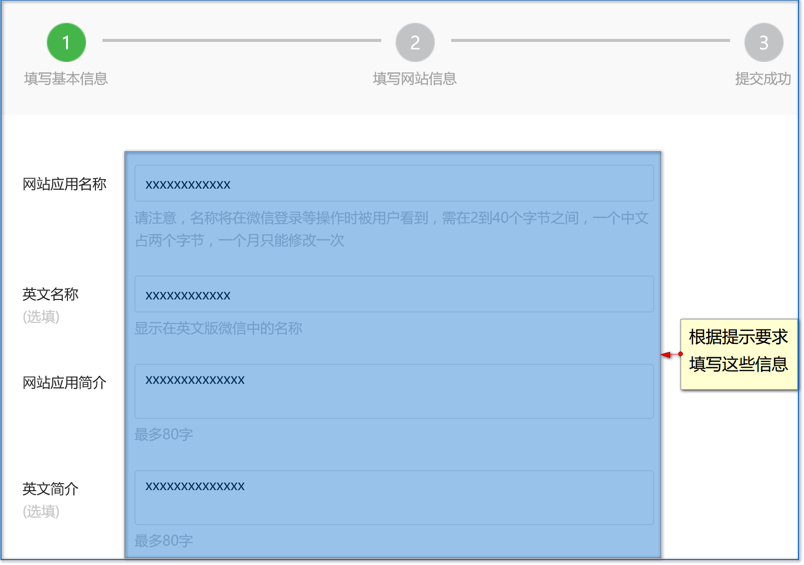

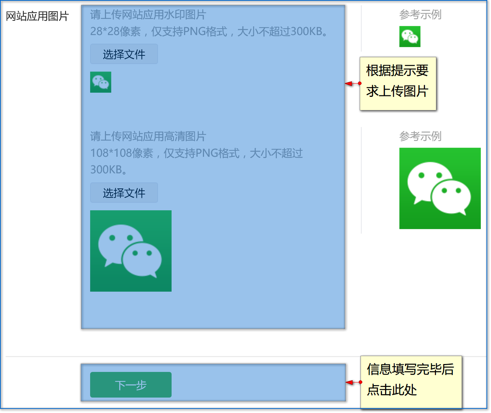

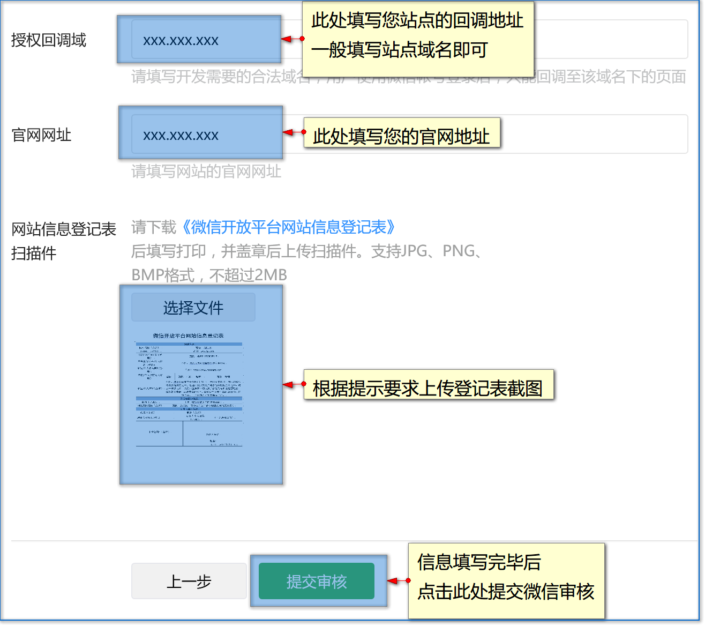

3、等待微信审核，审核通过后，查看创建的应用，记录Appid及AppSecret

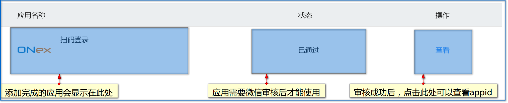

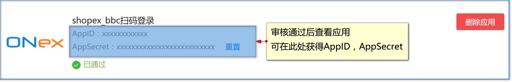

4、微信开放平台的配置到此为止，登录ONex-B2B2C的运营平台，进行微信扫码登录配置。

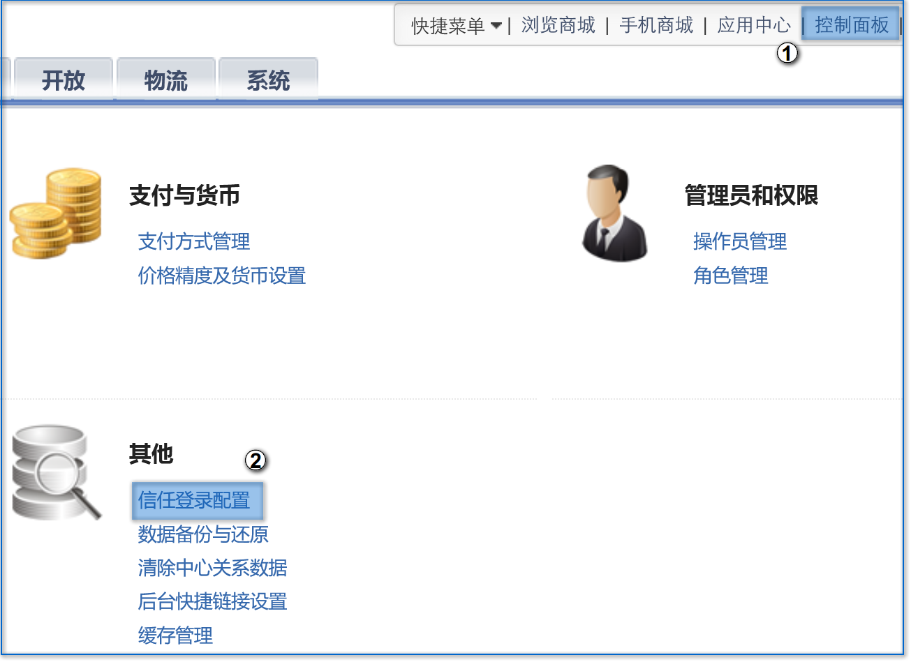

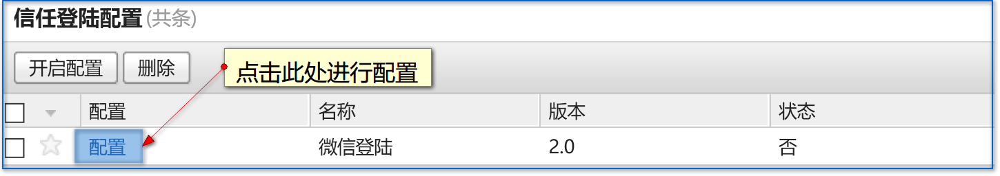

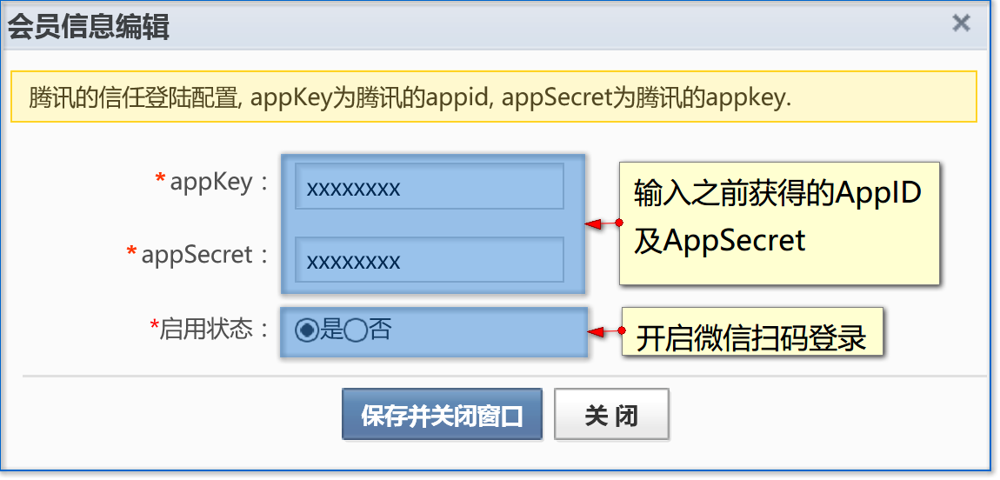

别忘了开启'信任登录功能项'

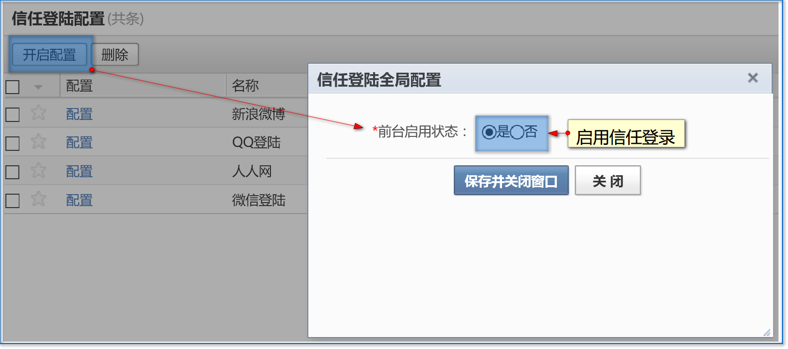

开启后，会员可以在前台使用微信扫码来登陆网站。

前台会员如何进行微信扫码登录，详见此[页面](../400.mall/1000.trustlogin-user.md)：

### <a id="1.2">微信客户端免登</a>

使用微信客户端免登前，您需要先开通微信的公众号。

开通微信公众号后，登录微信的[公众平台](https://mp.weixin.qq.com/)，进入'接口权限'页面，修改'授权回调页面域名'。

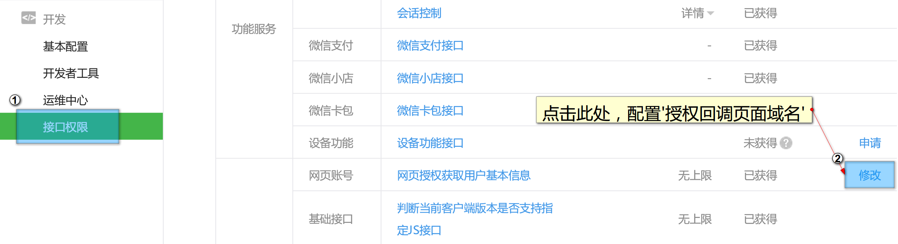

将您的ONex_B2B2C商城域名配置到'授权回调页面域名'。

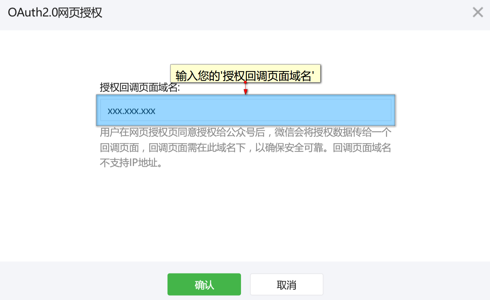

接着进入'基本配置'页，记录此公众号的AppID及AppSecret

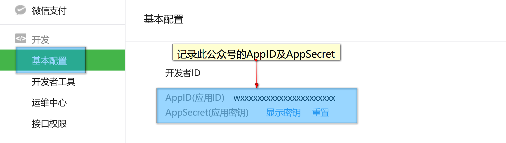

返回ONex_B2B2C商城运营后台，进入'控制面板'-'信任登陆配置'，点击'触屏版'标签，'微信免登'便在其中，点击'配置'进行'微信免登'设置。

输入之前记录的AppID及AppSecret，开启'微信免登'

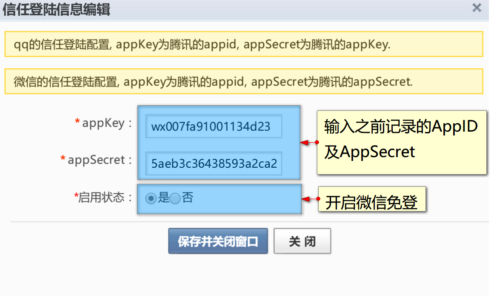

最后别忘了开启'信任登录功能项'

开启后，会员可以在微信客户端中进行免登。

### <a id="1.3">APP-微信登录</a>

首先请访问 open.weixin.qq.com，登录您的微信开放平台帐号，申请一个‘移动应用’，申请的流程这里就不阐述了，您可以查看[APP微信支付](../200.platform/2300.payment-setting.md)或者咨询微信客服。

申请成功后,您的‘移动应用’会显示对应的AppID、AppSecret。

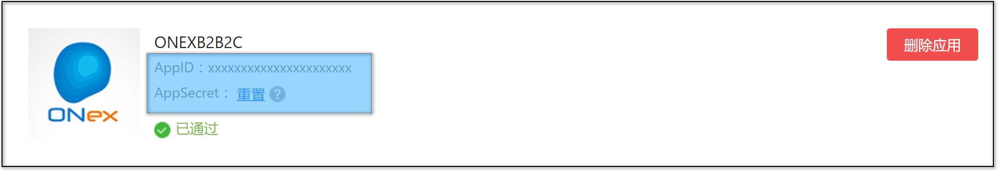

打开HBuilder，在app的manifest.json文件中启用‘OAuth(登录鉴权)’模块，将获得的AppID、AppSecret填写到‘SDK配置’的‘微信登录’中，之后便能在app中使用微信登录了。

HBuilder的具体配置教程可以查看其[官方文档](http://ask.dcloud.net.cn/article/192)。

### <a id="1.4">APP-QQ登录</a>

首先请访问 open.qq.com，登录您的腾讯开放平台帐号。

登录后，进入‘应用接入’。

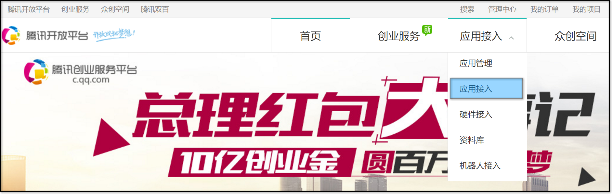

在‘应用接入’中根据您的实际需求来申请移动平台应用。具体的申请流程这里就不阐述了，您可以咨询腾讯客服。

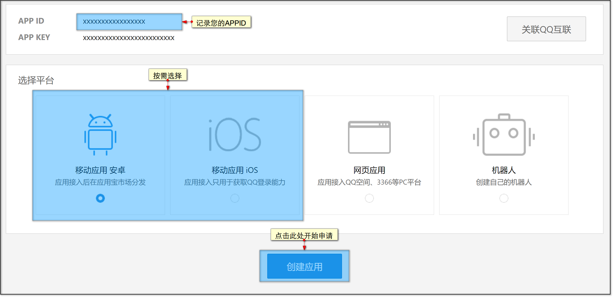

申请成功后，记录下您的APPID，具体位置见上图。

打开HBuilder，在app的manifest.json文件中启用‘OAuth(登录鉴权)’模块，将获得的APPID填写到‘SDK配置’的‘QQ登录’中，之后便能在app中使用QQ登录了。

HBuilder的具体配置教程可以查看其[官方文档](http://ask.dcloud.net.cn/article/192)。

### <a id="1.5">APP-新浪微博登录</a>

首先请访问 open.weibo.com，登录您的新浪微博开放平台帐号。

在首页直接点击‘移动应用’图标。

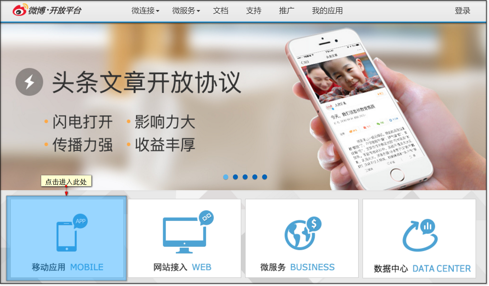

在‘移动应用’中点击‘立即接入’开始申请。具体的申请流程这里就不阐述了，您可以咨询新浪客服。

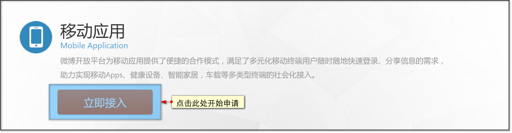

申请成功后，进入‘我的应用’可以查看到您申请成功的移动应用，点击您的应用，查看详情，在‘应用信息’-‘基本信息’中可以查看到您的App Key及App Secret。

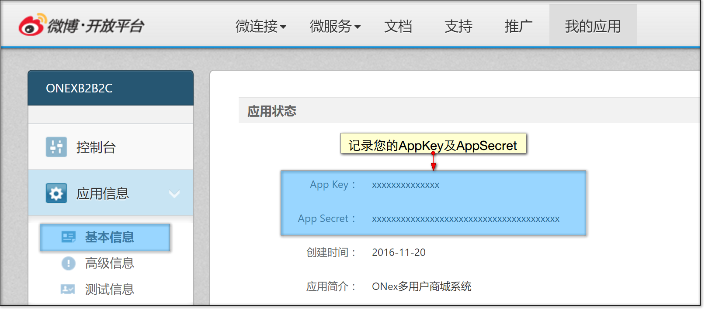

打开HBuilder，在app的manifest.json文件中启用‘OAuth(登录鉴权)’模块，将获得的App Key、App Secret填写到‘SDK配置’的‘新浪微博登录’中，之后便能在app中使用新浪微博登录了。

HBuilder的具体配置教程可以查看其[官方文档](http://ask.dcloud.net.cn/article/192)。

## <a id="2">社交化分享</a>

### <h2 id="2.1">微信内分享</h2>

首先请访问 mp.weixin.qq.com，登录您的微信公众平台帐号。

1、进入右侧菜单的'基本配置'，查看并记录自己的AppID及AppSecret

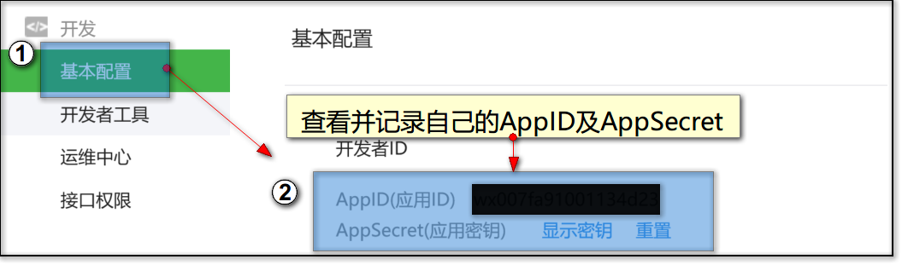

2、进入右侧菜单的'公众号设置'页面，选择'功能设置'标签页，找到'JS接口安全域名'，点击【设置】。

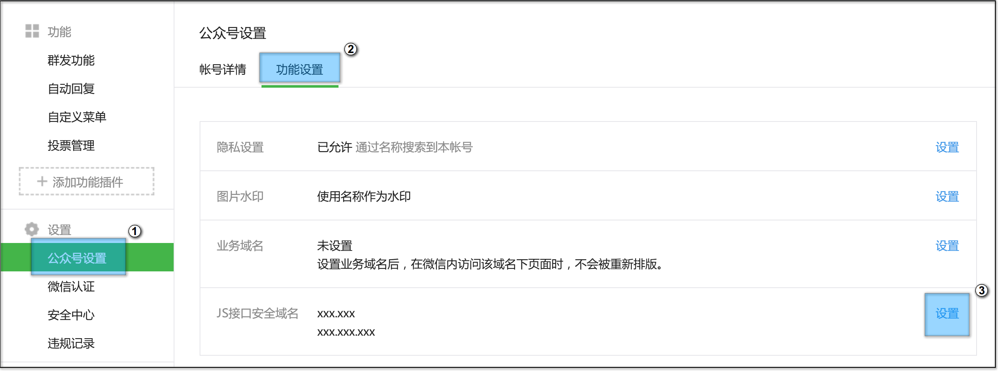

3、此处输入您要调用微信JS接口的域名，域名格式可以参考微信提供的格式要求。

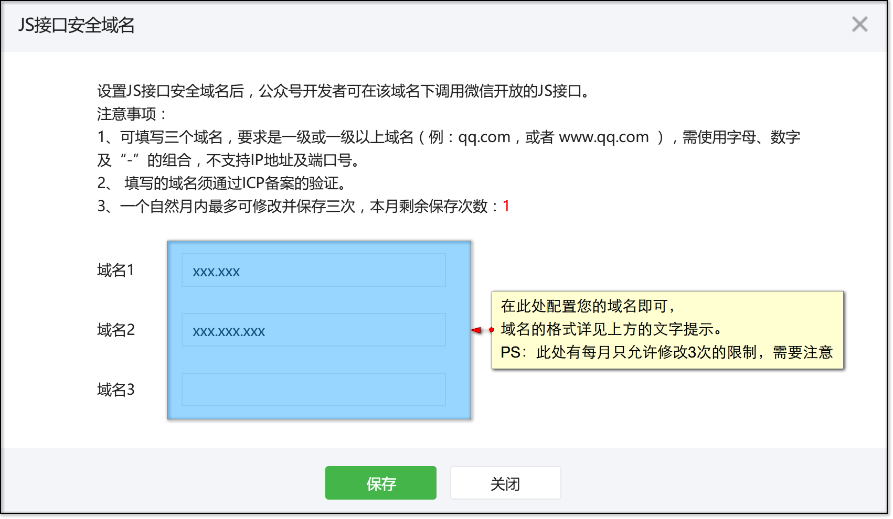

微信公众平台的配置到此为止，现在我们登录ONex-B2B2C的运营平台，进行微信分享配置。

进入平台后台的'站点'-'微信分享配置'页面，将之前从微信公众平台处获取的AppID和AppSecret输入对应表单，点击【确定】

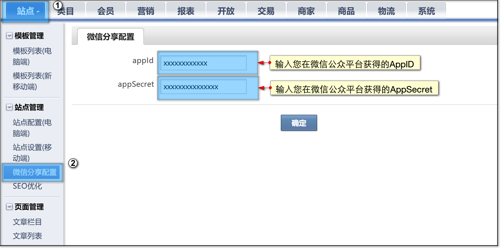

至此微信分享配置完成，快去微信上试试分享商品、活动和店铺吧.

下图为在微信中进行商品分享。

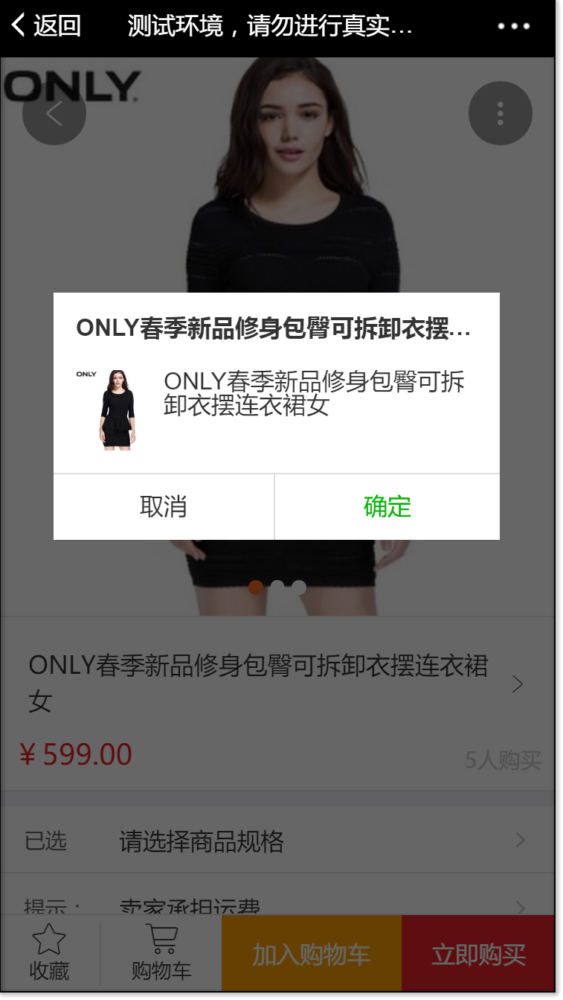

### <h2 id="2.2">APP分享</h2>

APP目前支持微信、QQ、新浪微博分享，要求的配置与APP信任登录一致，如果您尚未申请相关配置，请参考各个APP信任登录（[微信](#1.3)、[QQ](#1.4)、[新浪微博](#1.5)）的手册来进行申请。

申请到相关配置后，打开您的HBuilder，在app的manifest.json文件中启用‘Share(分享)’模块。

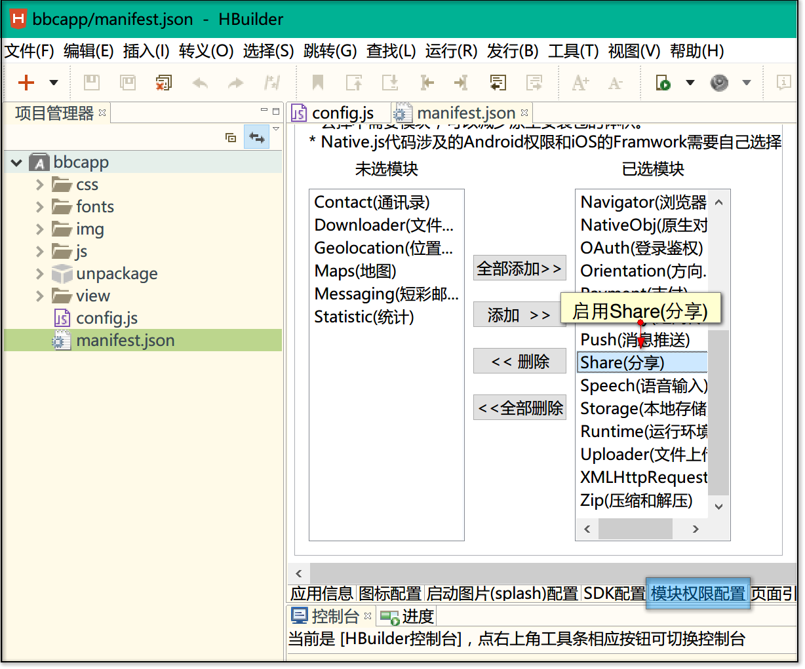

然后进入‘SDK配置’找到‘plus.share-分享’项，选择要开启的分享平台，输入相关配置，之后便能在app中使用分享功能了。

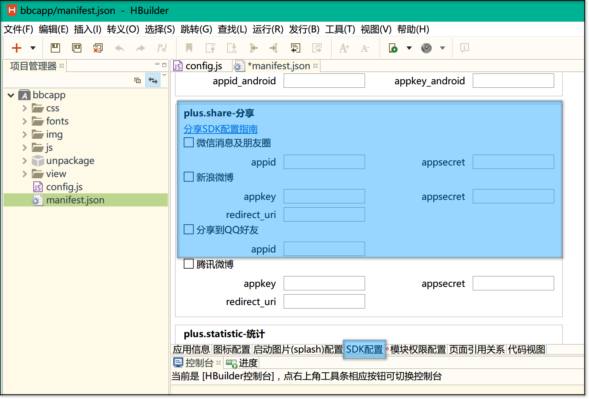

APP分享展示：

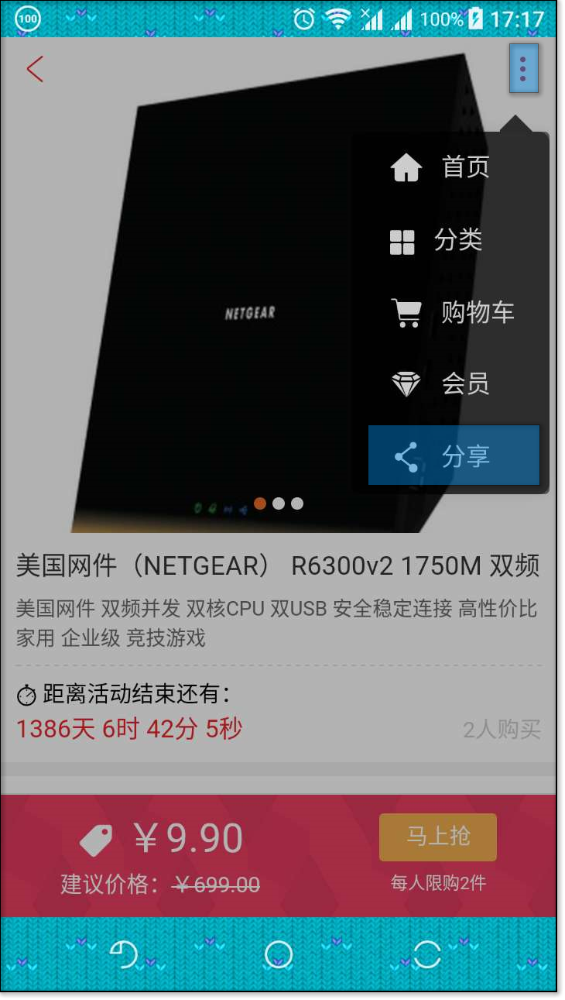

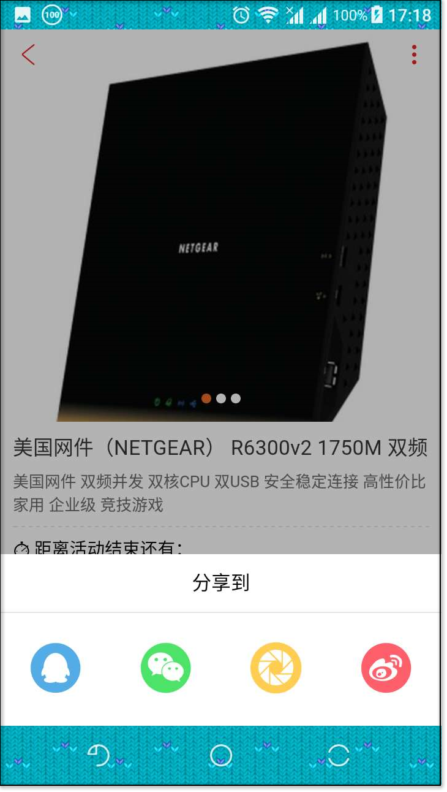
