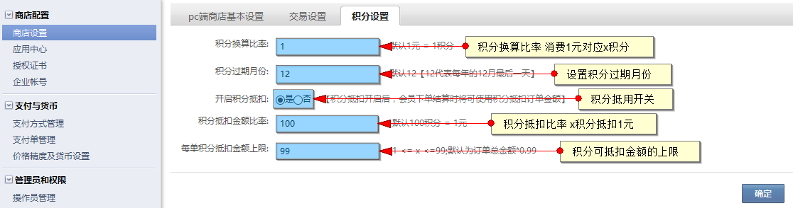

# 积分设置

运营商可在控制面板－商城设置－积分设置内设置积分相关内容

1、进入积分设置

积分换算比率：设置消费1元可获得x积分。如：设置10，消费1元可获得10积分

积分过期月份：可设置用户积分过期的月份。在自然年内获取的积分，当过了设置的过期月份则状态变为即将过期积分。次年过了该月份后积分过期（积分抵扣时会优先抵扣即将过期的积分）

开启积分抵扣：积分是否可以抵扣的开关

积分抵扣金额比率：x积分可抵扣1元。如：设置10，则10积分抵扣1元

每单积分抵扣金额上限：积分抵扣的金额占订单金额的上限设置，范围为1%－99%，且设置数据需为整数

