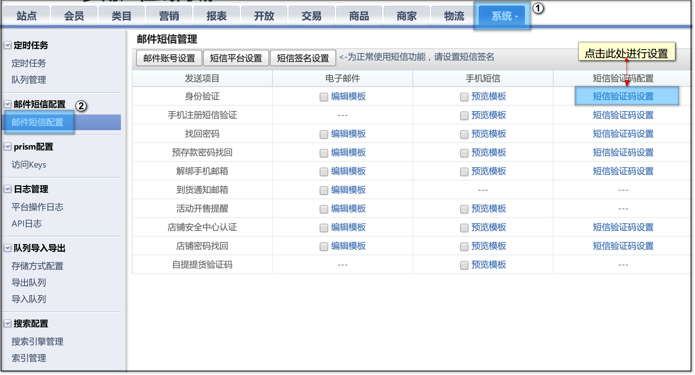
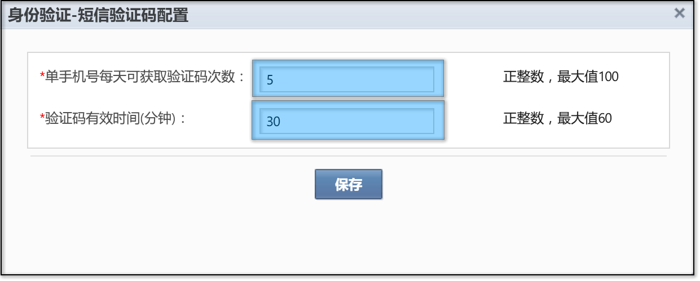

# 邮件短信配置

## 短信

### 短信验证码获取次数及有效时间

管理员可通过设置【短信验证码获取次数】来限制每个手机号每天所获取的短信数量；通过设置【验证码有效时间】来控制每个短信验证码的有效时间。

在【邮件短信配置】页面中，除了开售提醒、自提提货码外每个类型的短信都有【短信验证码设置】

【短信验证码设置】有两个配置项，【单手机号每天可获取验证码次数】及【验证码有效时间】

以上图为例：

【单手机号每天可获取验证码次数】设置为5，则每天每个手机号所能获取的短信验证码不得超过5条

【验证码有效时间】设置为30，则每条验证码的有效时长为30分钟，超过30分钟即会失效。

