# 模板管理

## 模板管理介绍

打开任意一个平台网站，看到的即为模板的前台表现形式。设计师根据创意做好页面文件，经过联动处理便成为模板，它可以改变前台所有的内容布局、颜色、风格等

模板可随时在后台进行更换、编辑后台，依次点击站点-模板管理-模板列表，可以看到当前使用的模板与已经上传的模板

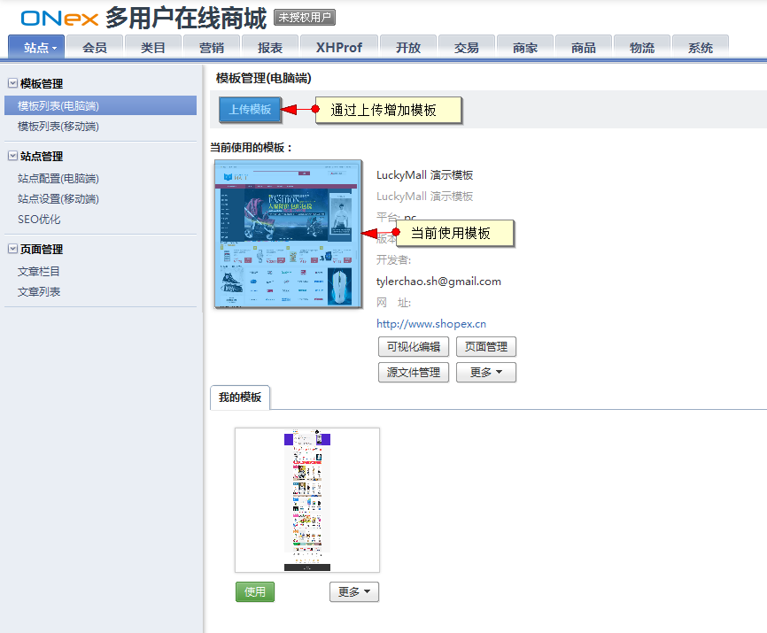

#### 安装模板

本地上传安装：已安装的模板可以下载，下载后会在本地生成新的模板文件，格式为 .tgz

在模板管理界面点击上传新模版

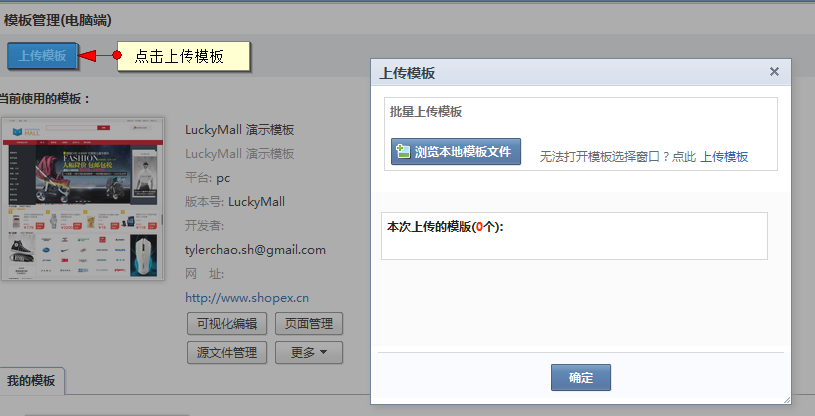

上传成功后会出现在模板列表中

#### 编辑模板页面

如果要修改当前模板页面中内容，或重新调整版块，就需要对模板进行编辑

进入页面管理

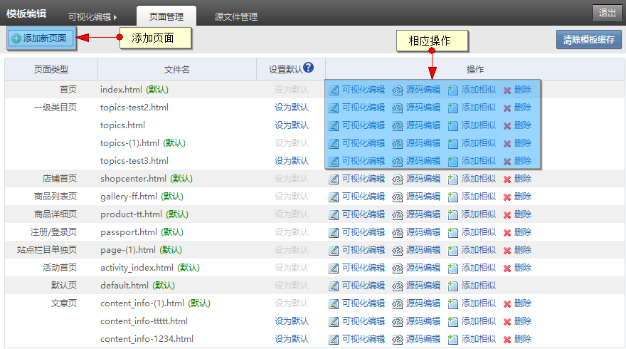

(1)、可视化编辑：为直接在前台页面上进行修改，较为直观，适合多数使用者

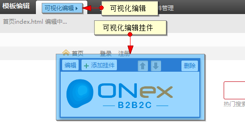

(2)、页面管理：在后端直接增加站点所需要的页面，其可多方面的对页面进行编辑

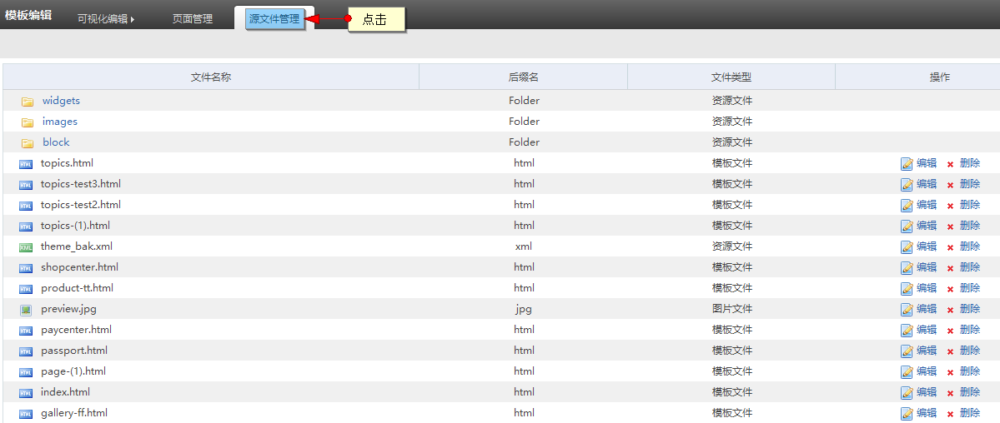

源码编辑：为通过代码编辑页面，适合专业人员使用

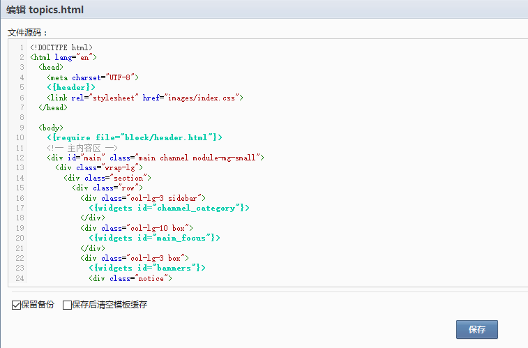

添加相似：可以为当前栏目增加相似页面，并对其进行编辑

删除：删除按钮就会永久删除此页面，用户在删除页面之前最好先做一下备份，以免删除之后带来的不便

(3)、源文件管理：管理模板中的的所有的文件，可直接在线修改更多：对模板整体对应的的操作项

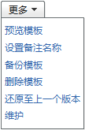

下载：将此套模板进行下载，下载默认的格式为tgz

设置备注名称：对此模板备注特定方便记忆的名字

备份模板：备份此模板

还原至上一个版本：备份后，误操作后可还原

维护：加了新挂件上去就要点下维护，否则可视化编辑里面看不到挂件

清楚模板缓存：删除模板多余缓存

## 模板中的版块说明

我们知道，在“拼图”游戏中，一个拼图是有很多拼块组成，拼块来回移动就可以组成一幅完整的拼图了。那么在平台模板页面中也是这样，一个页面就是一副拼图，而拼块就是版块（英文通常称为widget）。一个页面就是由多个版块组成，每个版块内置了常用的功能，这些版块可以在页面中随意移动，从而组成不同的页面

本小节包括4部分，通过本节操作，您可以对版块有深刻的认识，并可对版块进行日常维护

##### 1、版块常识

##### 2、模板中内置的版块种类

##### 3、版块的添加、删除与编辑

##### 4、模板备份

1、版块常识

设计师在完成一个模板后，通常其中已经包括了商店日常能用到的基本功能。上传模板后，直接启用就可以了，不需要再做特别的修改。在模板的每一个页面中，都是由若干个版块组成的

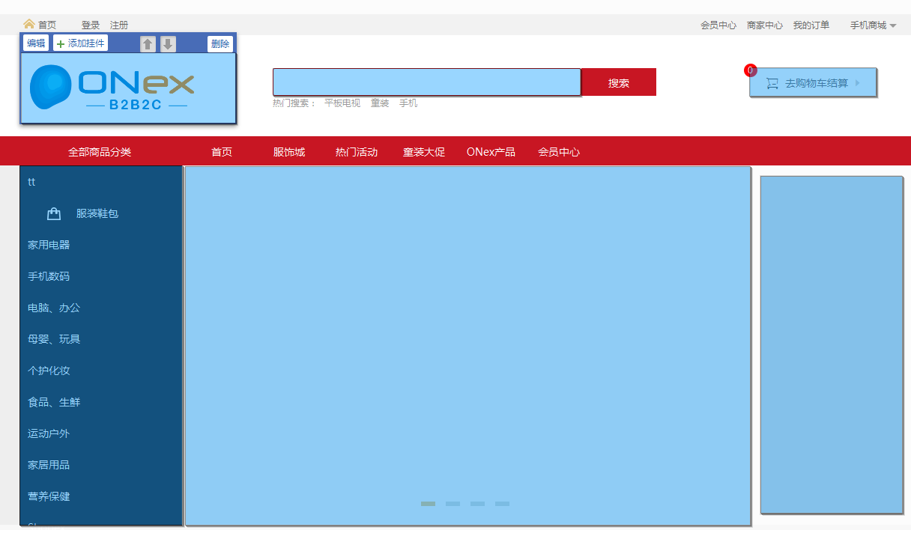

2、模板中内置的版块种类

模板中按前台表现形式对版块进行了分类，主要是 辅助信息，。、广告相关、商品相关、文章相关、商品挂件、积分兑换、购物车、注册登录等。每一分类包括了多种表现形式不同具体版块，如下例：

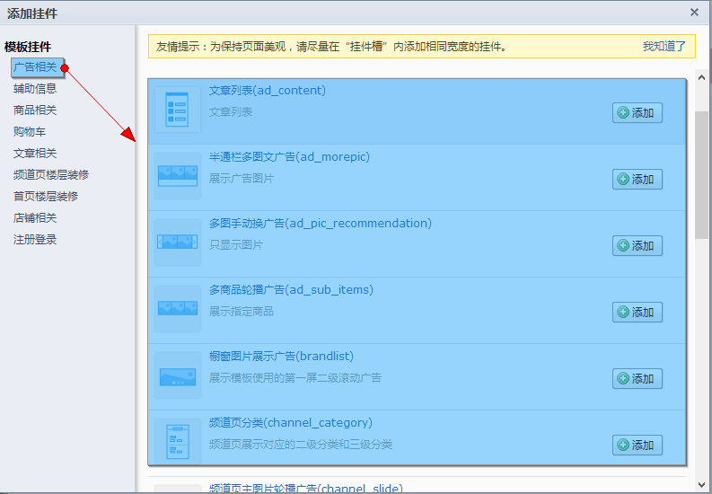

要添加某个版块时，先决定功能，再依次选择版块分类-具体版块就可以了，就如同在多个商品分类中选择商品一样

3、版块的添加、删除与编辑

当模板中原有版块已经不能满足需要时，可以添加相应的版块

比如，添加另一个商品广告版块：

进入模板管理页面，点击正在使用中的模板的“可视化编辑”按钮

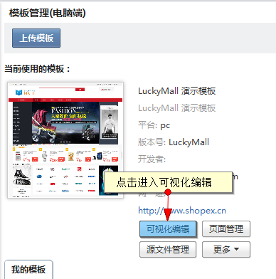

默认进入首页的可视化编辑，点击空挂件位，或点击任意已添加挂件的“添加挂件”按钮

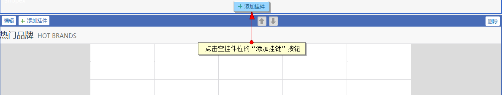

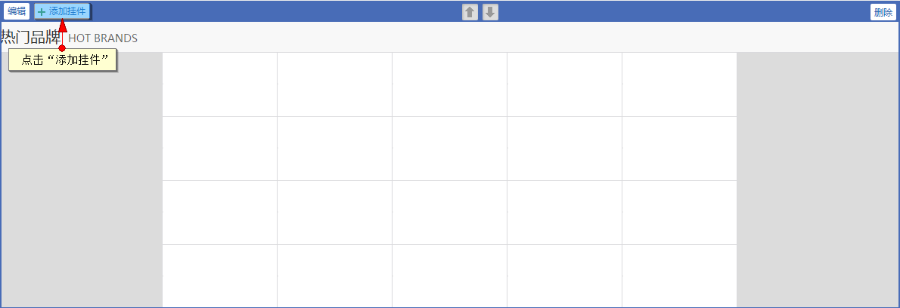

在弹出的挂件列表页中找到“半通栏图文广告”挂件，点击添加

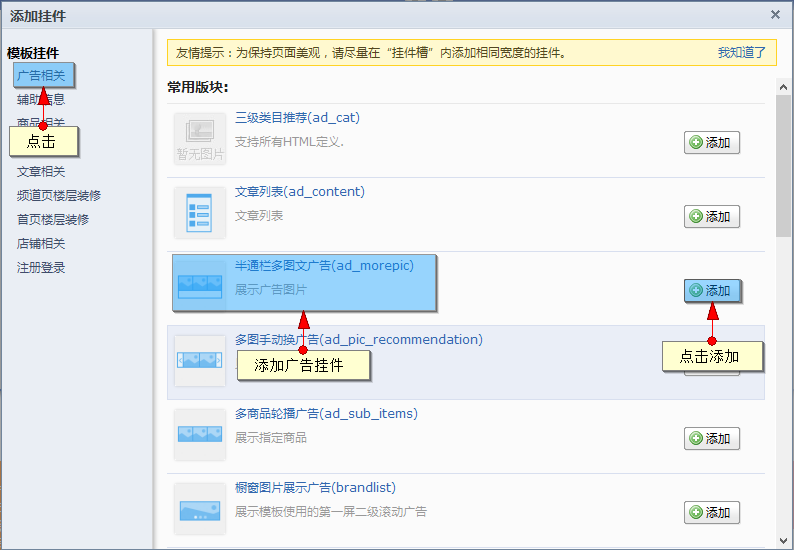

可对挂件进行内容编辑

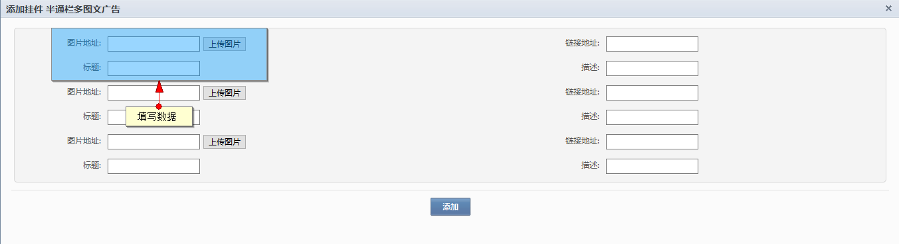

配置完后，保存修改，并保存模板后，挂件的添加就完成了

如果对已添加的挂件感到不满意，可以对挂件进行编辑和删除

在可视化编辑中，点击任意挂件的编辑按钮，可以对挂件进行编辑

4、模板备份

如果对模板进行了修改，则修改结束后建议对此模板进行备份，然后下载，保存在本地就可以了。

当出现问题时，可以利用备份文件进行恢复。
