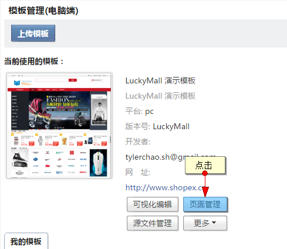
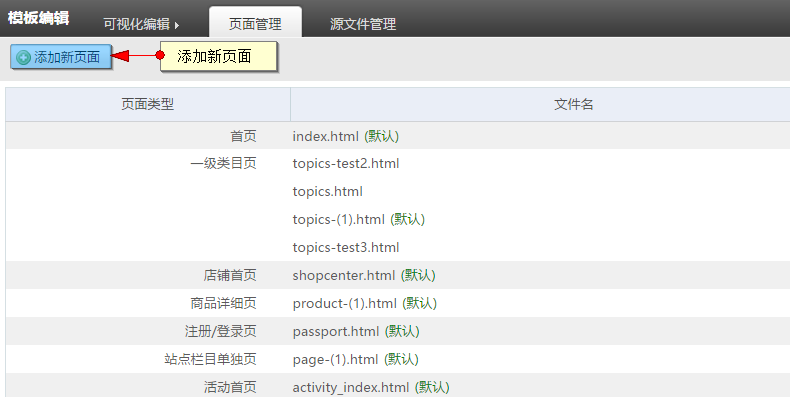
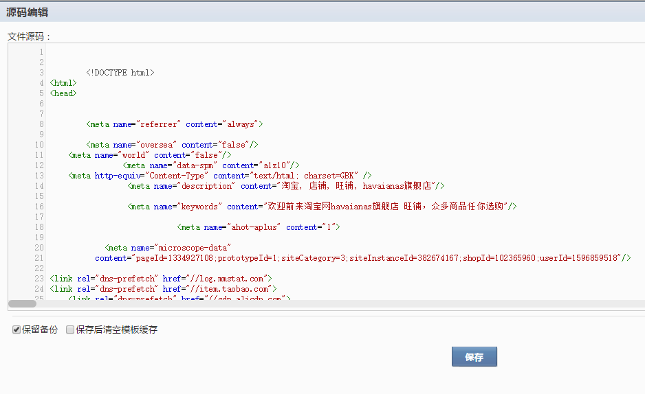
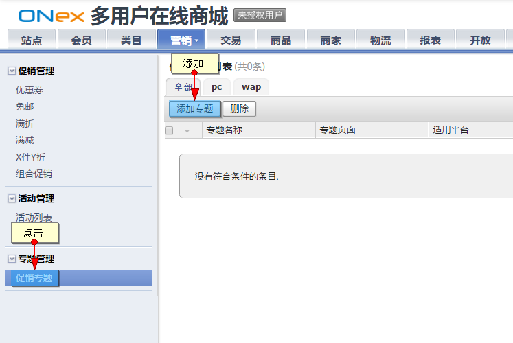
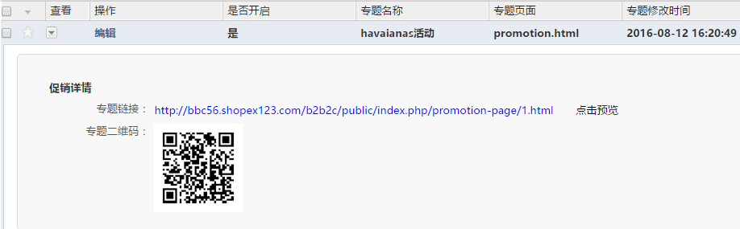
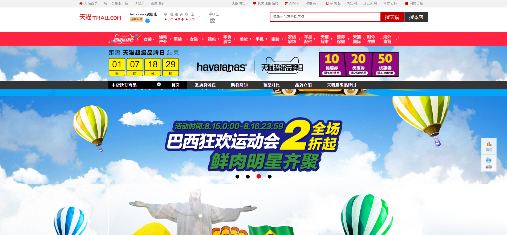

# 促销专题

平台后台提供了单独添加活动页面功能，主要分为页面添加与专题添加两部分

## 促销页面添加

用户首先需要在模板管理－页面管理内添加促销专题页

进入页面管理后，点击添加页面（促销专题页）

编辑专题页面内容后保存

## 促销专题添加

当专题页面添加后进入营销－专题管理内添加专题

进入专题管理页面后点击添加专题

专题页内选择模板处选择之前添加的专题页面，可以选择发布时间，发布后在前台才可显示

专题保存后展开可查看专题的链接和二维码，用于平台前台的配置

部署后前台的显示（如：天猫商城页面）

## wap端的专题添加与pc端一致
