# 类目管理

* [1 平台主分类](#1)
* [2 平台虚拟分类](#2)

## <a id="1">平台主分类</a>

* [添加主分类](#1.1)
* [为三级分类绑定品牌、属性及参数](#1.2)
* [编辑分类](#1.3)
* [删除分类](#1.4)

- - -

分类用于定义产品类目及品牌，可供商家入驻的时候选择其签约类目和品牌，以便规范商家的产品管理及销售行为；同时可针对类目设定服务费及费率

### <a id="1.1">添加主分类</a>

**添加一级分类**

后台依次点击“类目”-“分类列表”进入分类管理页，再点击“添加一级分类”即可添加一级分类。

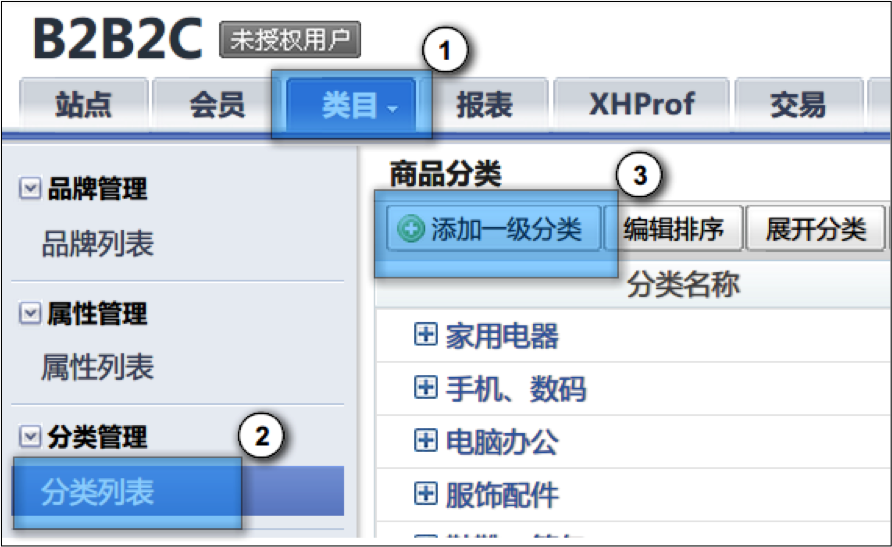

添加属性配置项说明：

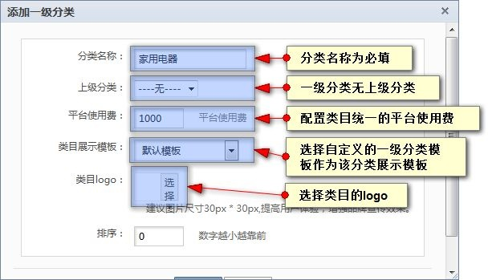

**添加二级级分类**

添加一级分类后，可以为一级分类添加二级分类，点击“添加二级分类”即可添加二级分类。

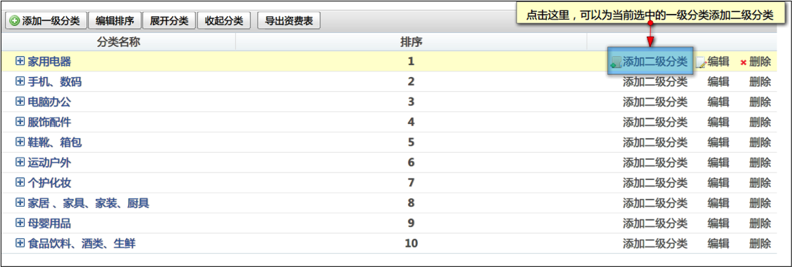

添加属性配置项说明：

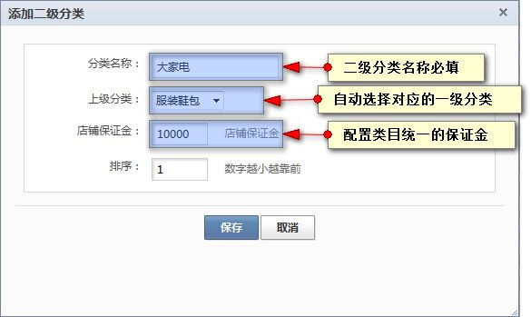

**添加三级分类**

添加二级分类后，可以为二级分类添加三级分类，点击“添加三级分类”即可添加三级分类。

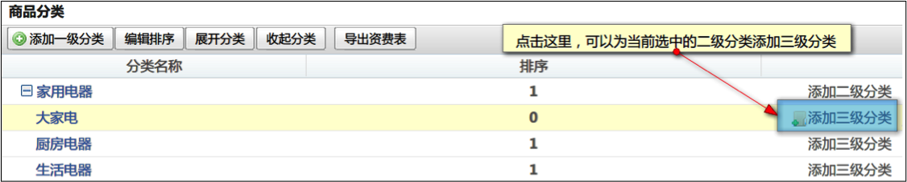

添加属性配置项说明：

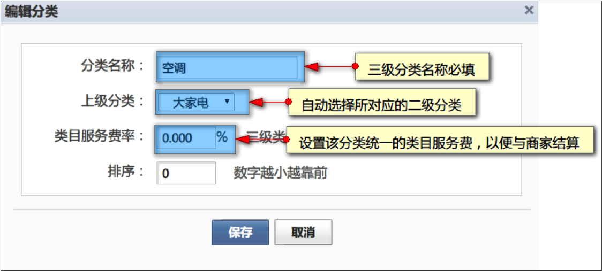

### <a id="1.2">为三级分类绑定品牌、属性及参数</a>

三级分类可以绑定品牌、属性及参数，以供商家添加商品的时候按规定设置商品数据，实现商品信息的规范化。

管理员可以在三级类目列表页中为任意三级类目绑定品牌、属性及参数。

在三级类目列表页中可以看到品牌、属性及参数关联项。

- 关联品牌
  点击品牌关联项即可对品牌进行关联。
  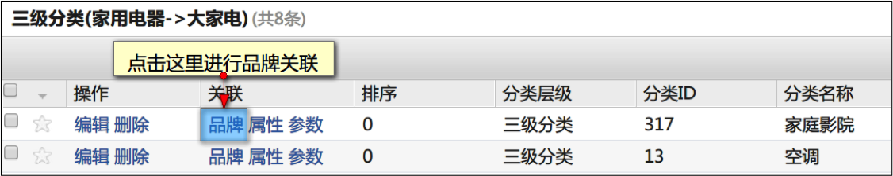
  选择需要关联的品牌
  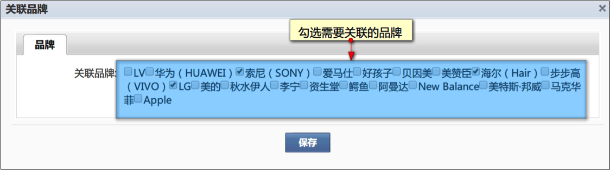
- 关联属性
  点击属性关联项即可对属性进行关联。
  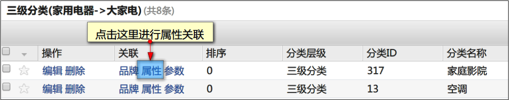
  选择需要关联的属性，一个三级分类最多关联3个销售属性，10个自然属性。
  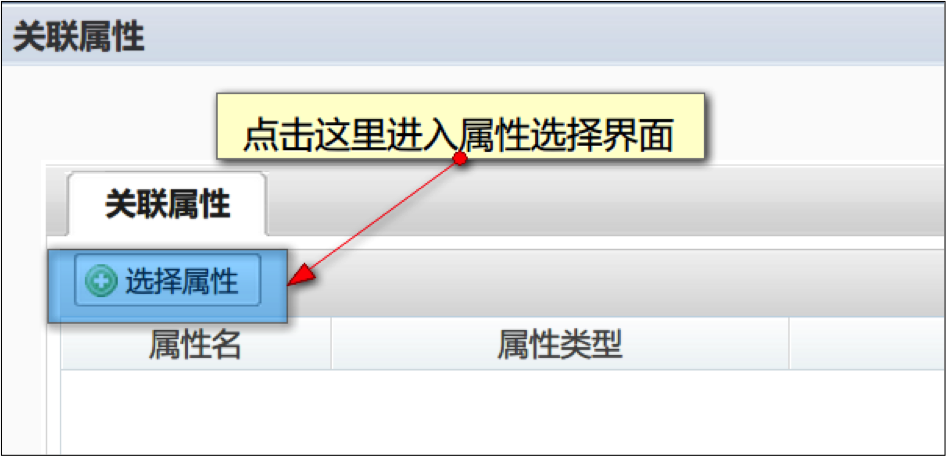
  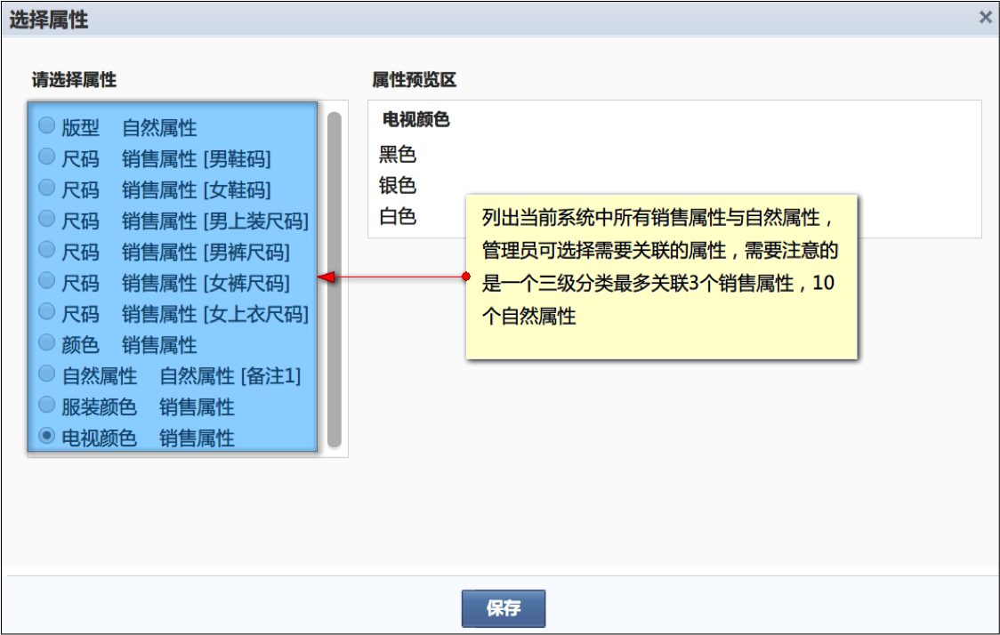
  选择的关联属性会显示在关联属性页面，管理员可以在此页面对所选择的属性进行排序及删除操作。
  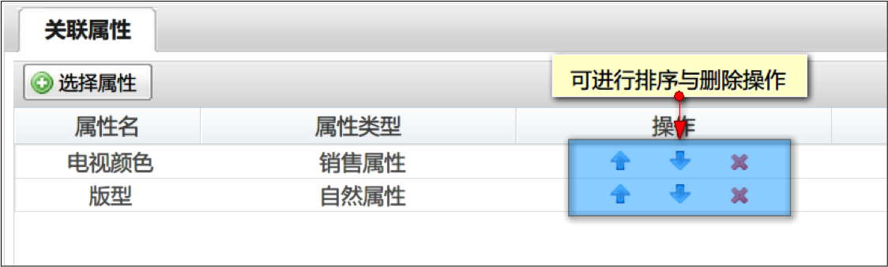
- 关联参数
  点击参数关联项即可对属性进行关联。
  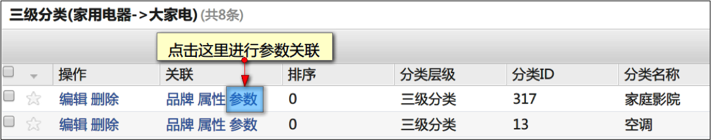
  参数是产品本身具体性能指标量化介绍说明，参数是用参数组管理的，需要先添加参数组，然后在组中添加参数内容。
  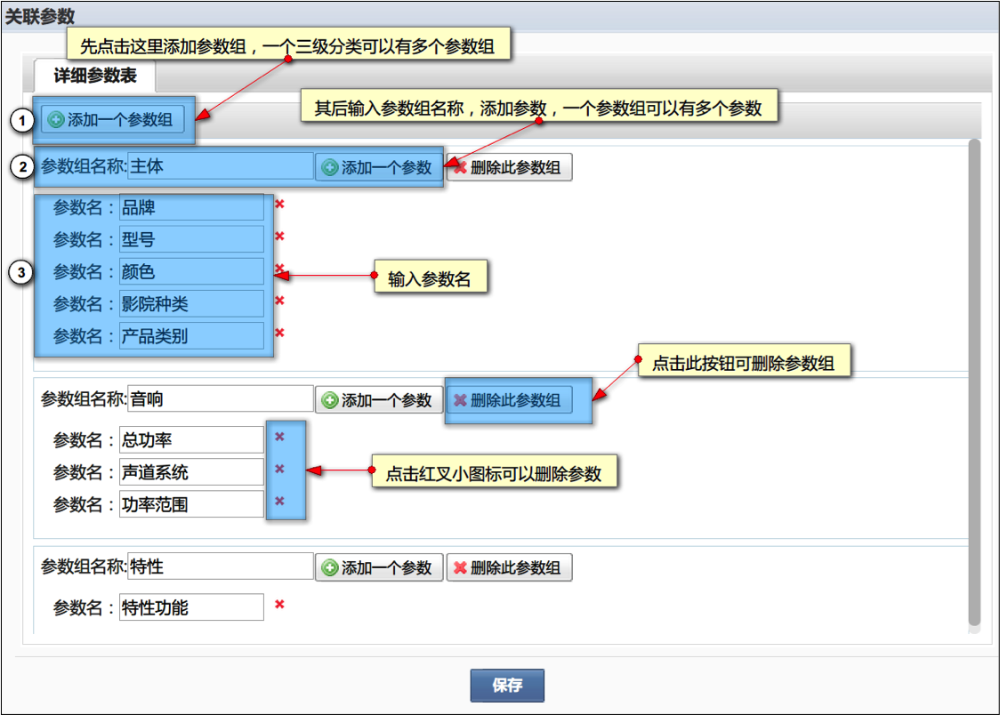

### <a id="1.3">编辑分类</a>

- 编辑一级分类
  点击一级分类的“编辑”操作项即可对一级分类进行编辑
  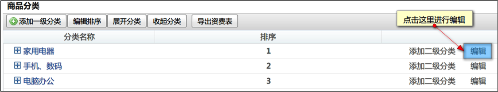
- 编辑二级分类
  点击二级分类的“编辑”操作项即可对二级分类进行编辑
  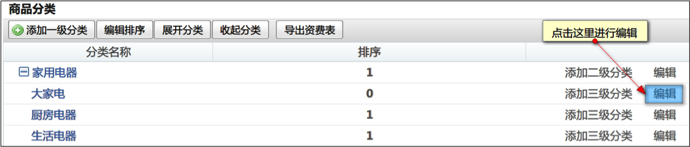
- 编辑三级分类
  点击三级分类的“编辑”操作项即可对三级分类进行编辑
  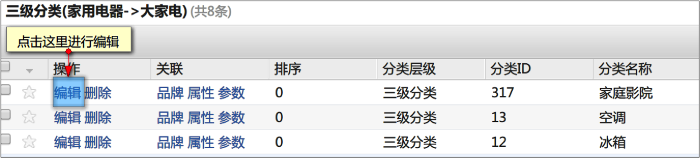

### <a id="1.4">删除分类</a>

- 删除一级分类
  点击一级分类的“删除”操作项即可对一级分类进行删除，如果一级分类下含有二级分类则无法被删除，需要先删除二级分类
  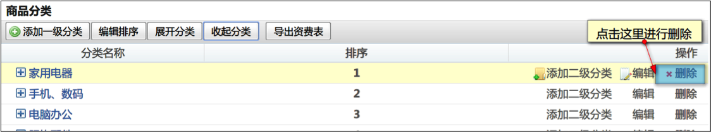
- 删除二级分类
  点击二级分类的“删除”操作项即可对二级分类进行删除，如果二级分类下含有三级分类则无法被删除，需要先删除三级分类
  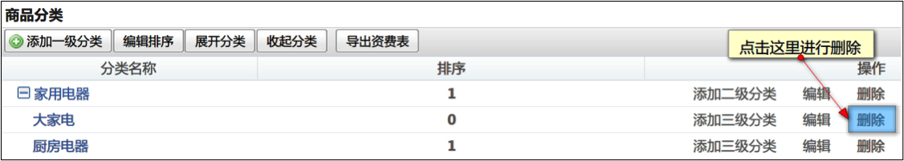
- 删除三级分类
  点击三级分类的“删除”操作项即可对三级分类进行删除
  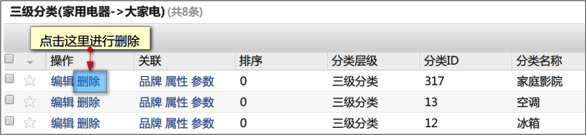

## <a id="2">平台虚拟分类</a>

* [PC端虚拟分类](#2.1)
* [H5/APP端虚拟分类](#2.2)

虚拟分类是把搜索结果当成分类名称的功能,是基于商品品牌、分类、价格、关键词签等搜索出来的结果形成的分类.虚拟分类相对主分类较为灵活.

### <a id="2.1">PC端虚拟分类</a>

#### <a id="2.1.1">添加PC端虚拟分类</a>

后台依次点击“类目”-“PC虚拟分类列表”进入PC虚拟分类列表页,具体的增删改流程可以参见[主分类的添加流程](#1.1),此处就不多加阐述了.

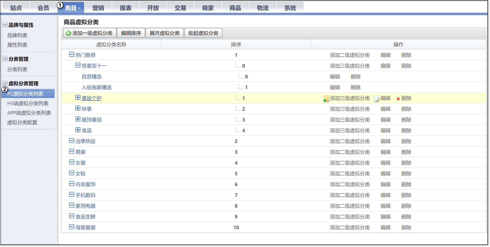

这里重点说下三级虚拟分类,您可以为三级虚拟分类设置筛选项或者自定义链接.

**筛选项:**

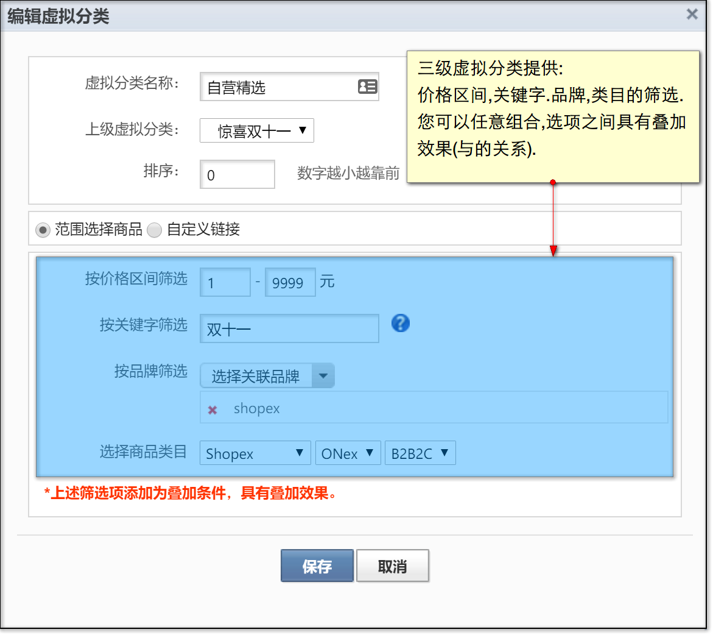

**自定义链接:**

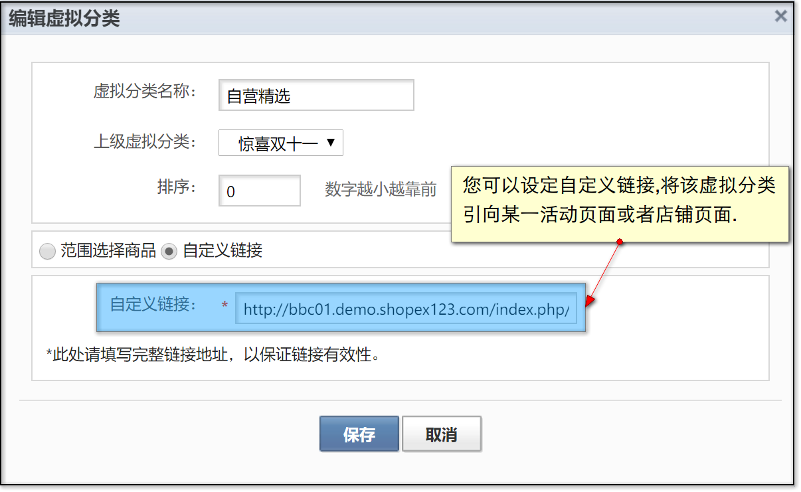

#### <a id="2.1.2">使用PC端虚拟分类</a>

PC端虚拟分类可以通过挂件来调用,在PC端模板中可以查找到'首页虚拟分类(item_virtualcat)'这个挂件,此挂件的位置与首页主分类挂件位置一致,您可以用虚拟分类挂件来替代主分类挂件.

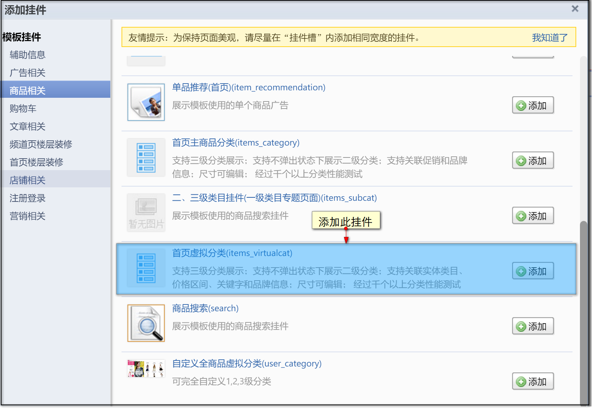

前台效果图:

### <a id="2.2">H5与APP虚拟分类</a>

#### <a id="2.2.1">添加H5/APP端虚拟分类</a>

H5/APP端的虚拟分类可以在后台“类目”-“H5/APP端虚拟分类列表”中进行管理,具体的增删改流程可以参见[主分类的添加流程](#1.1),此处就不多加阐述了.

#### <a id="2.2.2">使用H5/APP端虚拟分类</a>

H5/APP端虚拟分类的使用与PC的挂件方式不同,是以开关方式来呈现.
进入“类目”-“虚拟分类设置”页面,管理员可以在此处选择是否开启H5/APP端虚拟分类的前台显示.

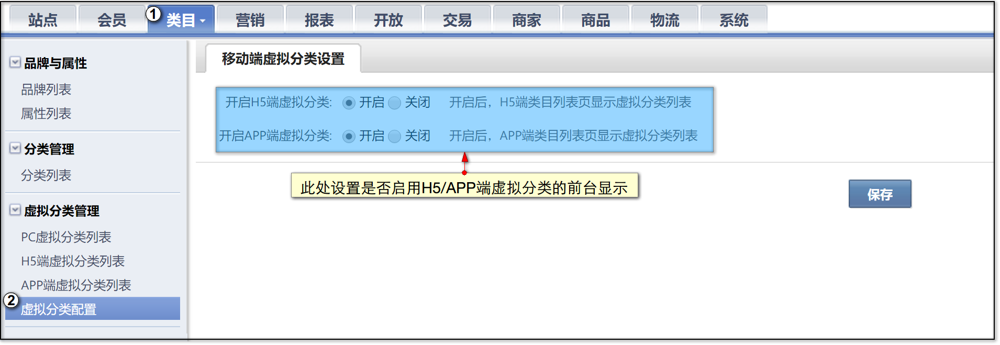

虚拟分类开始后,H5/APP端前台分类导航中的数据会切换为后台所设置的虚拟分类.

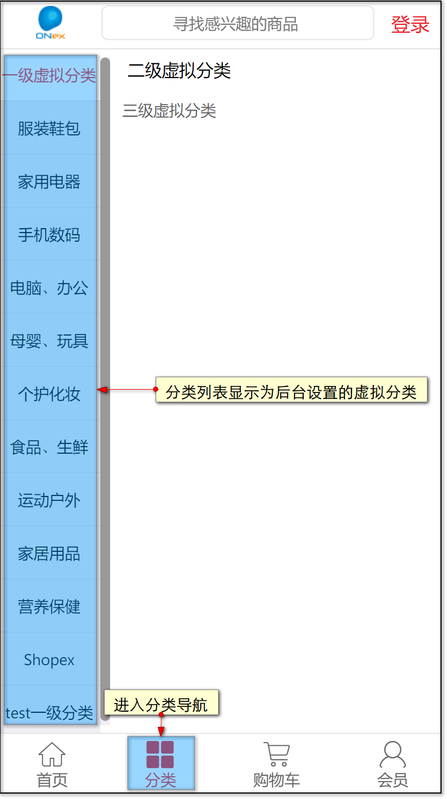

