# 促销管理-红包
* [1 红包](#1)
* [1.1 新增红包](#1.1)
* [1.2 编辑红包](#1.2)
* [1.3 红包状态](#1.3)
* [1.4 红包挂件](#1.4)
* [1.5 会员中心－我的红包](#1.5)
* [1.6 红包使用](#1.6)
* [1.7 随机红包](#1.7)

## <h2 id="1">红包</h2>

### <h2 id="1.1">新增红包</h2>
运营商可在营销模块，促销管理的红包菜单进入红包管理界面

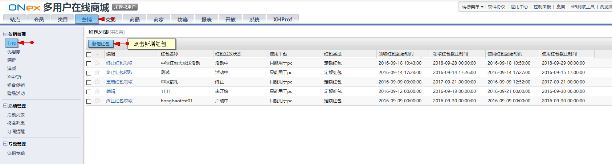
 
点击“新增红包”

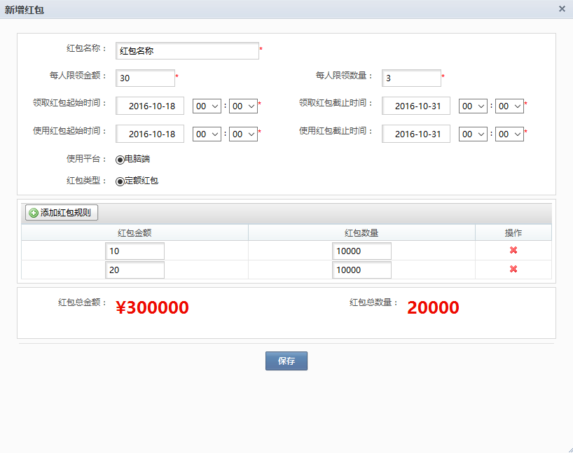

设置红包数据并保存

红包活动的相关数据：

限领金额：

该红包活动每个用户限制领取红包金额的上限

限领数量：

该红包活动每个用户限制领取红包数量的上限

领取红包时间：

设置红包领取的开始和截止时间，开始时间需大于当前时间

使用红包时间：

设置红包使用的开始和截止时间，开始时间需大于当前时间

添加红包规则：

可以添加多个红包规则，规则包含单个红包的金额，该金额规则的数量

红包总金额，数量

显示该红包活动中，所有红包规则的总数据（金额，数量）

### <h2 id="1.2">编辑红包</h2>

新增红包规则后，状态为未开启，需要再次编辑红包数据，选择开启红包领取

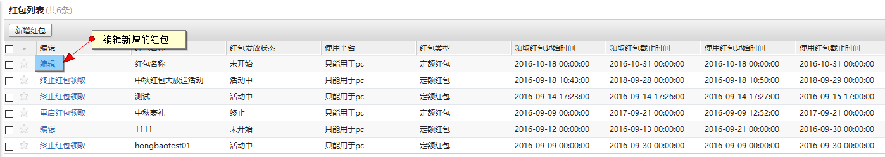

### <h2 id="1.3">红包状态</h2>
当开启红包领取后，可以在红包列表页终止或者重新开启红包的领取

### <h2 id="1.4">红包挂件</h2>

红包数据添加后，可在模板内添加红包挂件

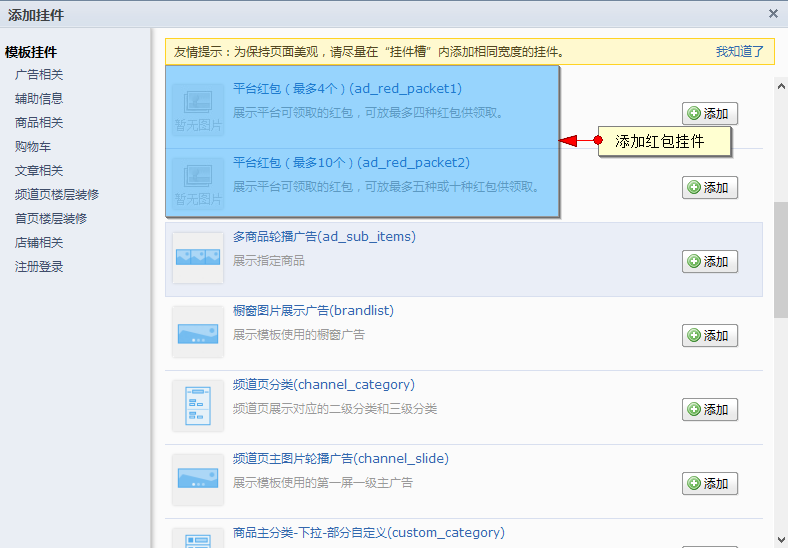

可以选择两个类型的红包挂件（最多4个红包数据展示挂件，最多10个红包数据展示挂件）

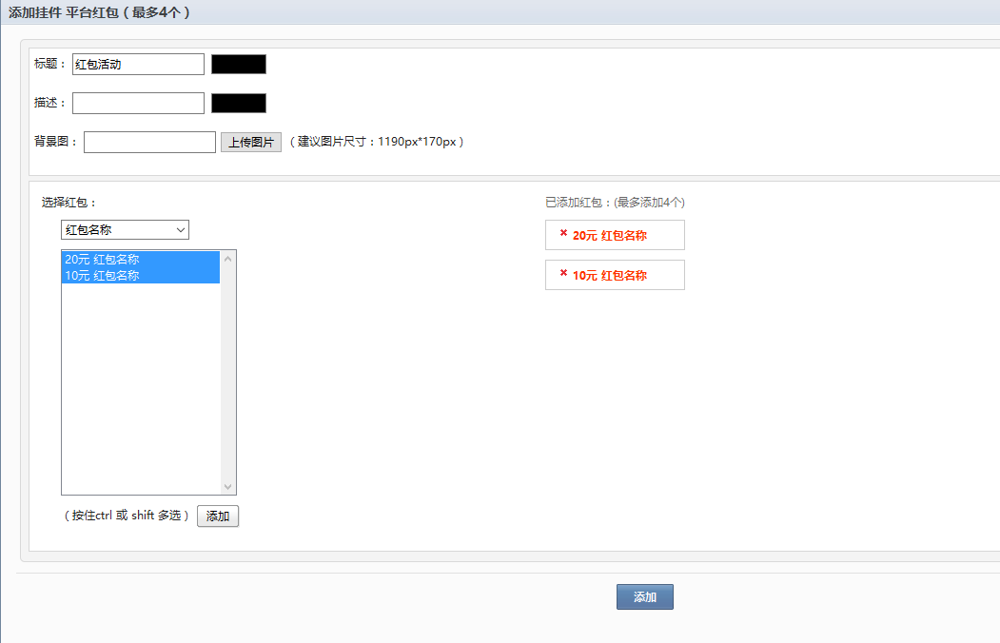

添加后在前端的展示

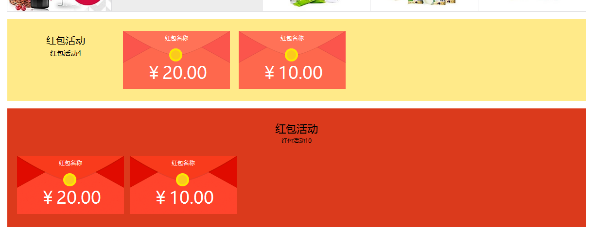

### <h2 id="1.5">会员中心－我的红包</h2>

当成功领取红包后，可在会员中心我的优惠－我的红包处查看我的红包

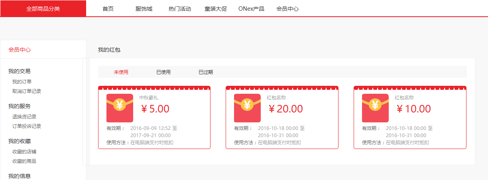

### <h2 id="1.6">红包使用</h2>

在订单结算时可以选择使用红包

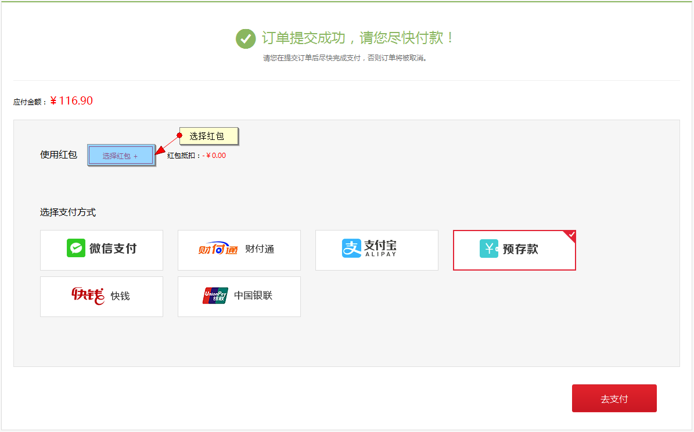

选择需要使用的红包

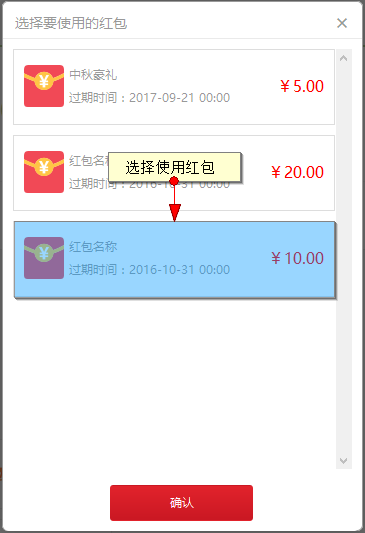

使用后扣减相应红包金额

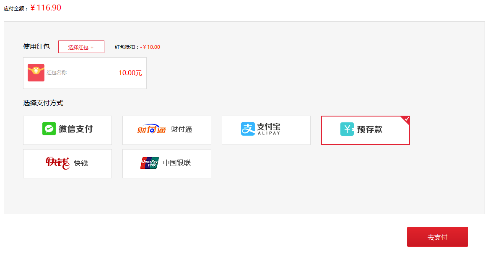

付款后会展示支付的状态

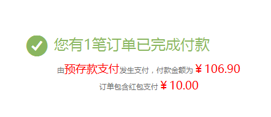

### <h2 id="1.7">随机红包</h2>

红包类型除定额红包类型外还有随机红包类型

红包总数： 小于等于 红包总金额*100

最小红包： 会出现的最小金额为(0.01)

最大红包： 会出现的最大金额为（人均金额*2）

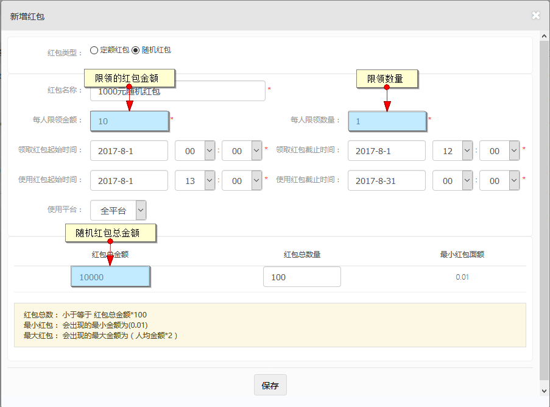

领取随机红包

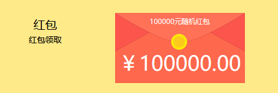

点击后会随机生成一个随机金额的红包

