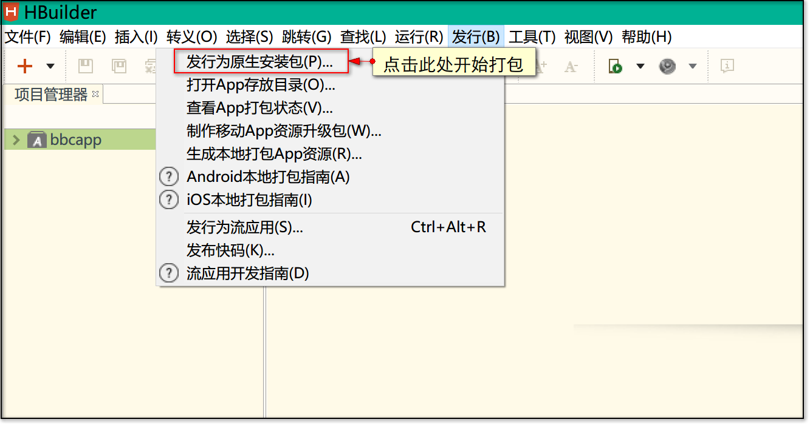
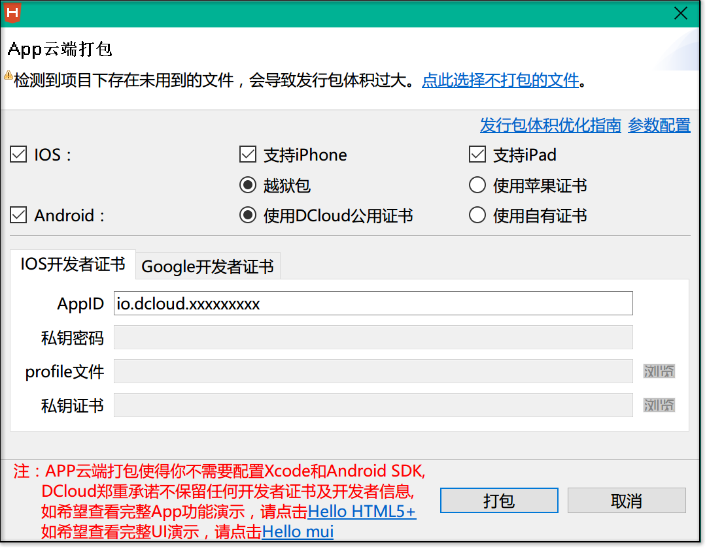
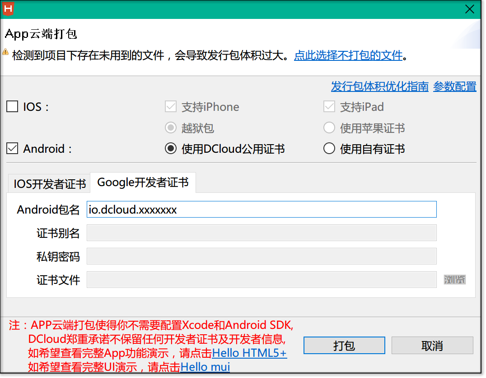

# APP管理

* [1 如何打包app](#1)

## <h2 id="1">如何打包app</h2>

首先您需要下载DCLOUD的编译工具[HBuilder](http://www.dcloud.io/index.html)

打开HBuilder，导入您的app项目，然后选中项目，点击顶部菜单中的【发行】，选择【发行为原生安装包】，HBuilder会弹出打包界面，您可以自行选择系统平台（IOS/Android）。这里我们使用DCLOUD自带的证书来生成打包文件，IOS和Android应用的自有证书生成方法请自行百度。

**IOS:**

**Android:**

选择完毕后，点击【打包】按钮便会开始打包，之后一路确定即可打包成功，如果途中出现提示有配置未完成（比如应用图标、开机图标没有配置），请根据提示在manifest.json文件中修改后再次打包即可。

