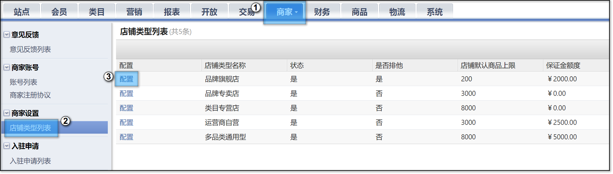
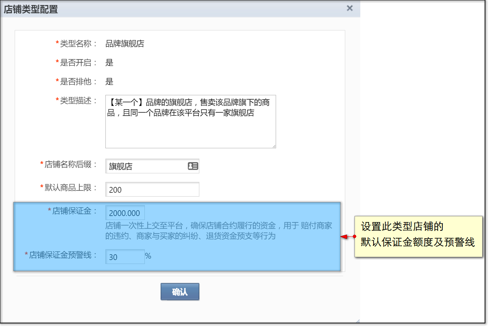
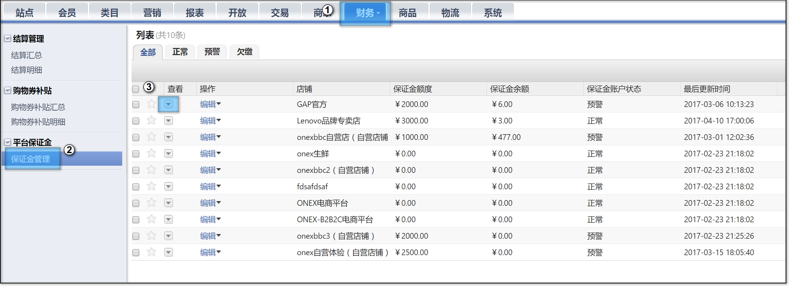
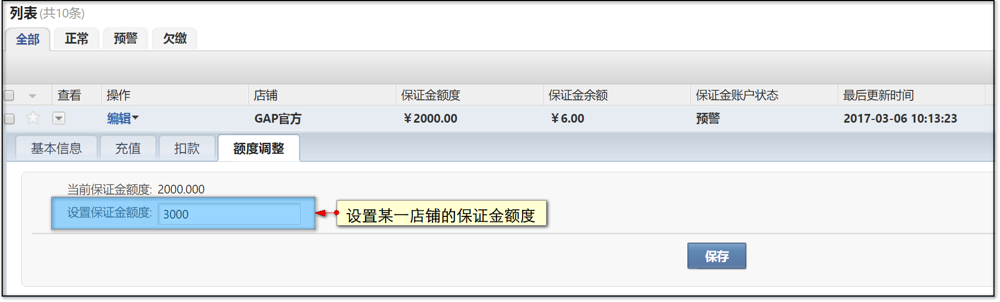
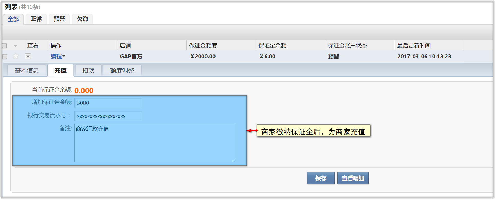
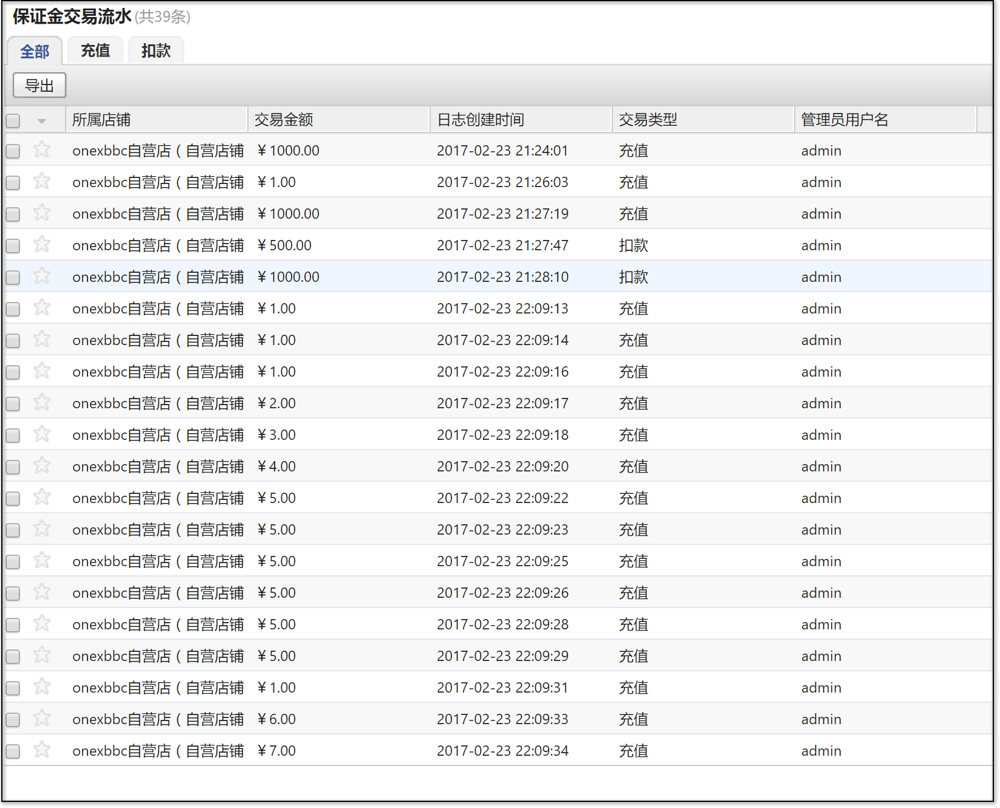

# 保证金管理

* [1 设置默认保证金](#1)
* [2 针对某一店铺设置保证金](#2)
* [3 保证金充值与扣款](#3)
* [4 保证金状态说明](#4)

**本文针对运营平台对于保证金的管理，商家如何查看保证金，详见此[页面](../300.shopCenter/1400.shop-guaranteeMoney.md)**

保证金是为了更好的保障消费者，提升卖家的服务水平和商品质量，所产生的一种基金。用于处理异常订单、消费者赔付、商家处罚的业务场景。

PS：3.1.9、3.1.10版本的用户，请先至【应用中心】安装【财务系统】应用，方可开启保证金管理。

_ _ _

## <a id="1">设置默认保证金</a>

管理员可以为每个店铺类型设置统一的保证金额度，新开通的店铺默认使用所属店铺类型的保证金额度。

进入【商家】-【店铺类型列表】，点击任意店铺类型的‘配置’按钮。

进入【店铺类型配置】界面可以看到‘店铺保证金’和‘店铺保证金预警线’配置项。

**店铺保证金**：即该类型店铺的默认保证金，新入驻的店铺默认使用此保证金额度。

**店铺保证金预警线**：即商家保证金余额的预警线，低于预警线系统会自动发送通知提醒商家及时充值保证金。

## <a id="2">针对某一店铺设置保证金</a>

除了设置统一的保证金额度，管理员也可为某一店铺单独设置保证金额度。

进入【财务】-【保证金管理】，点击任意店铺的‘展开’按钮。

选择‘额度调整’标签，可以为此店铺单独设置保证金额度，在此处设置后，该店铺就不会使用所属店铺类型的默认保证金额度，而是使用此处所设置的值。

## <a id="3">保证金充值与扣款</a>

当商家线下缴纳保证金后，管理员可以为商家充值保证金。

选择‘充值’标签，输入商家充值的金额，便能为商家充值保证金。

当商家存在违规举动时，可对商家的保证金进行扣款。

选择‘扣款’标签，输入需要扣除的金额，便能扣除商家的保证金。

想要查看某一店铺的保证金充值、扣款记录，可以点击按钮查看保证金的流水。

## <a id="4">保证金状态说明</a>

保证金分为状态：正常、预警、欠缴

正常：即正常，无需处理

预警：保证金余额低于预警线，系统会自动发送通知提醒商家。

欠缴：保证金余额出现负数，此时商家将会被冻结结算（欠缴店铺在‘结算汇总’页面不会出现‘确认结算’按钮），待保证金状态正常时才会解冻，冻结期间结算单正常产出。

