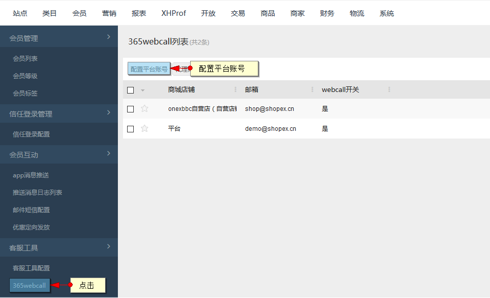
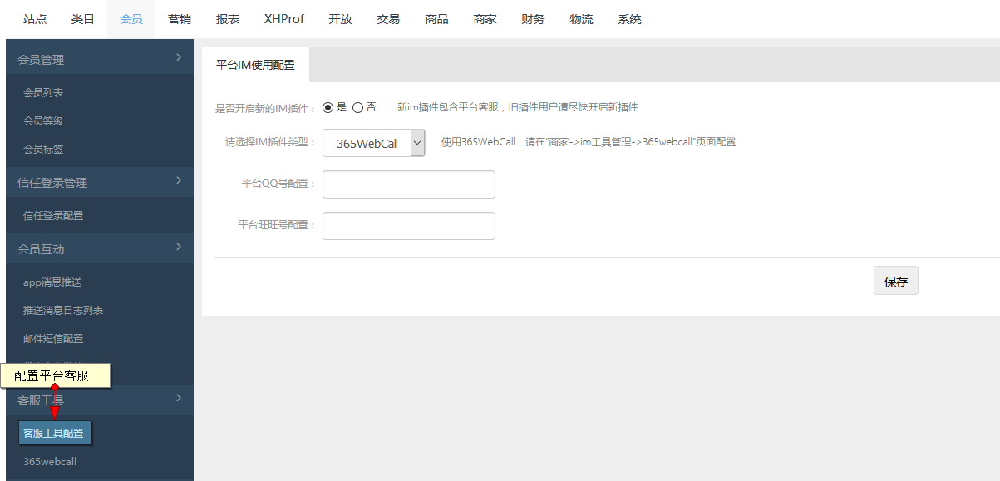
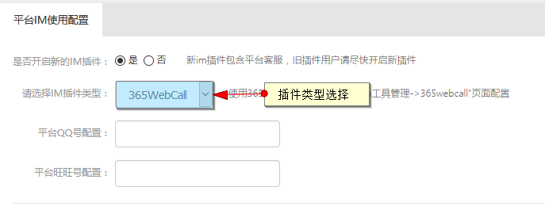
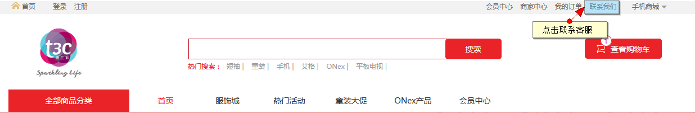

# 客服工具

## 365webcall

365webcall智能在线客服系统是一种运用于网站的客户营销工具，可能使访客在不下载，安装客户端的前提下与网站方进行交流，网站方也可主动与访客交流。

配置平台账号

在会员-客服工具-365webcall处配置平台账号

在用户注册了365webcall账号的情况下进行配置

配置完成后将用于客服工具配置

## 客服工具配置
 
 在会员-客服工具-客服工具配置处进行平台客服配置
 
 
 
 客服工具可选择IM插件类型：365webcall，qq，旺旺
 
  

配置后在平台顶部“联系我们”处进行使用

 