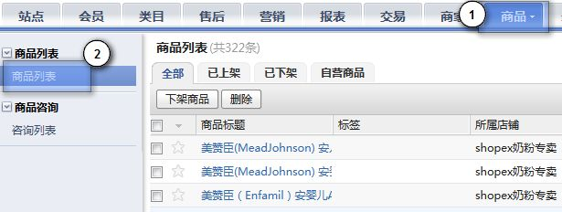
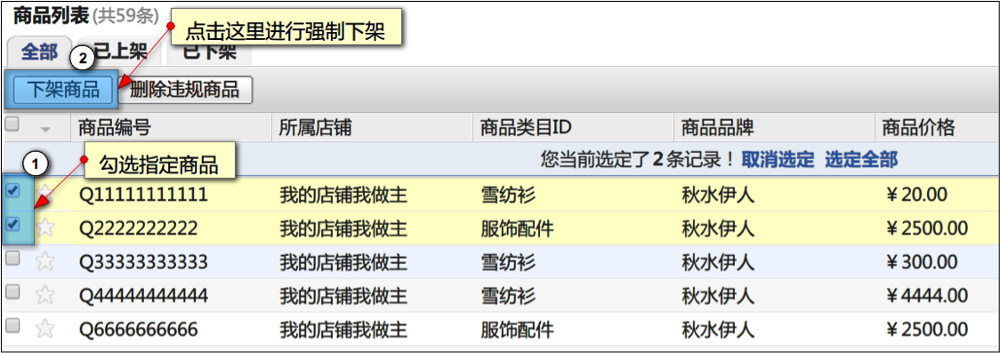
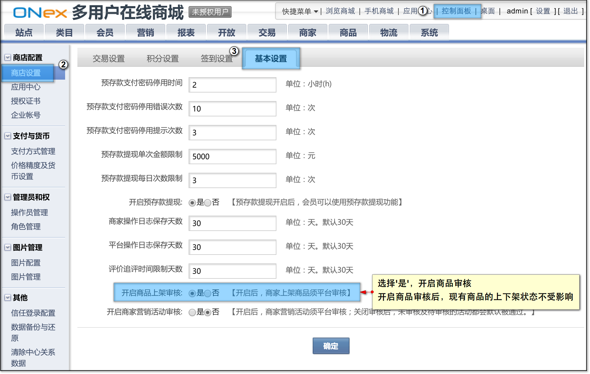
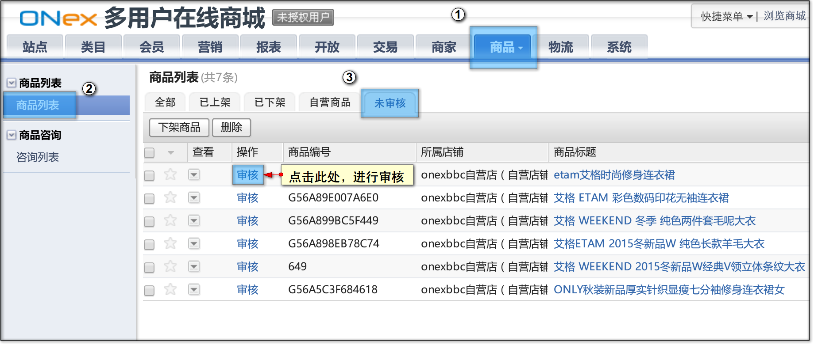
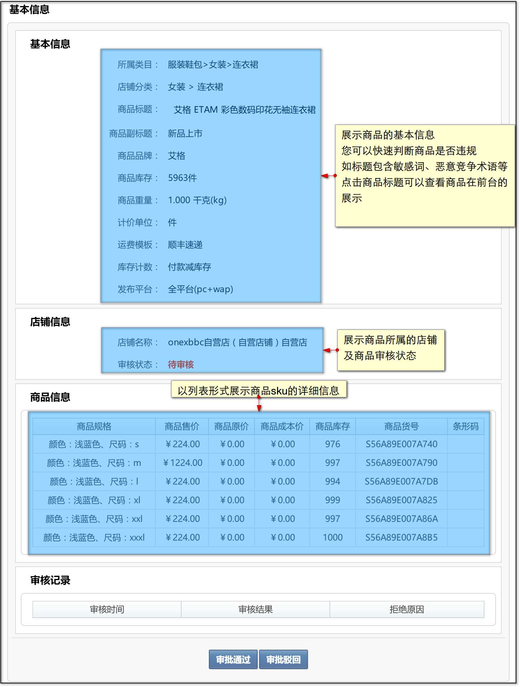
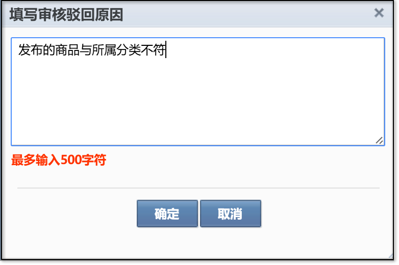
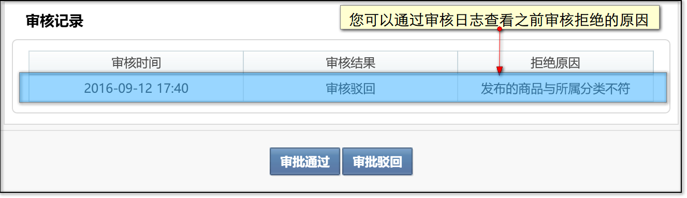

# 商品管理

* [1 商家商品列表](#1)
* [2 商品强制下架](#2)
* [3 商品审核](#3)

## <a id="1">商家商品列表</a>

### 如何查看商品列表？

后台依次点击“商品”-“商品列表”即可进入商品列表页查看平台所有商品。

 
## <a id="2">商品强制下架</a>

## 什么是商品强制下架？

管理员可以对指定商品进行强制下架，以快速处理劣质及违规商品的投诉。

## 如何对商品强制下架？

## <a id="3">商品审核</a>

*此处为平台方的审核操作，商家提交审核请详见[此处](../300.shopCenter/400.goods-manager.md)*

管理员可以在【控制面板】-【商店设置】-【基本设置】中开启商品审核功能（系统默认关闭）。

商品审核功能一旦开启，商家发布的商品必须经过平台审核才允许上架，不过开启此功能前就已上架的商品不受影响。

开启商品审核功能后，商品列表页面会出现一个【未审核】标签，各商家提交审核的商品便会显示在此页面内。

点击任意商品的【审核】按钮即可对商品进行审核操作。

在弹出的审核界面中，您可以通过查阅【商品基本信息】、【店铺信息】、【商品信息】来快速定位商品是否违规。另外，您可以通过点击【商品标题】来查看商品在前台的展示，通过查阅前台的展示来判断商品图片及图文详情中是否含有违规图片。

当发现商品含有违规信息时，您可以点击来拒绝商品上架，输入驳回原因后，点击【确定】，商品的审核请求便被成功驳回。

商家通过您给予的驳回原因，重新修改商品并再次提交审核，此时您可以通过商品审核界面中的【审核记录】来查看之前拒绝的原因。

在确认商家修改了违规内容并且商品无其他违规内容后，您可以点击来确认审核，审核通过后，商品便会成功上架。

