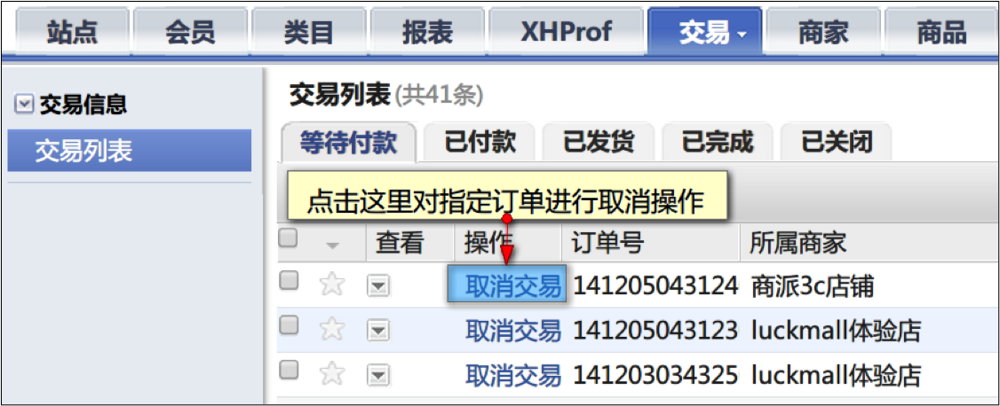
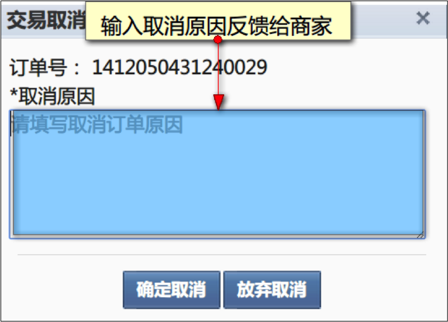
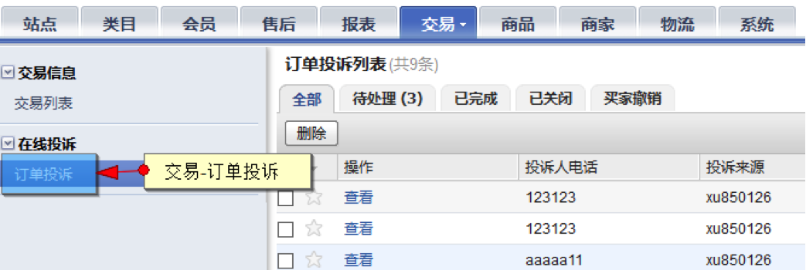
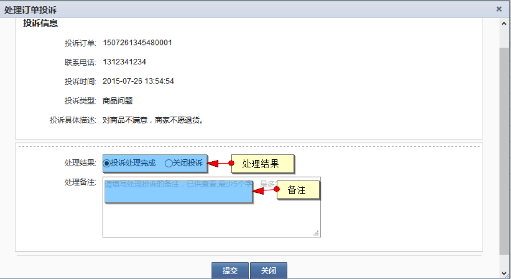

# 交易管理

* [1 商家订单列表](#1)
* [1.1 如何查看订单列表](#1.1)
* [1.2 未付款订单取消](#1.2)
* [2 订单投诉](#2)
* [3 预存款提现](#3)

## <a id="1">商家订单列表</a>

### <a id="1.1">如何查看订单列表？</a>

后台依次点击“交易”-“订单列表”即可进入订单列表页查看平台所有订单。

 
### <a id="1.2">未付款订单取消</a>

运营方可以根据情况特殊性对未付款订单进行取消。

#### 如何取消未付款订单？

管理员在订单列表点击任意未付款订单的“取消交易”操作项即可取消订单（已付款订单无此操作项）。

取消订单的同时可以反馈取消原因给商家。

## <a id="2">订单投诉</a>

> 本段针对运营平台的订单投诉操作流程，关于会员的投诉处理，[详见此处](../400.mall/300.order-complaints.md)。

运营商在接受到投诉后可对投诉状态进行改变

点击处理

## <a id="3">预存款提现</a>

预存款提现，请详见[此处](../200.platform/2200.pre-deposits.md#4)。

