# 会员管理

## 会员列表

### 如何查看会员列表？

后台依次点击“会员”-“会员列表”即可进入会员列表页查看平台所有会员。

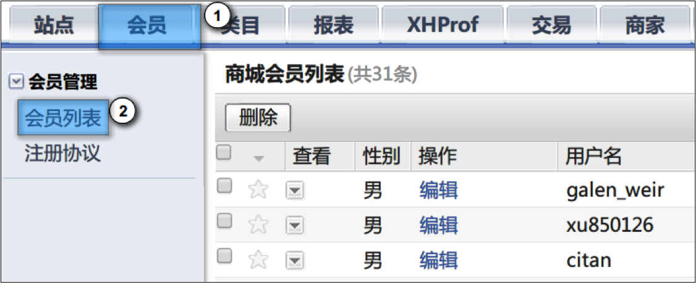

## 会员编辑

### 管理员能够修改会员那些信息？

会员可以通过联系管理员申请修改部分会员信息，包括会员昵称、会员性别、会员生日，但是会员名称、会员电话、会员email 管理员无权修改。

### 如何对会员进行编辑？

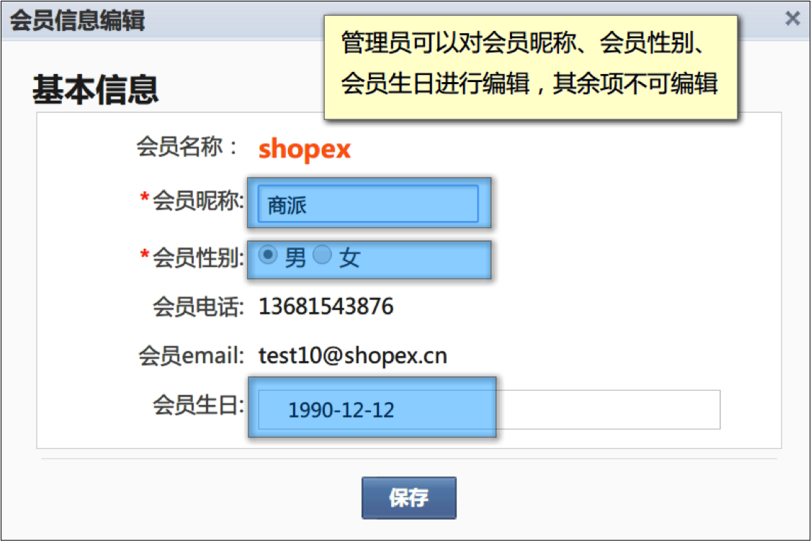
 
## 会员等级

### 会员等级

一般情况下，商店中会有多个会员等级，不同等级的会员可以享受不同的折扣价格，这样可以吸引会员持续消费。同时可以根据积分设置会员升级的标准，积分越多会员等级越高，享受的折扣越低。完整的会员体系可以方便商家对会员进行管理，同时也会给会员本身带来一定的便利。
本小节包括3部分，通过本节操作，您可以为商店设置丰富的会员等级
- 会员等级说明
- 编辑与添加会员等级
- 会员等级在会员中心的表现

- 会员等级说明
  对会员来说，是用成长值来划分不同的会员等级，例如成长值0-1000分为普通会员，成长值10000以上的为黄金A会员，每个等级折扣不同。如下图所示

  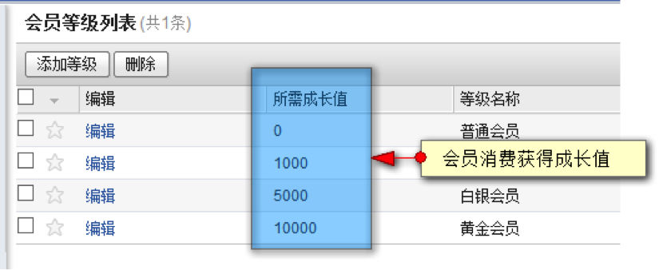
  
> **说明** 当会员的成长值达到升级标准后会自动升级

- 编辑与添加会员等级
  编辑会员等级与添加会员等级界面相同，参照操作即可。
 
> **例如** 添加一个零售会员等级“铂金会员”
> 运营商后台，依次点击 会员－会员等级-添加等级

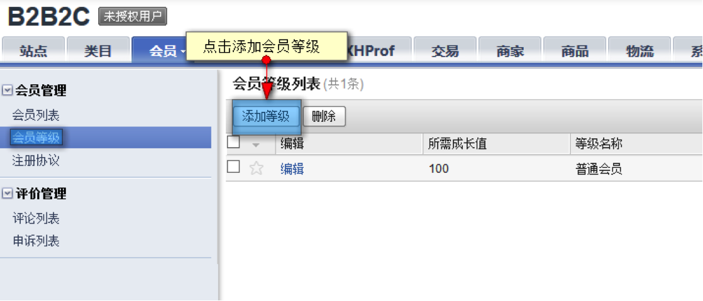

点击后弹出等级添加页面

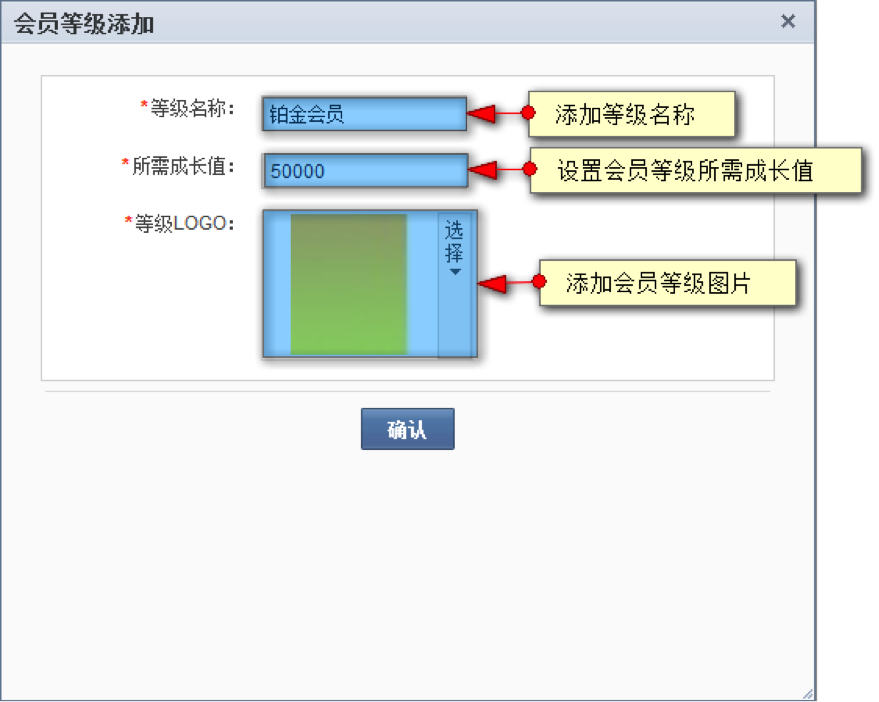

> **说明** 如果某会员等级设置为默认会员等级，则新会员注册后直接成为此等级会员，每个商店必须有且只有一个默认的会员等级，默认会员等级无法删除。
 
- 会员等级在会员中心的表现
  在前台会员中心，会员登录后会显示该会员所属的会员级别，如图：
  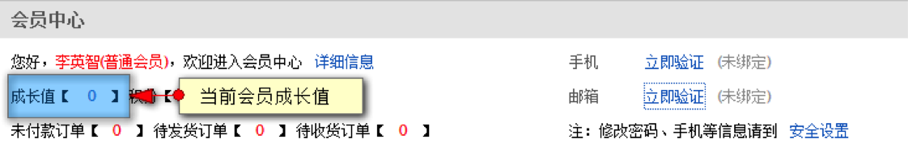
  点击成长值后可进入查看成长记录
  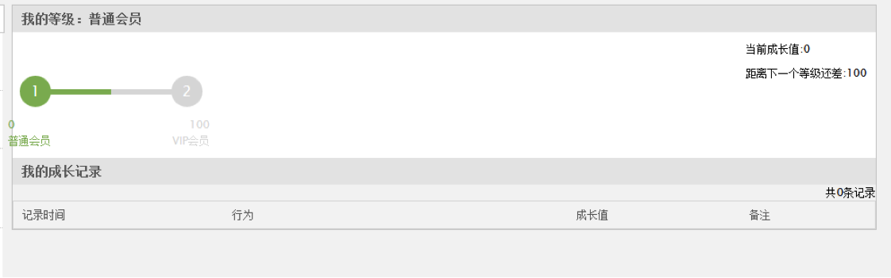
 
## 注册协议

### 如何配置注册协议？

后台依次点击“会员”-“注册协议”即可进入注册协议配置页。

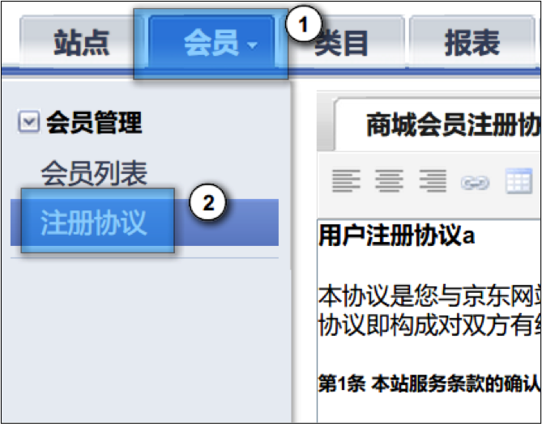
 
## 信任登录

除了用户在商城注册的账号，系统还支持第三方信任登录包含：QQ，淘宝网，新浪微博，人人网，开心网，搜狐网。

### 信任登录配置

在运营商管理，信任登录配置可以配置第三方信任登录账号的appKey和appSecret。

点击配置

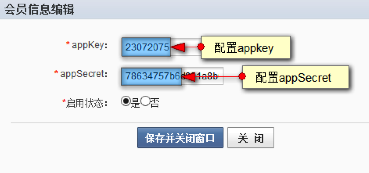

配置保存后再设置前台开启状态

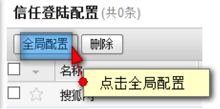

设置前台是否开启

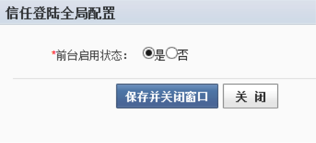
 
### 信任登录前台展示

当运营商配置完信任登录后，在用户点击登录跳转至登录页面时便可看到相应的登录图标。

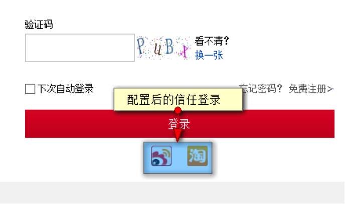

点击相应的信任登录，登录成功后返回页面如下图显示

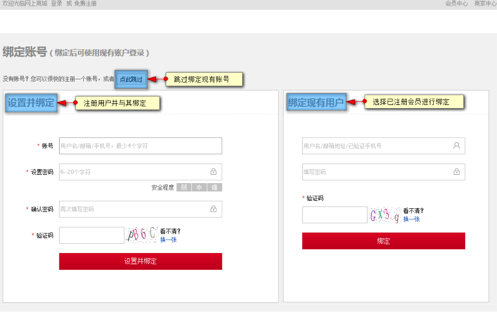
 
返回后有三个选择
- 点此跳过
  快速注册，不与现有任何用户进行关联，但下次购物时认需要用该账户进行信任登录。
- 设置并绑定
  注册新用户，并与信任登录账号绑定，如果按此操作，下次购物时可使用用户名登录，保留之前信任登录的用户所有信息。
- 绑定现有用户
  当在商城拥有已注册过用户，则可以绑定该账户，绑定后即登录已注册的会员中心。
