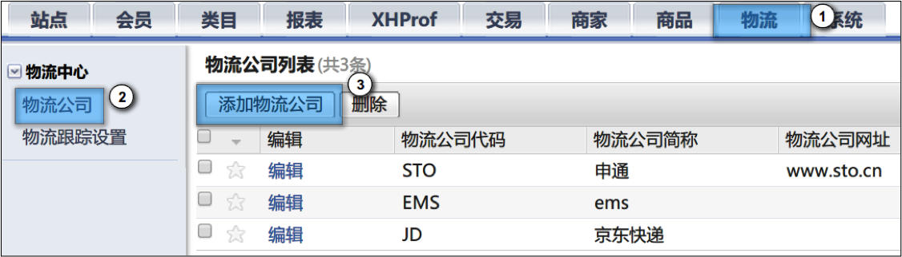
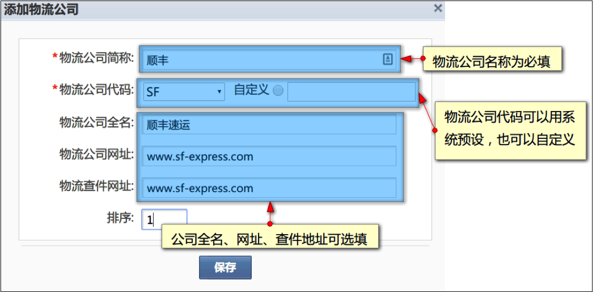
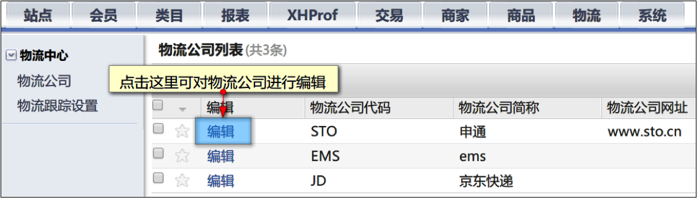
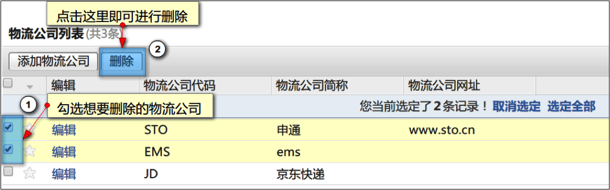
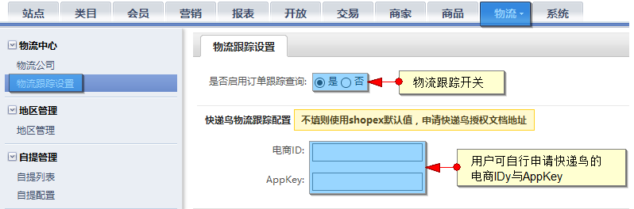

# 物流配置

* [1 物理公司设置](#1)
* [1.1 如何添加物流公司](#1.1)
* [1.2 如何编辑物流公司](#1.2)
* [1.3 如何删除物流公司](#1.3)
* [2 第三方物流跟踪](#2)
* [2.1 如何配置第三方物流跟踪接口](#2.1)

## <a id=1>物流公司设置</a>

管理员可以预先定义物流公司信息，以供商家使用，为商家提供更为便捷的工具

### <a id=1.1>如何添加物流公司？</a>

后台依次点击“物流”-“物流公司”进入物流公司列表页，再点击“添加物流公司牌”即可添加物流公司。

添加物流公司配置项说明：

### <a id=1.2>如何编辑物流公司？</a>

 
### <a id=1.3>如何删除物流公司？</a>

 
## <a id=2>第三方物流跟踪</a>

### <a id=2.1>如何配置第三方物流跟踪接口？</a>

本系统提供快递鸟物流查询，可在后台“物流”-“物流跟踪设置”中进行配置

用户可自行申请快递鸟物流接口的ID与KEY，如果没有申请可使用shopex预设的ID与KEY来进行物流跟踪。

快递鸟授权文档地址：http://www.kdniao.com/YundanChaxunAPI.aspx