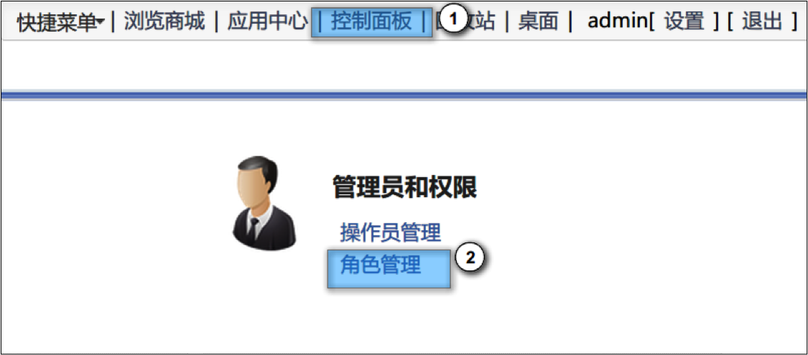
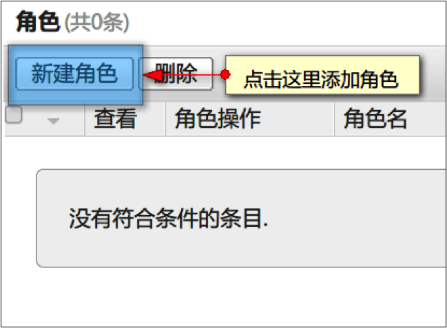
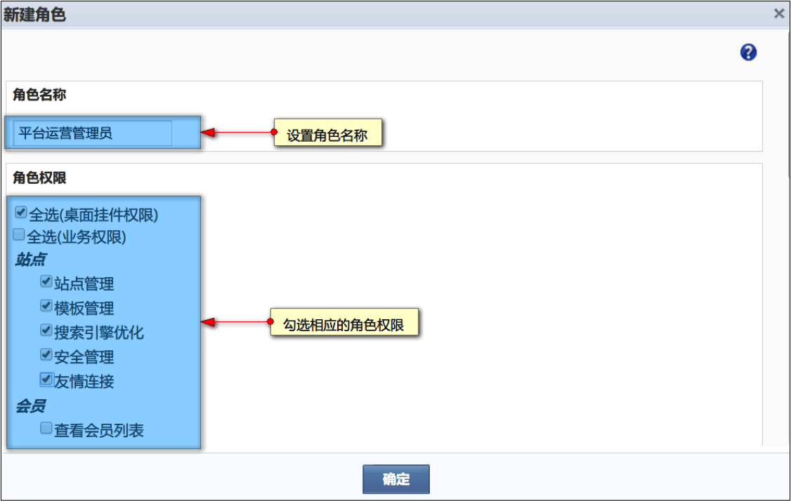
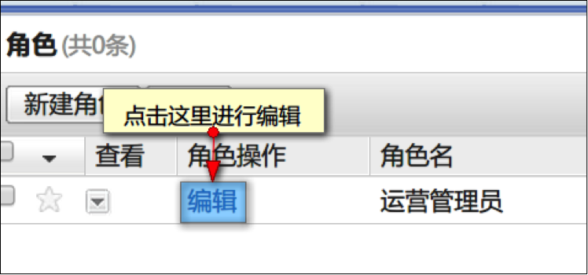
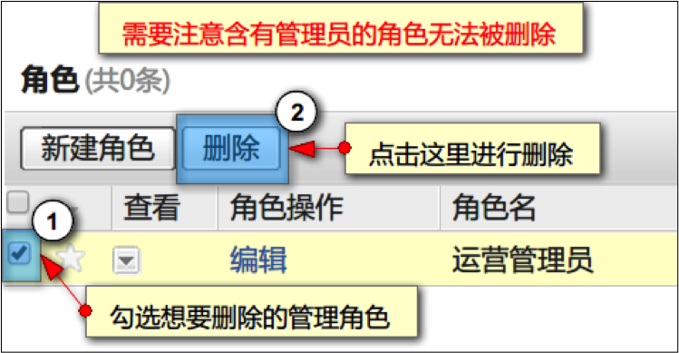
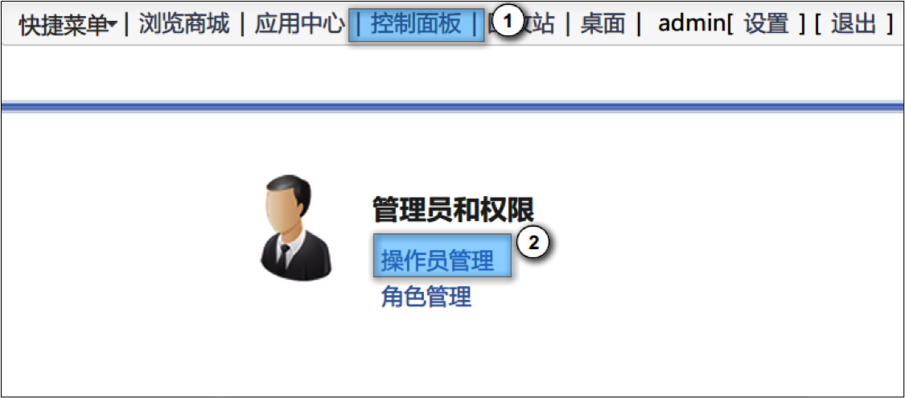
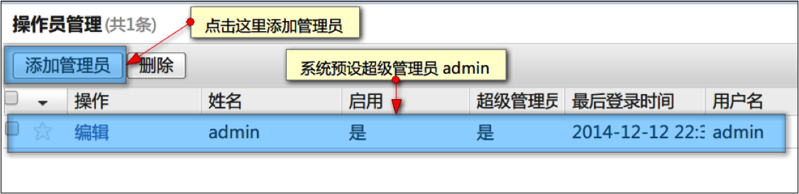
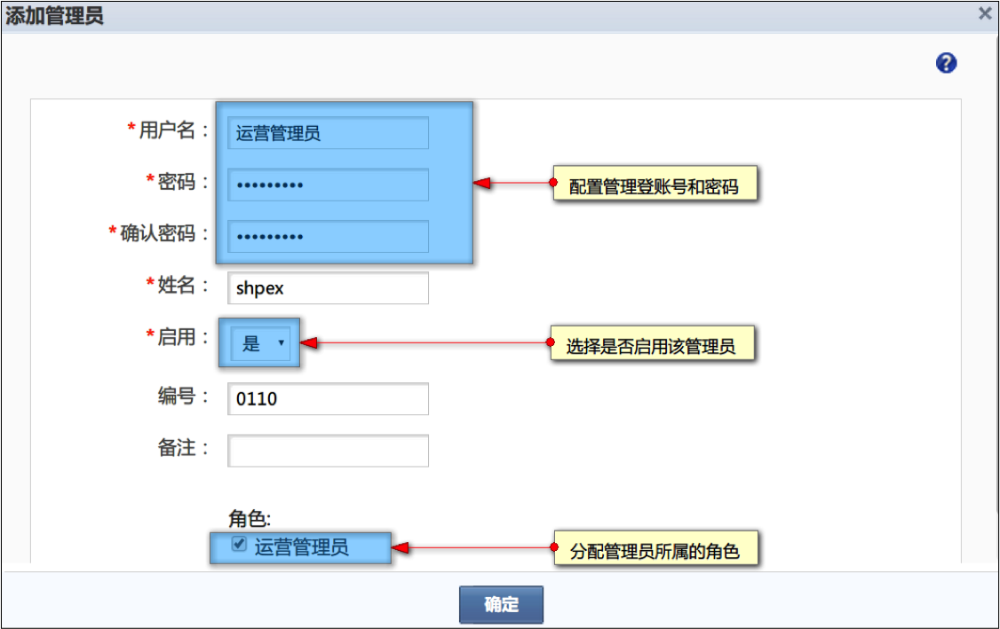
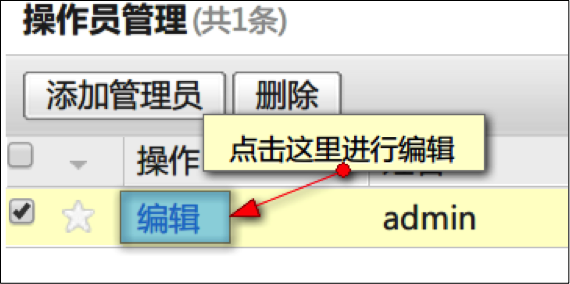
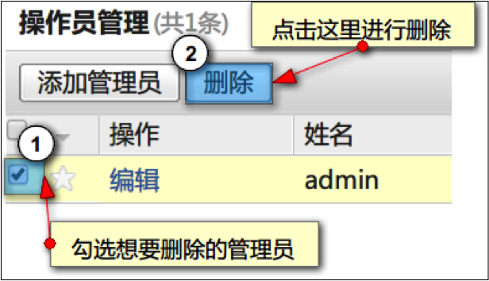

# 平台账户管理

在平台日常运营过程中，有时会需要多个部门、多人员协作操作，比如审核商家入驻、管理类目、处理订单等。使用角色与权限管理可以有效解决这个问题。

## 如何进行角色管理？

### 如何添加角色？

后台，依次点击  “控制面板”—“角色管理”进入角色管理页面

点击添加角色，即可添加管理角色。

系统提供后台各个模块的对应权限，管理员可以选择相应的权限给予添加的新角色。

 
### 如何编辑角色？

### 如何删除角色？

 
## 如何进行管理管理员？

### 如何添加管理员？

添加管理员的前提是角色已经设置结束，如果没有角色，需要先添加角色。

后台，依次点击 “控制面板”—“操作员管理”进入操作管理页面

点击添加管理员，即可添加管理员。

 
### 如何编辑管理员？

### 如何编辑管理员？

