# 商家注册及入驻

* [1 如何注册商家帐号](#1)
* [2 如何申请入驻商城](#2)
* [3 审核通过后开通店铺](#3)
* [4 审核失败后重新提交审核](#4)

## <a id="1">如何注册商家帐号</a>

如果您希望成为商城的商家首先进入商城首页点击“商家中心”。

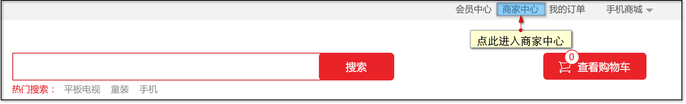

进入商家登录页面。

如果您已有商家帐号，请使用商家帐号直接登录。

如果您还未注册过商家帐号，请点击【注册】，页面会跳转到商家注册页面。

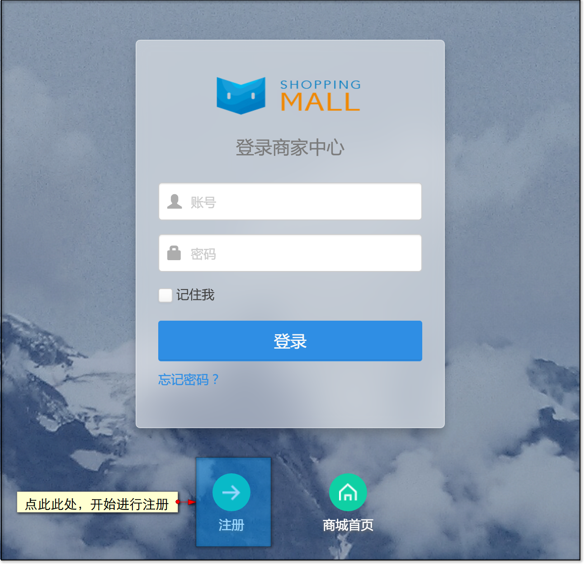

在正式注册之前，系统会请求验证您的手机号。

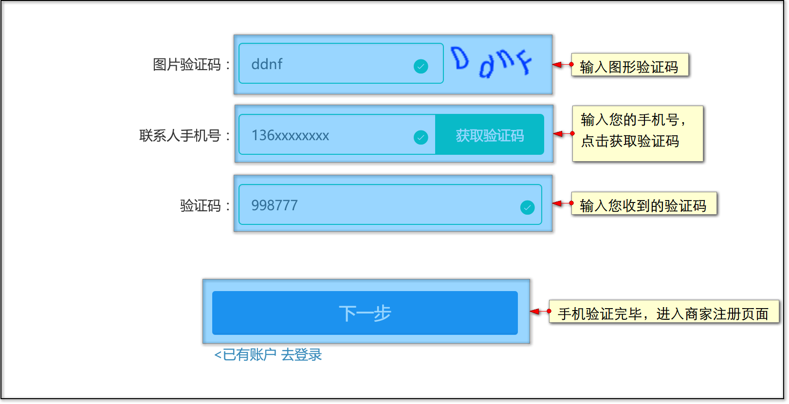

手机号验证通过后，即可进行注册。

填写注册信息完成注册，注册成功后，先前验证过的手机号就会绑定您的商家帐号。

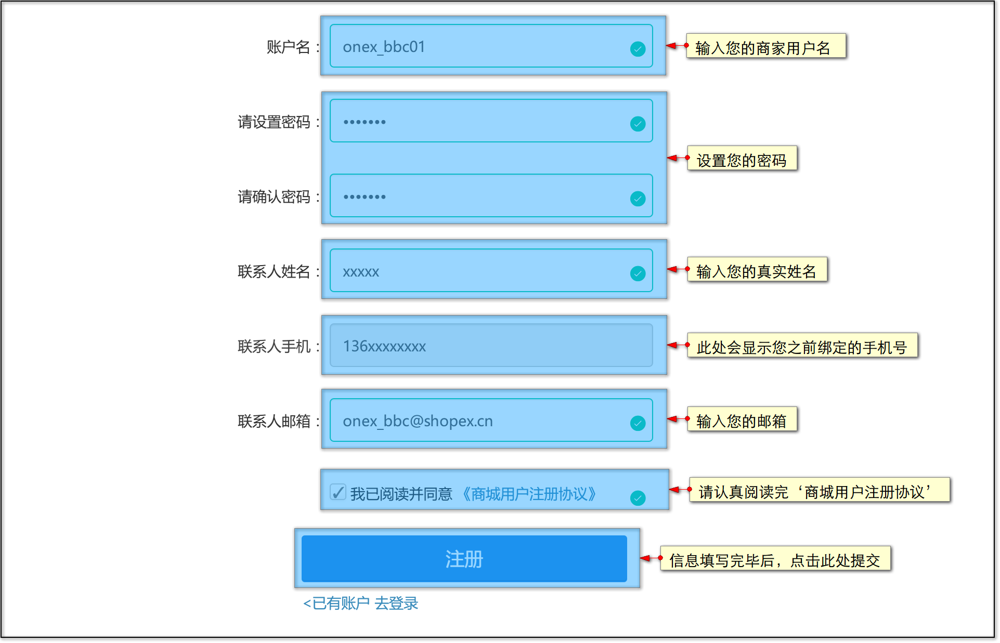

## <a id="2">如何申请入驻商城</a>

当您获得商家帐号后，就可以进行入驻申请了。

登录您的帐号进入商家平台，尚未申请入驻的您就可看到【入驻协议】页面，您必须仔细阅读并同意【入驻协议】才能够进行入驻申请。

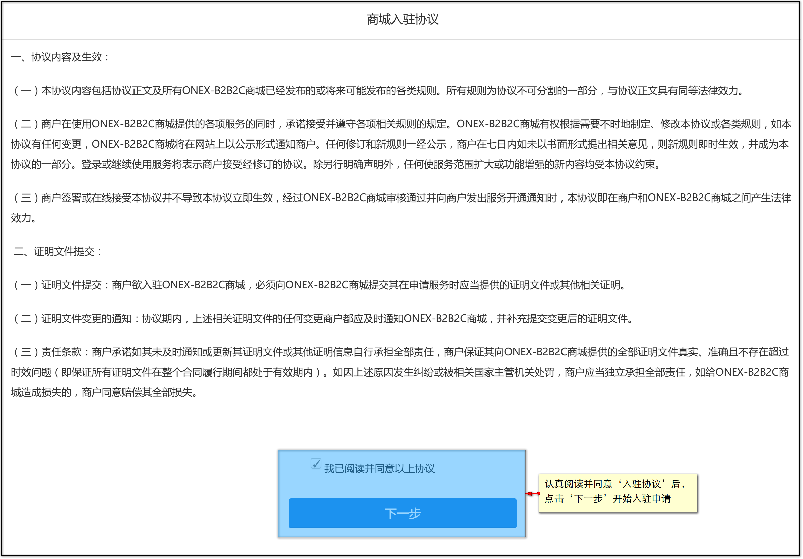

同意【入驻协议】后，您可以开始填写【入驻申请表】，【入驻申请表】分三块内容：公司基本信息、银行及税务信息、店铺信息。

您需要填写的第一部分内容便是【**公司基本信息**】。

此部分主要是您的公司相关信息，如果您对某部分输入项不是很明白，可以将鼠标移动至小图标上，里面会有温馨提示哦。

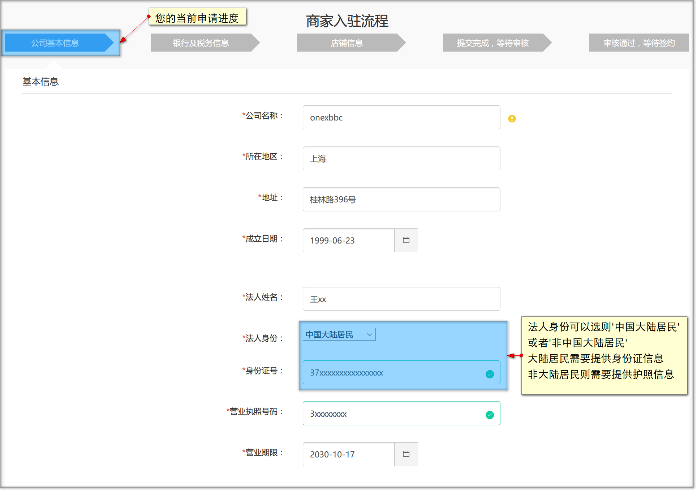

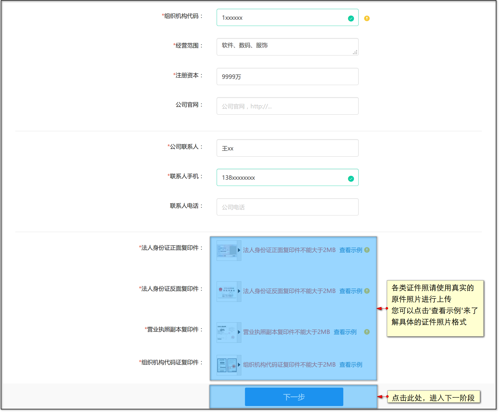

完成【公司基本信息】后，接下来是【**银行及税务信息**】

此部分主要是您的公司税务登记和用于结算的帐号信息。

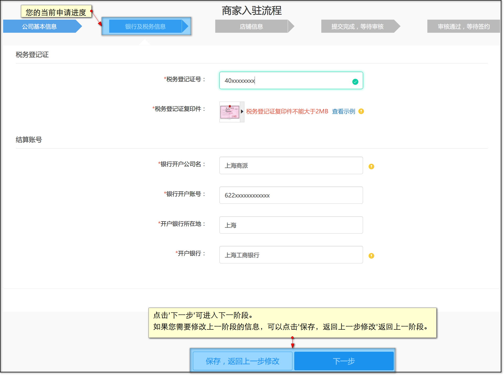

完成【银行及税务信息】后，接下来是【**店铺信息**】

此部分您需要选择您准备申请开通的店铺类型，ONEX-B2B2C系统提供4种店铺类型，下面我们来一一介绍：

**1、品牌旗舰店**

即商家以自有品牌，或由权利人排他性授权，在商城开设的店铺。以品牌为导向。

每个品牌只能存在一个官方旗舰店。

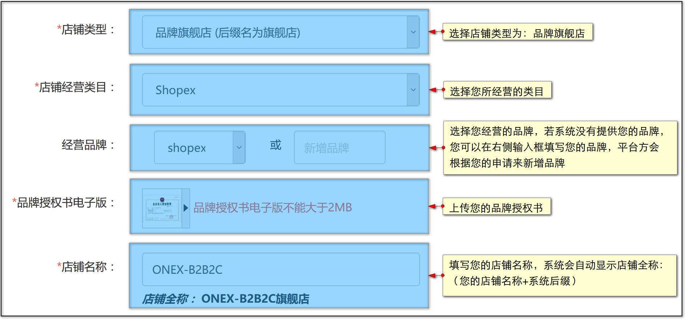

**2、品牌专营店**

即专门经营或授权经营某一主要品牌商品为主的零售类店铺。以品牌为导向。

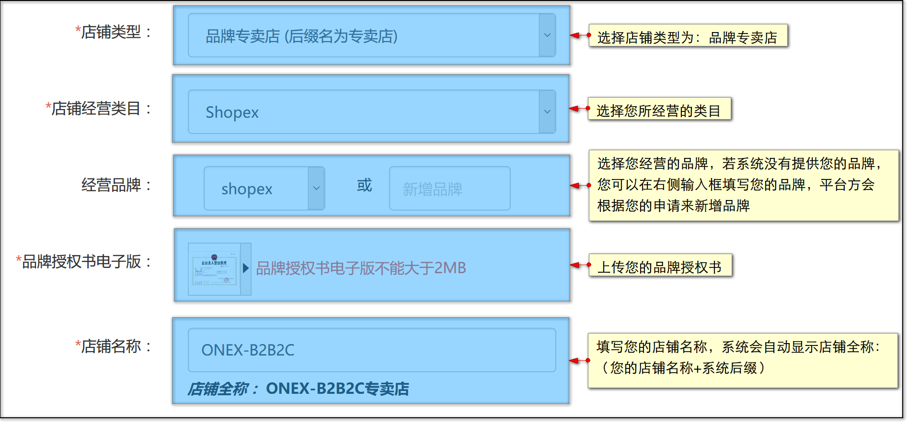

**3、类目专营店**

即商家经营商城同一个大类目（一级类目）下1个及以上品牌商品的店铺。以类目为导向。

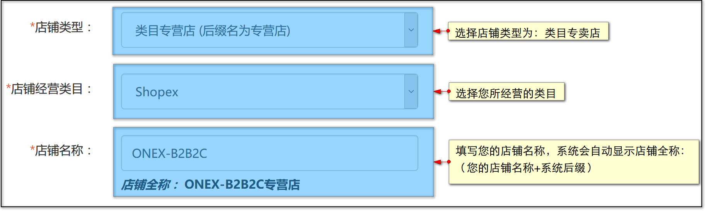

**4、多品类店铺**

即在商城经营多个大类目（一级类目）的产品，此类店铺一般类似与大卖场。

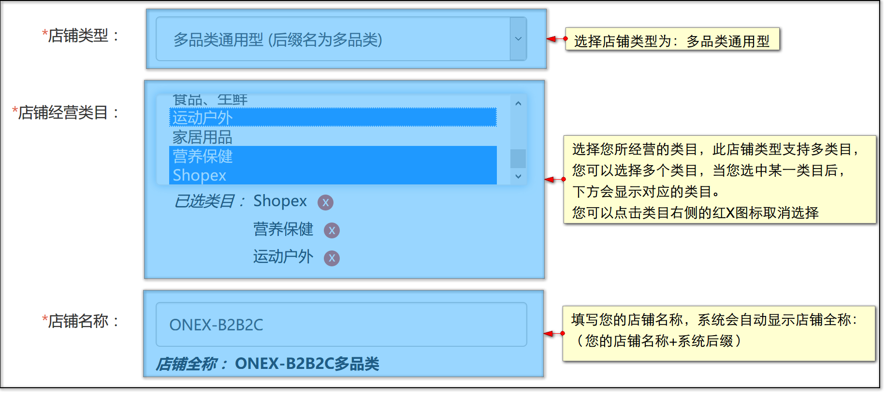

录入完店铺信息相关内容后，就可以提交入驻申请了！

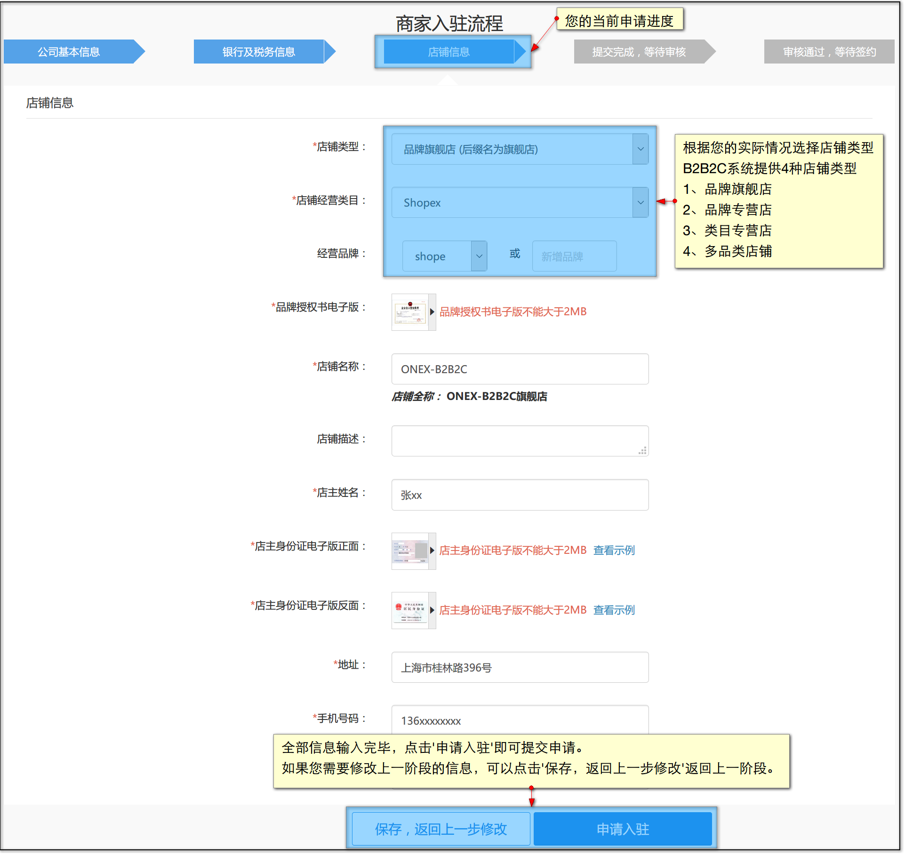

提交申请成功后，接下来就是请您耐心等待平台方审核啦！

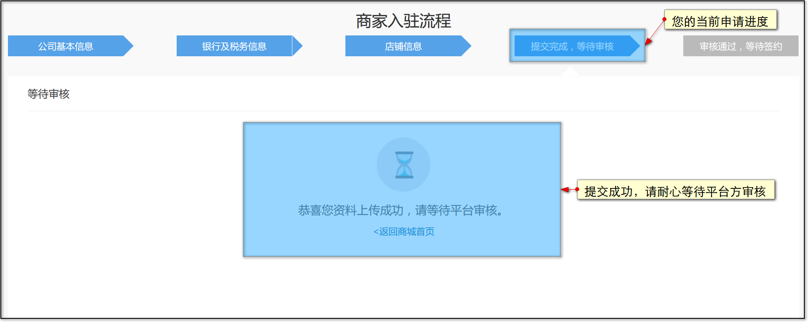

##  <a id="3">审核通过后开通店铺</a>

当您的入驻申请通过平台方的审核后，此时商家后台的入驻申请页面会提示您已通过审核。

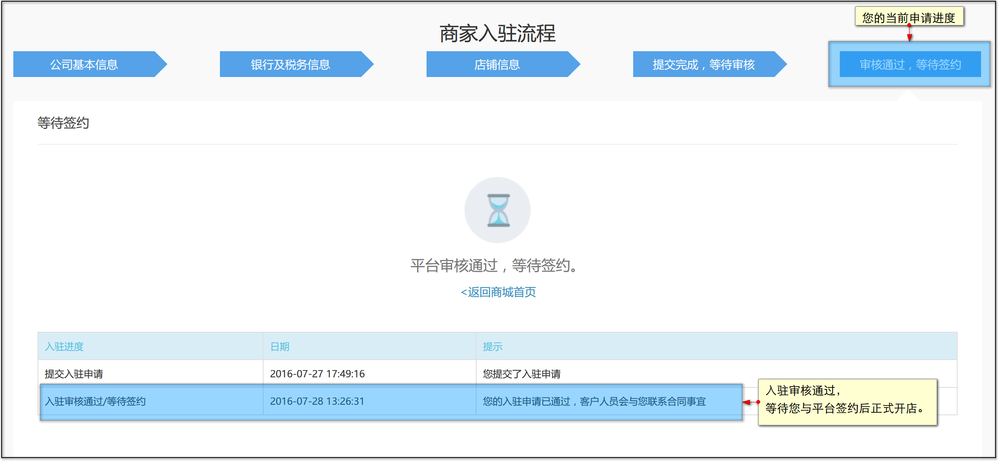

之后便是等待您与平台方签约了，一旦签约完毕，您的店铺就顺利开通啦！

## <a id="4">审核失败后重新提交审核</a>

如果您的申请不幸被平台方驳回了，可以在入驻申请页面查看到平台方的回复，并根据回复的提示来修改您的申请，再次提交申请。

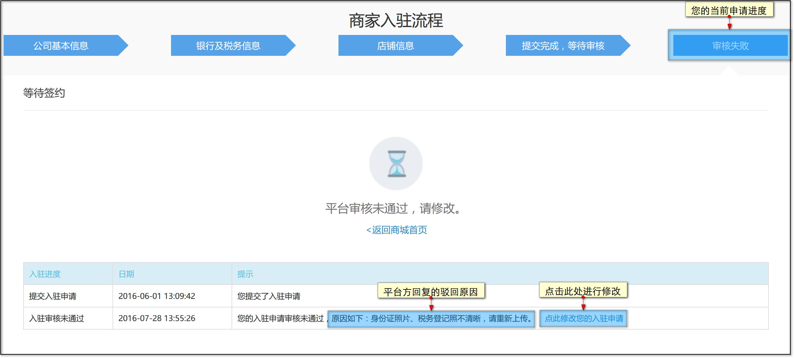

