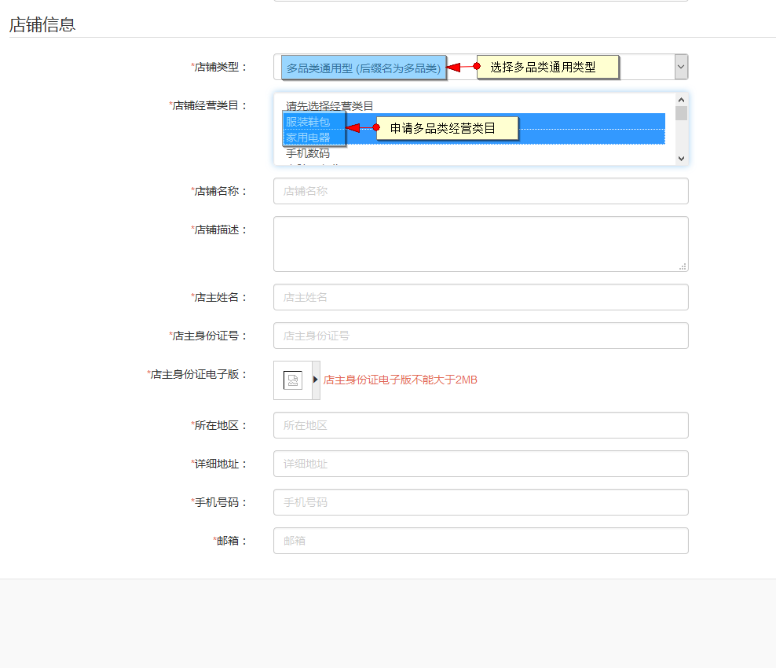
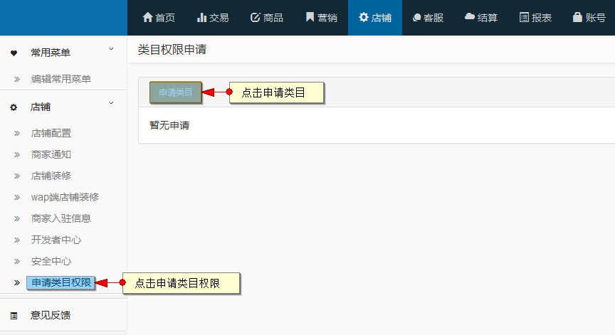
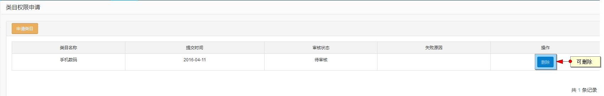
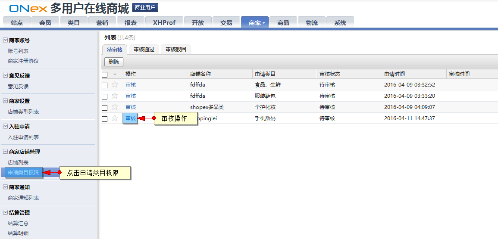
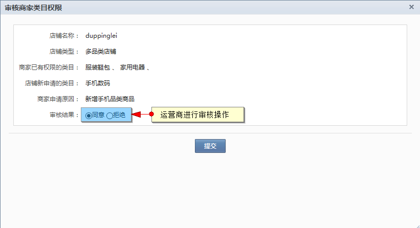
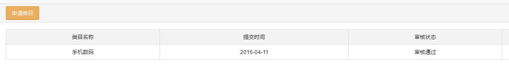
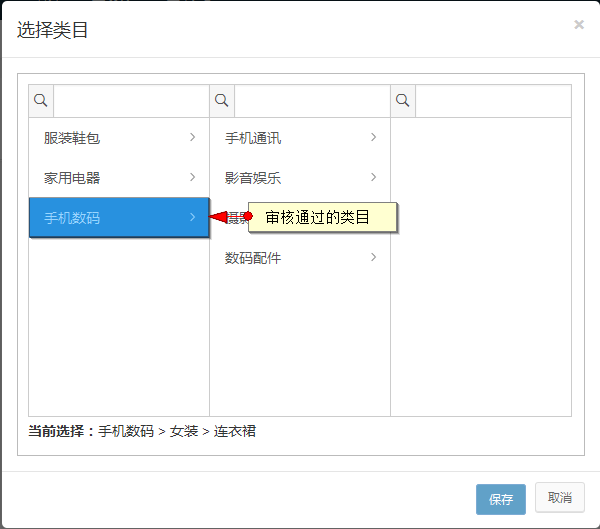

# 多品类商家

## 多品类商家入住

商城支持多品类商家入驻，入驻流程与3.1商家注册入驻相同，入驻类型选择多品类商家

## 多品类商家新增类目

多品类商家在可经营的类目范围外申请新的类目

点击申请类目

选择需要新增的类目，填写申请原因

申请后可对申请进行删除

运营商在“申请类目权限”菜单对申请进行审核

运营商审核通过

通过后的审核状态

添加商品时可选择审核通过的新类目

