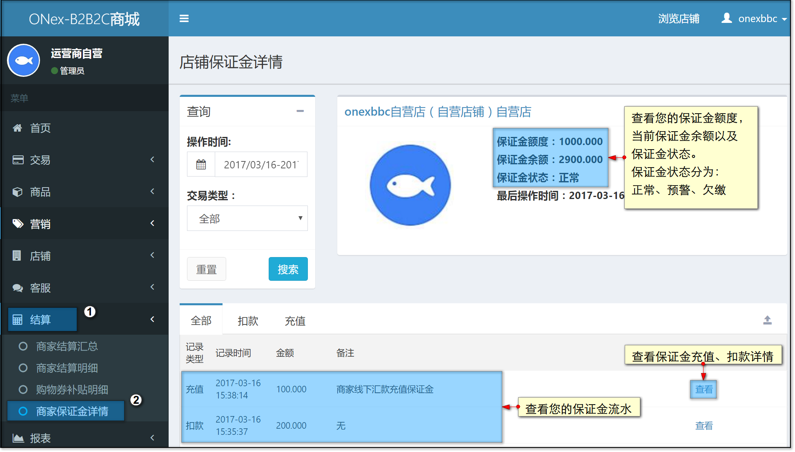
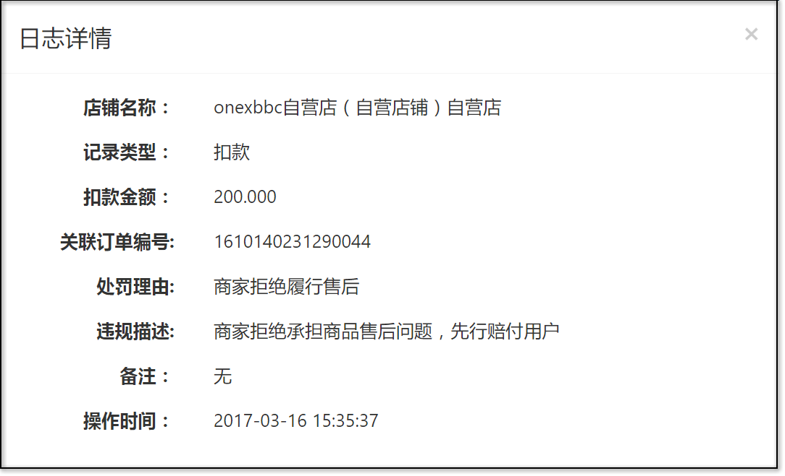
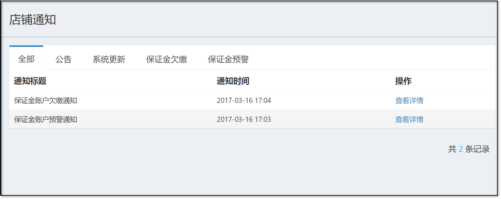

# 店铺保证金

## 查看店铺保证金

商家可以在【结算】-【商家保证金详情】中查看店铺目前的保证金状况。

商家保证金详情展示了店铺目前的保证金额度、当前保证余额、当前保证金状态、保证金流水日志。

其中保证金状态分为三种：正常、预警、欠缴

**正常**：即正常，无需处理。

**预警**：保证金余额低于预警线，系统会自动发送通知提醒商家及时充值。

**欠缴**：保证金余额出现负数，此时店铺将会被冻结结算，待保证金状态正常时才会解冻，冻结期间结算单正常产出。

当保证金金额发生变动时，商家可以查看保证金的流水日志了解详情。

当保证金状态处于预警或者欠缴时，系统会自动发送通知提醒商家，商家可以在【店铺】-【商家通知】中查看。

