# 商家后台首页

* [1 待处理业务快捷入口](#1)
* [2 店铺运营简报](#2)
* [3 店铺入住信息](#3)
* [4 修改密码](#4)
* [5 意见反馈](#5)

商家后台首页是商家管理店铺的总页面，在首页可以看到的内容包括（1商品相关，2订单相关，3店铺入驻信息，4运营概况）用来快速了解店铺情况以及快速进入待处理业务页面。

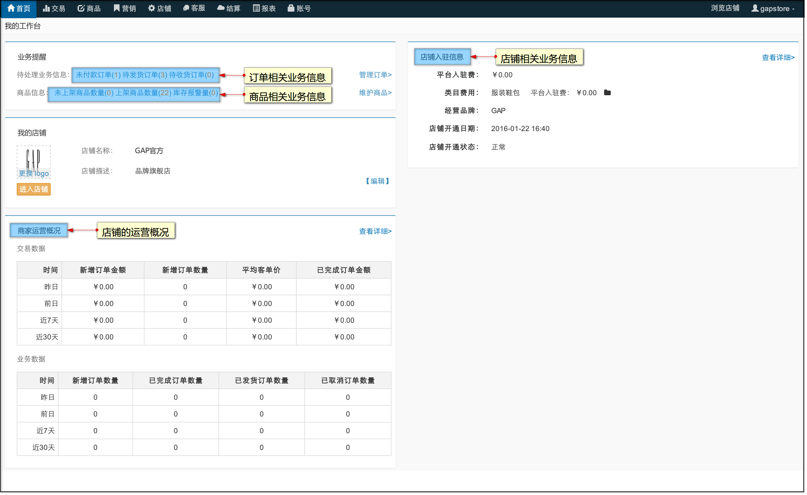

## <a id="1">待处理业务快捷入口</a>

在商家首页-我的工作台内可以查看到当前店铺的业务提醒。包括“待处理业务信息”，“商品信息”。

- 商品信息
  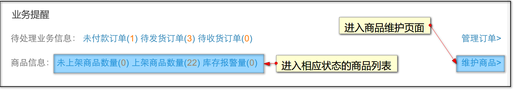
  点击未商家商品或商品总数进入对应状态的商品列表，点击“维护商品”进入商品维护列表
  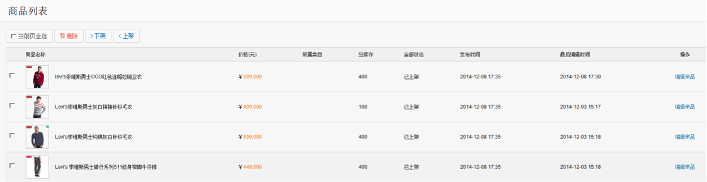
- 待处理业务信息
  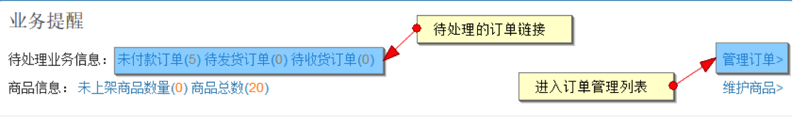
  点击待处理业务信息进入相对应状态的订单列表，点击管理订单进入订单管理列表
  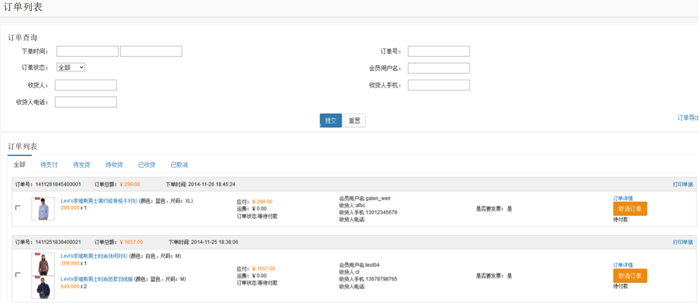
 
## <a id="2">店铺运营简报</a>

在商家首页可以查询到店铺运营的简报，包括交易数据，业务数据。

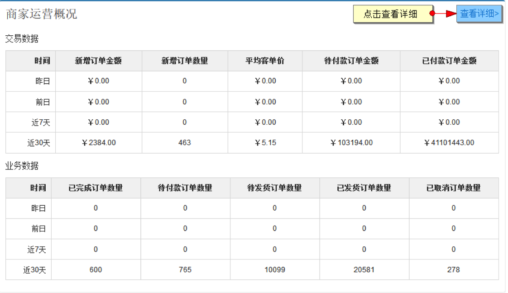

## <a id="3">店铺入住信息</a>

首页列出了入驻信息的概要，例如入驻费用、类目费用、店铺状态等。想要了解更多内容可以点击右上方的【查看详细】。

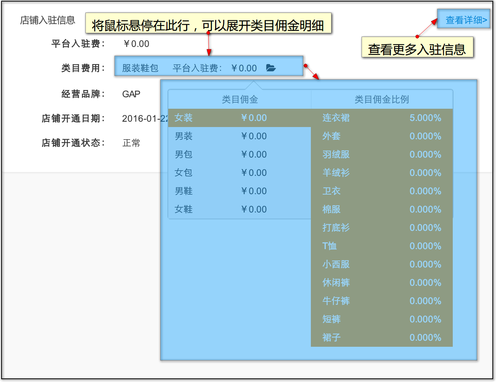

## <a id="4">修改密码</a>

商家可以在首页右侧点击修改密码修改商家登录密码

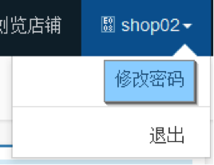

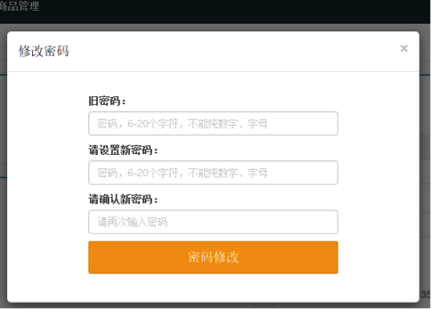

## <a id="5">意见反馈</a>

商家可在商家中心对平台进行“意见反馈”

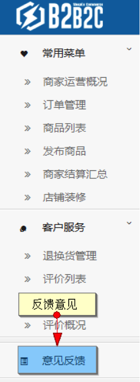

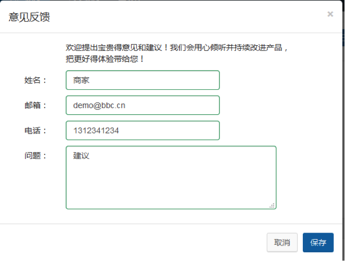
 
运营商可在后头商家，意见反馈中查看商家提交的意见

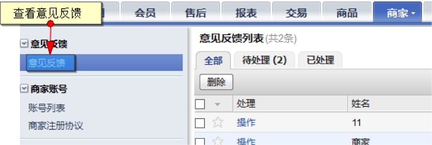

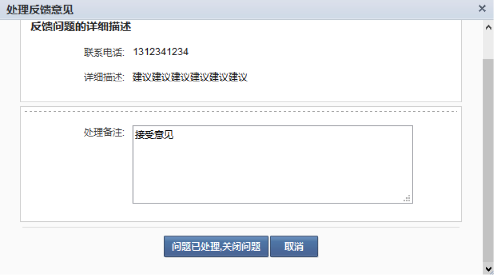
