# 店铺管理

店铺管理包含了店铺配置，店铺装修等店铺初始化等的配置。

## 店铺配置

店铺设置包含显示店铺名称，店铺LOGO，店铺描述，设置后显示在店铺首页。

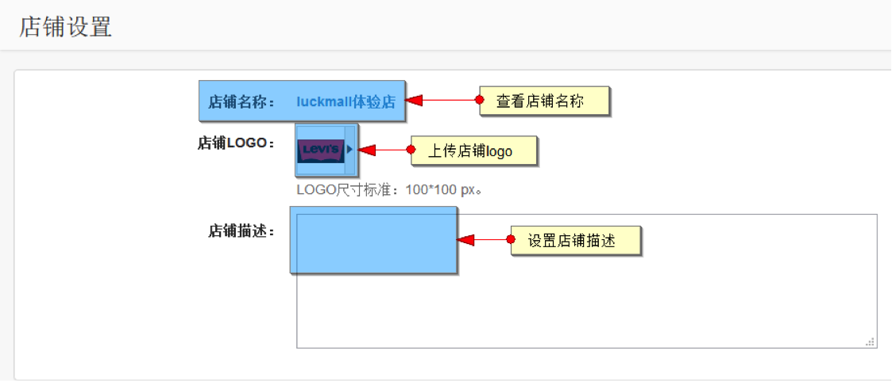
 
在线客服

3.0.4版本中加入了在线客服功能，在店铺配置的店铺描述下方，设置QQ和旺旺号

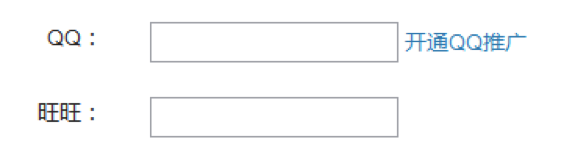

设置后在商城的店铺首页等位置限时在线客服

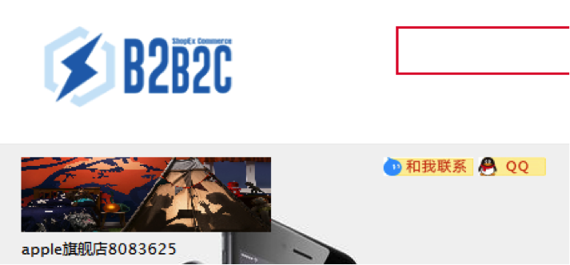

<!--
## 快递模板配置

在配置快递单模板的过程中，需要选择对应的快递公司，此处的快递公司是运营商预设的快递公司，需要先设置好快递公司，以方便在设置快递模板时进行选择。

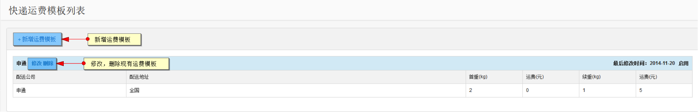

点击新增运费模板时进入模板新增界面

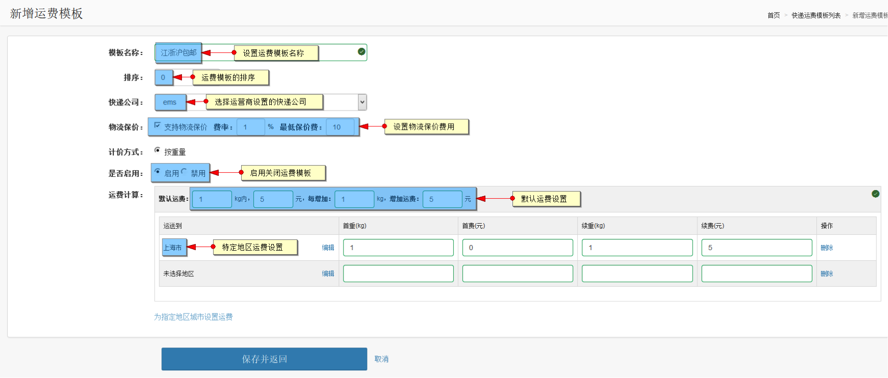

设置完相关数据保存后，买家即可在购买商品时选择该运费模板

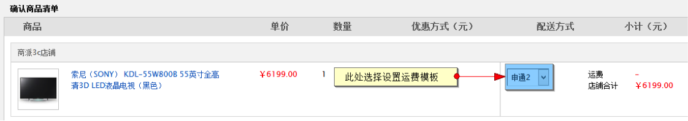

-->
 
## 店铺装修

店铺装修包含通用模块与店铺首页两部分。

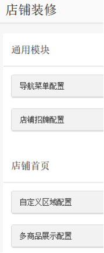

### 通用模块-导航菜单配置

导航栏菜单包含店铺分类，自定义链接两类。点击新增菜单添加导航栏。

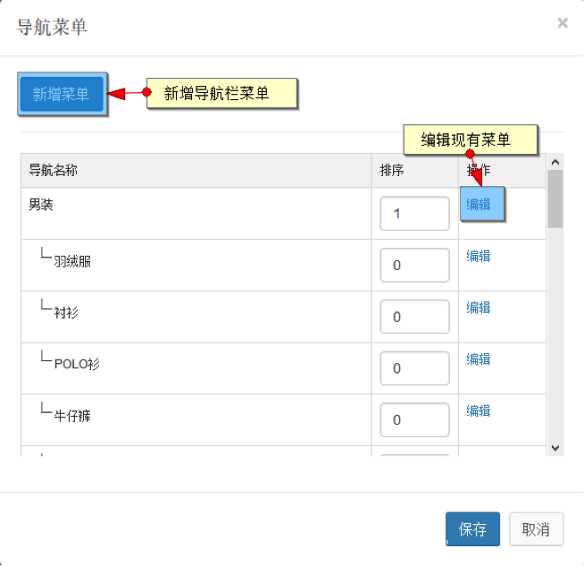

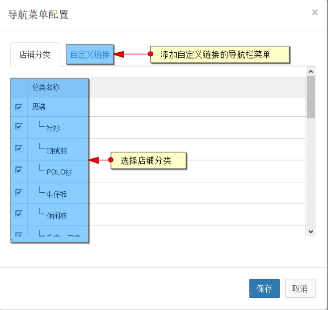

添加后点击保存，前台效果图如下：

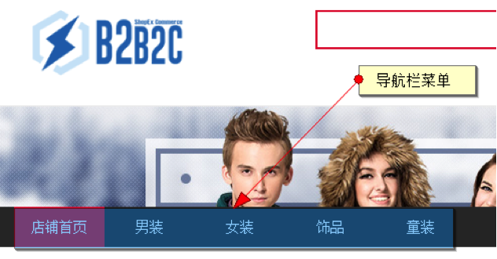
   
### 通用模块-店铺招牌配置

此处都是设置店铺招牌配置的内容。

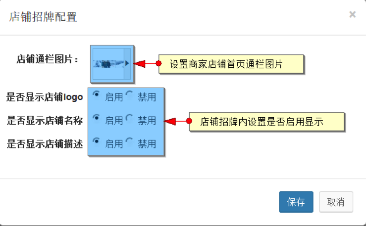
   
设置后前台的显示效果如下：

   
### 通用模块-自定义区域配置

自定义区域内容在店铺首页显示

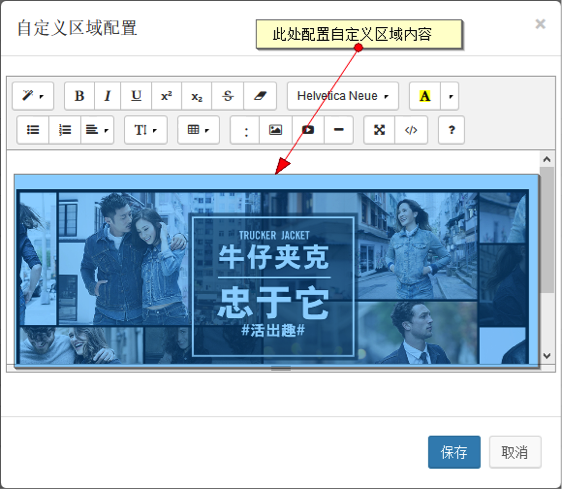
   
设置后的前台显示如下

  
### 通用模块-多商品展示配置

在店铺首页可以添加商品展示区域

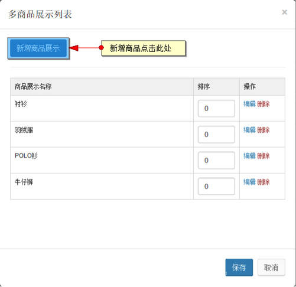
   
点击后添加页面如下：

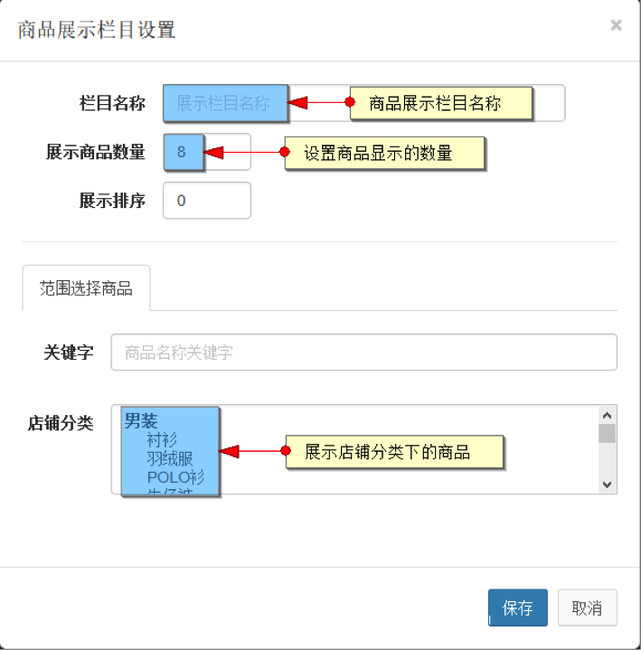
   
前台展示如下：

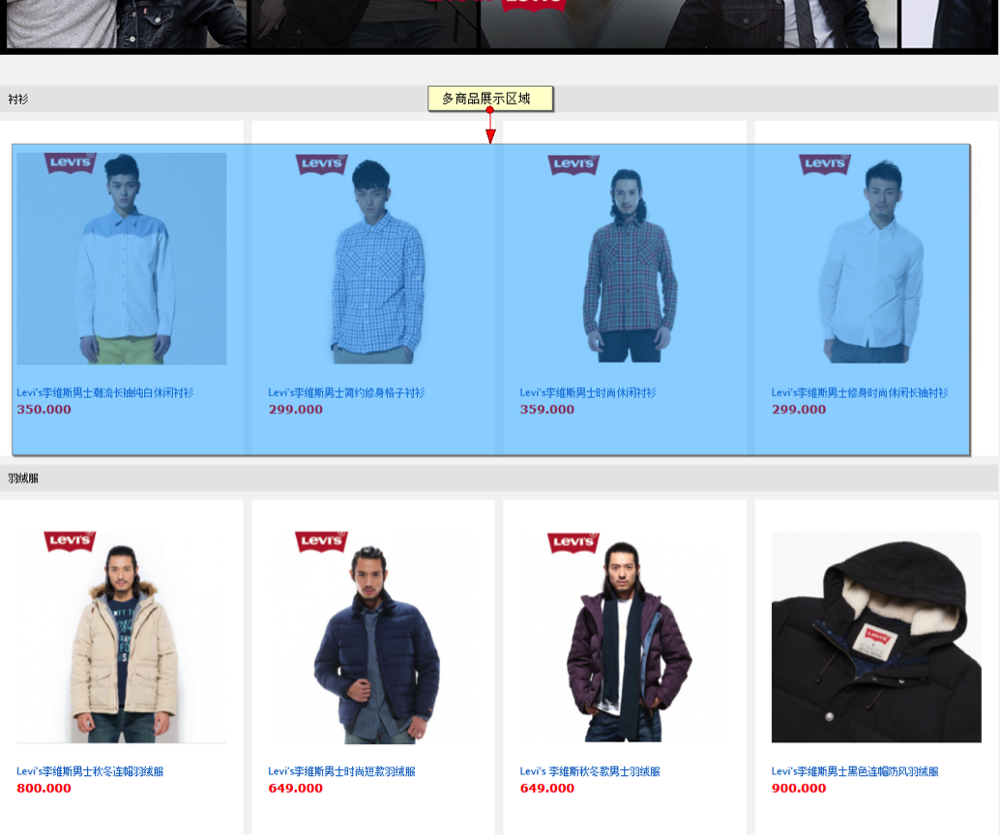
 
## wap店铺装修

wap店铺装修已于3.1.10版本更新为可视化编辑模式

当用户点击移动端店铺装修时会有更新提示

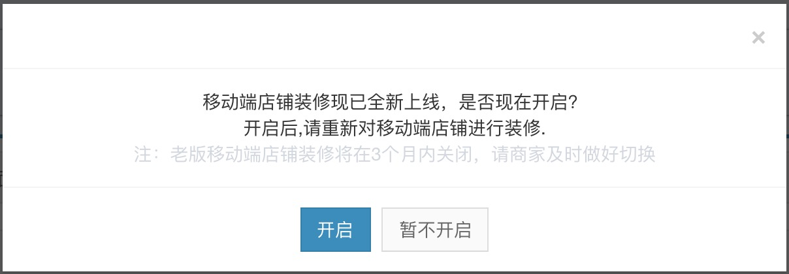

更新后的菜单如下展示

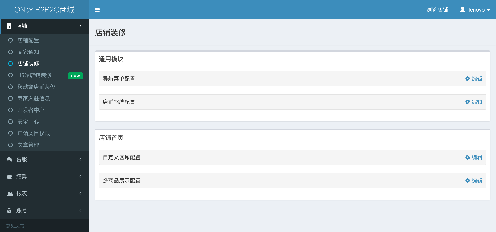

点击H5端店铺装修后进入wap店铺装修页面

### 商品展示

设置wap端店铺首页展示商品配置，点击左侧商品展示后可添加商品展示

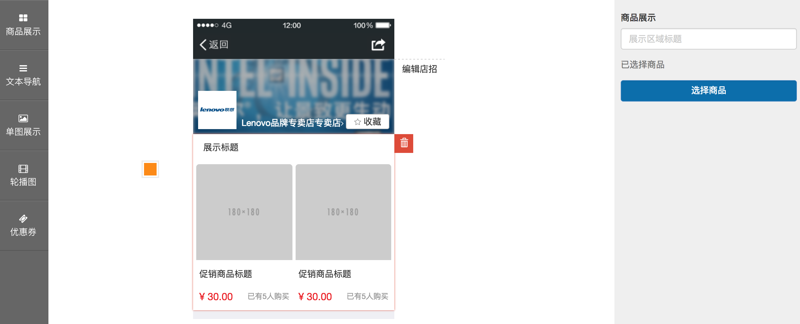

设置商品展示名称，选择展示的商品

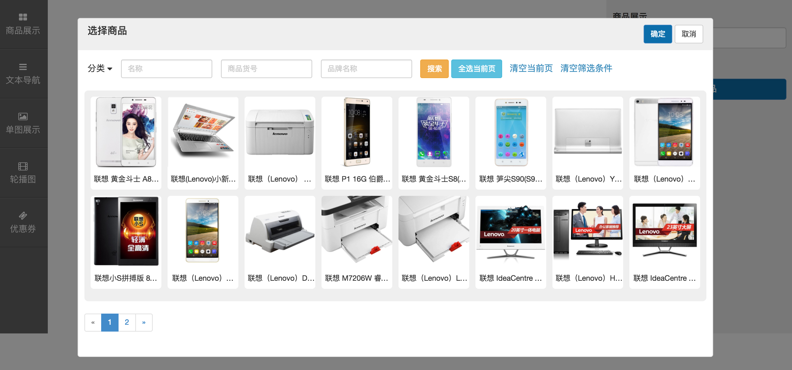

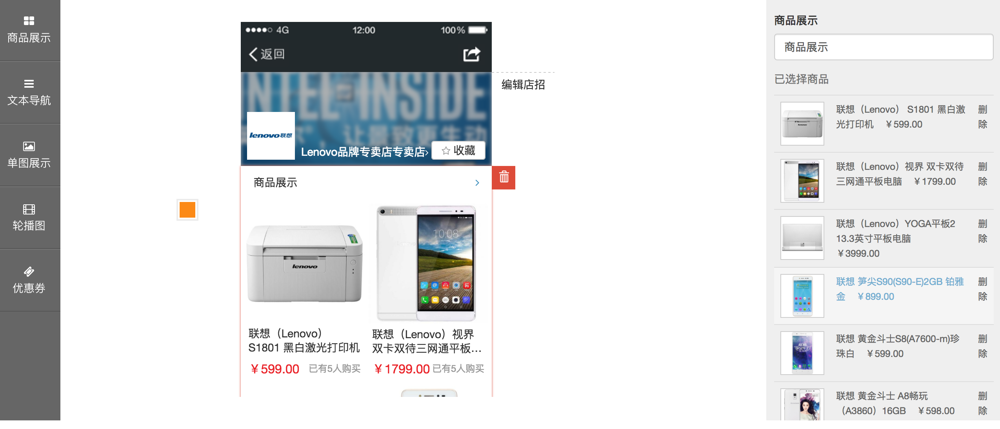
 
保存后在wap端展示效果

 
### 文本导航

设置wap端店铺首页标签配置

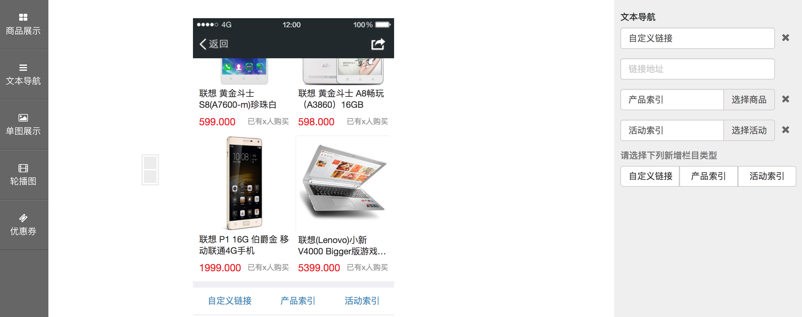

保存后在wap端展示效果

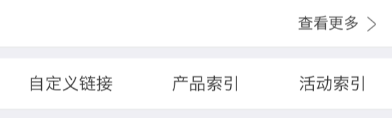
 
### 轮播图

设置wap端店铺首页轮播图

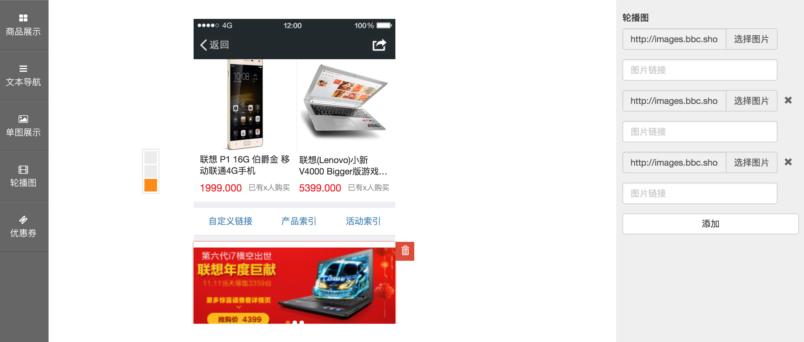

保存后在wap端展示效果

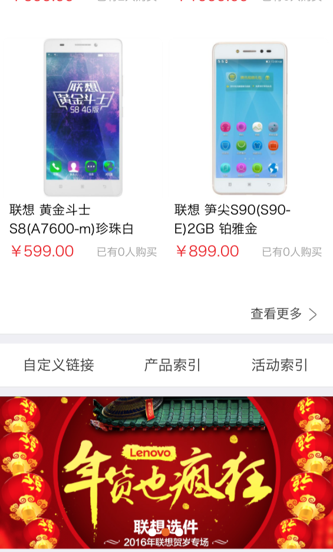
 
### 单图展示

设置wap端单图展示

保存后在wap端展示效果

### 优惠券展示

设置wap端优惠券展示

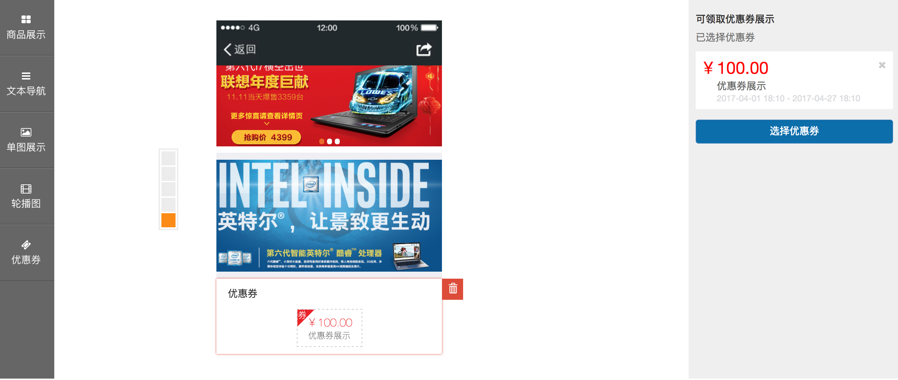

保存后在wap端展示效果

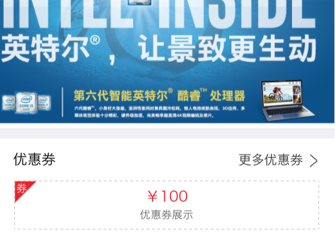
 
### 店铺招牌配置

设置wap端店铺招牌，点击编辑店招

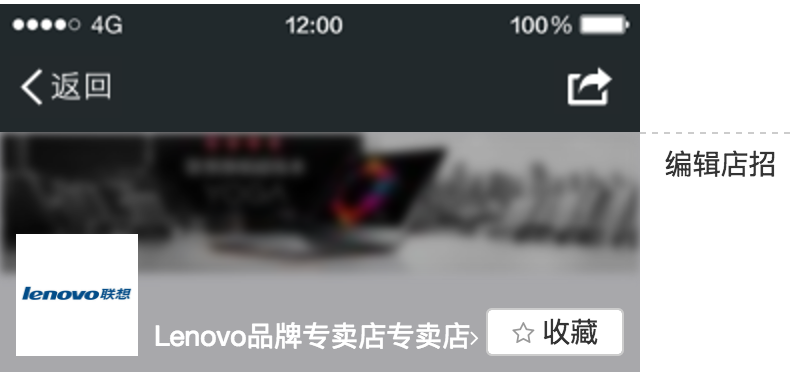

设置后在店铺前台展示如下

### 挂件拖动

以上所添加的个类型挂件可以根据需求，上下拖动调整显示的位置

<!--
前台展示目前版本暂未展示，请待版本更新。

## 图片管理

商家在管理端可对店铺图片做名称编辑，删除等操作，也可在图片管理模块上传店铺图片。
如图

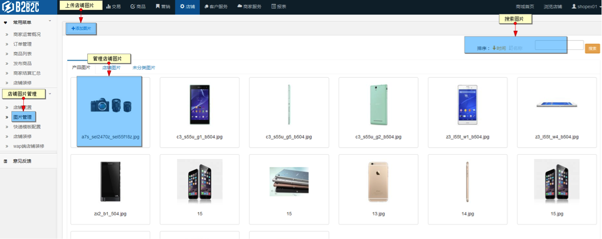
-->
