# 订单管理

* [1 订单列表及查询](#1)
* [2 订单详情](#2)
* [3 发货](#3)
* [4 未付款订单取消](#4)
* [5 运费编辑](#5)
* [6 自提验证](#6)

订单管理包含订单查询，订单列表对订单进行相应操作

## <h2 id="1">订单列表及查询</h2>

- 订单查询
  根据输入的查询条件进行订单筛选管理操作
  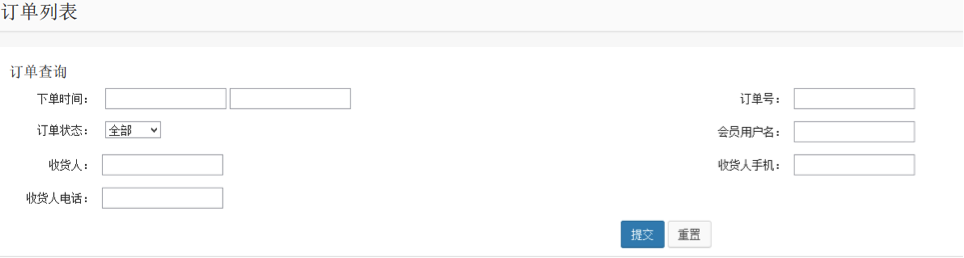
- 订单列表
  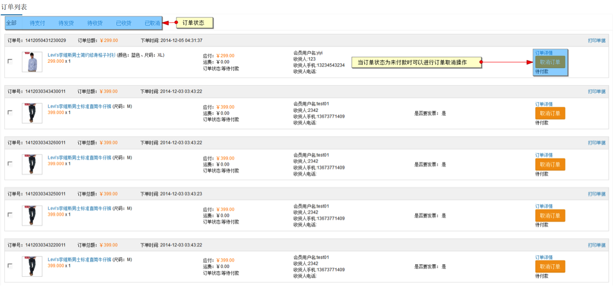
  订单列表可以对不同的订单进行查看，包括：待支付，待发货，待收货，已收货，已取消
  当订单状态为待付款状态下时，卖家可取消订单

## <h2 id="2">订单详情</h2>

在订单列表页选择订单，点击订单详情可进入订单详情页，可对订单进行备份操作

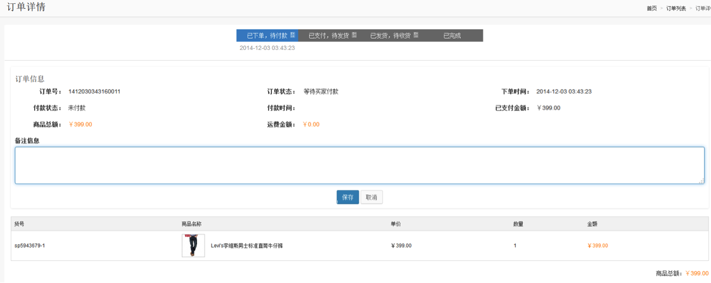
 
## <h2 id="3">发货</h2>

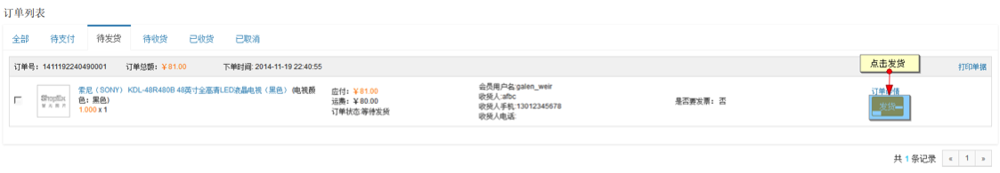
     
当订单状态未已支付的状态时，商家可对订单进行发货操作

## <h2 id="4">未付款订单取消</h2>

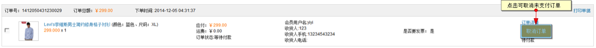

商家可点击取消订单，将未支付的订单取消

## <h2 id="5">运费编辑</h2>
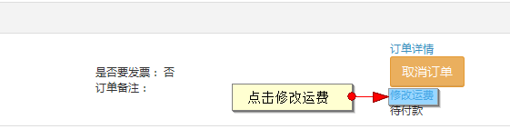

商家可对未支付的订单进行运费编辑

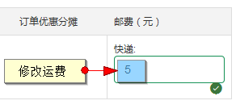

修改运费，保存

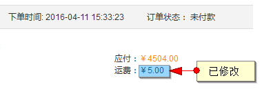

运费编辑完成

## <h2 id="6">自提验证</h2>

当自提订单发货后，商家可以通过【发送提货码】来通知会员去自提点进行提货。

【提货码】只针对自提的订单，普通订单不会有【发送提货码】选项。

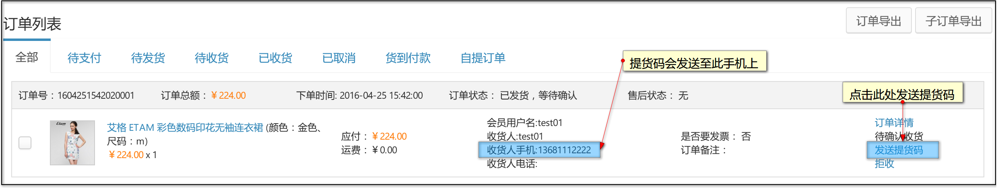

确认发送【提货码】后，系统会自动将提货码发送至【收货人手机】上。

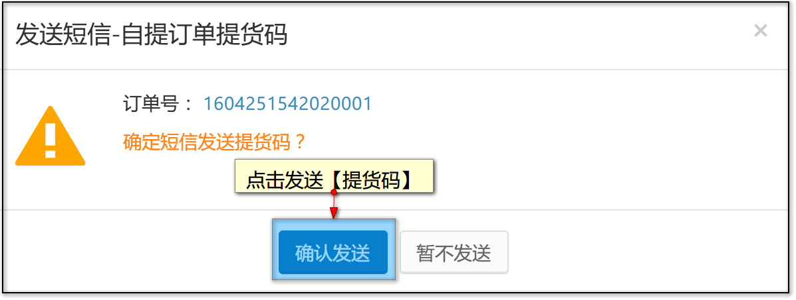

当会员接收到【提货码】后，前往自提点进行提货时，商家可以让会员提供【提货码】来进行身份验证。

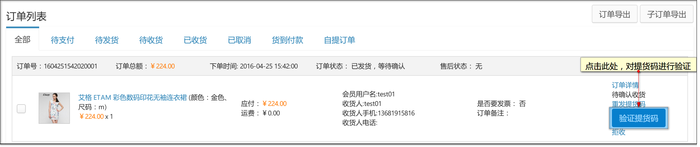

输入会员提供的提货码，进行验证，系统会判断【提货码】是否正确。验证通过后，会员即可提货

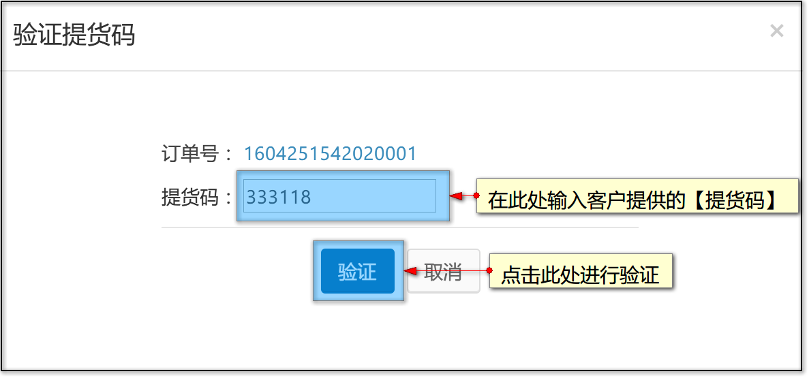

若会员未收到提货码，或者提货码失效等特殊情况时，商家可以【重发提货码】，系统会重新发送【提货码】至会员手机，届时会员可通过重新发送的【提货码】来进行提货验证。

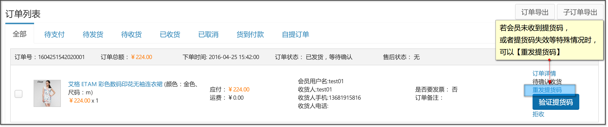

