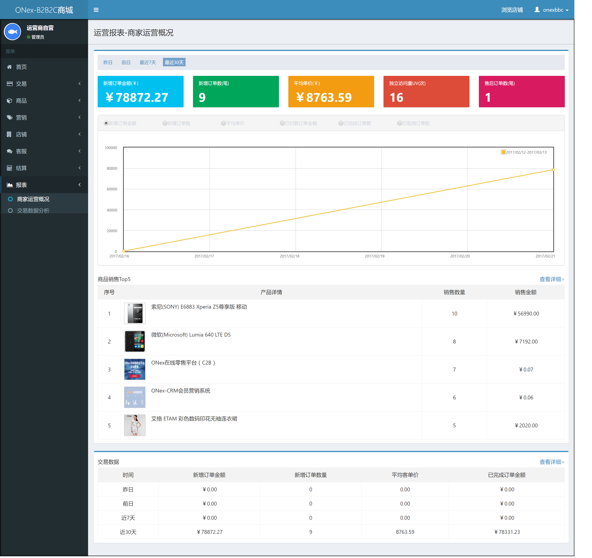
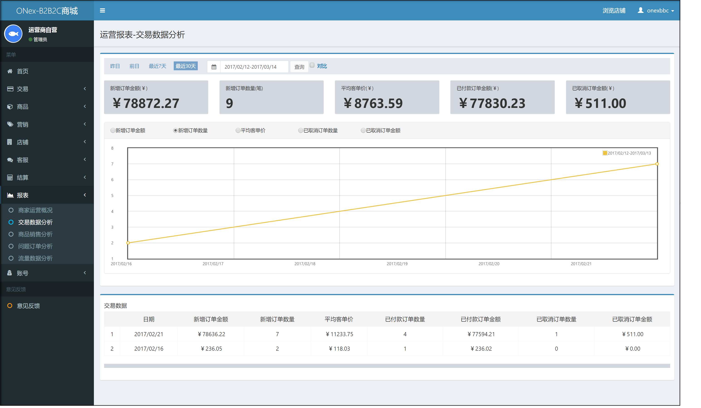
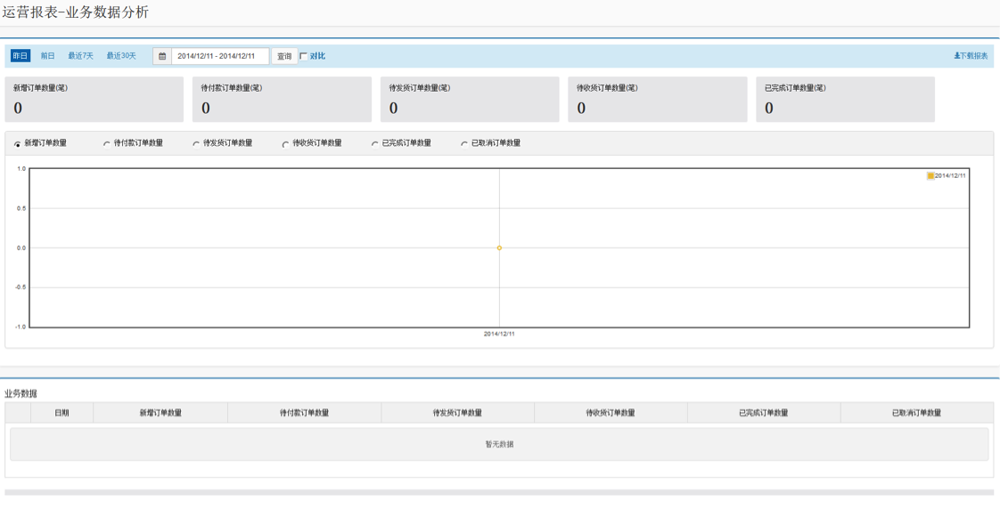
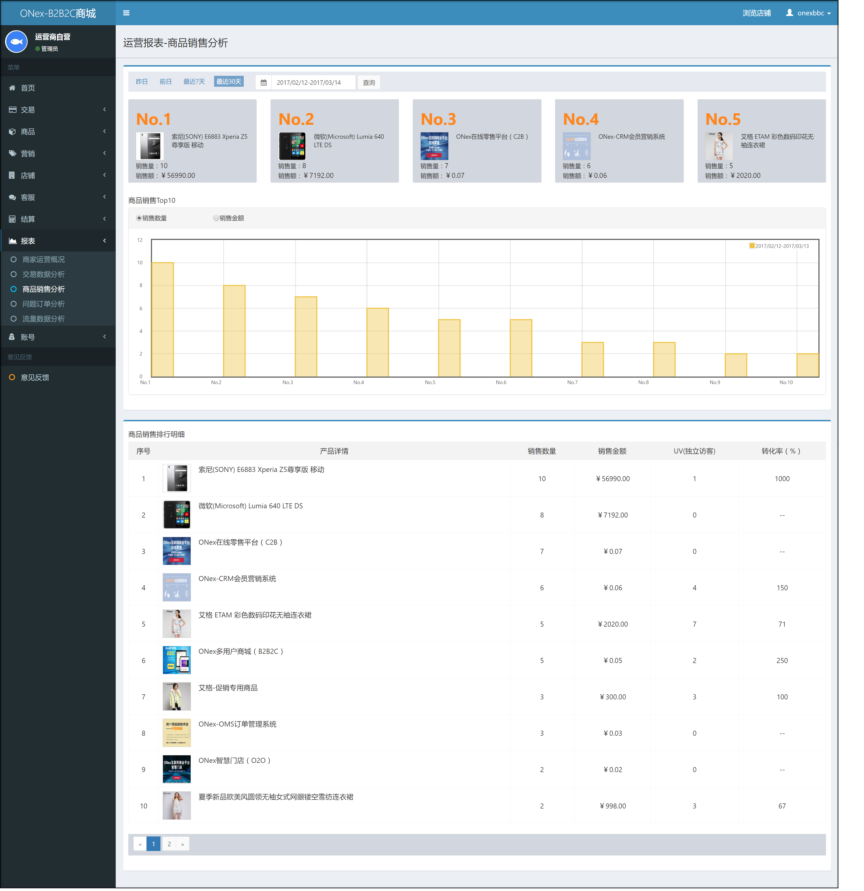
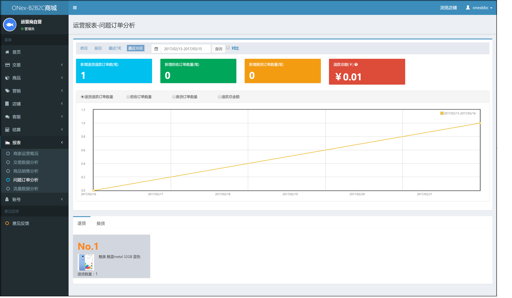
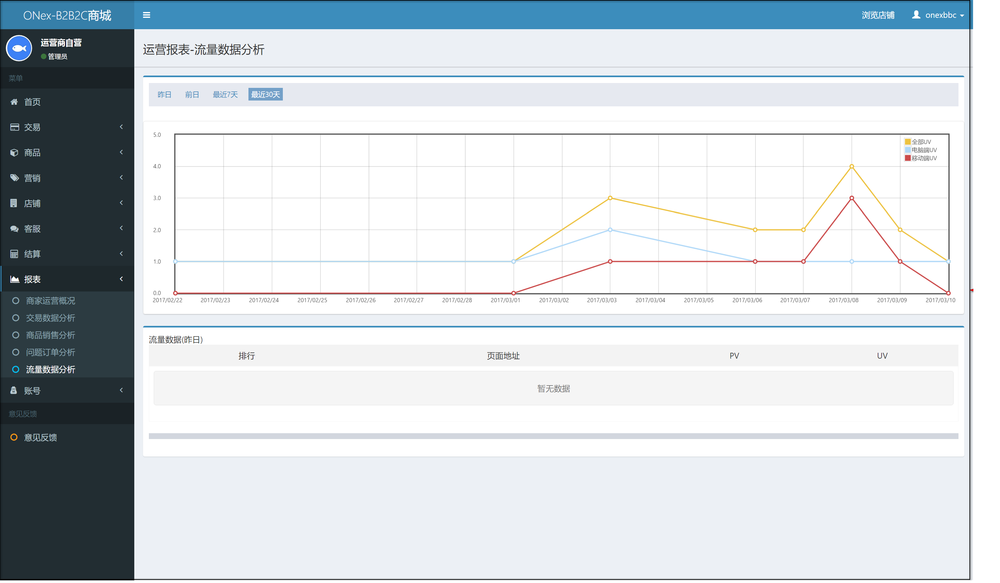

# 店铺运营报表

## 商家运营概况

商家可以在运营报表查看店铺运营概况，包含新增订单金额，新增订单数量，平均客单价，独立访问量、售后订单数等。

## 交易数据分析

此处显示店铺的交易数据以供分析

## 业务数据分析(3.1.8版本中被去除)

此处显示店铺的业务数据以供分析

     
## 商品销售分析

此处显示店铺的商品销售以供分析

## 问题订单分析(3.1.8版本中新增)

此处显示店铺的问题订单以供分析

店铺问题订单包含：退货订单、换货订单及客户拒收的订单。

## 流量数据分析(3.1.8版本中新增)

此处显示店铺的流量数据以供分析

系统通过PV、UV两个纬度对店铺的流量进行分析。

