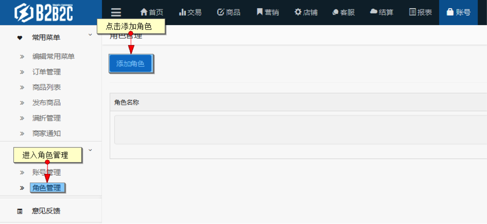
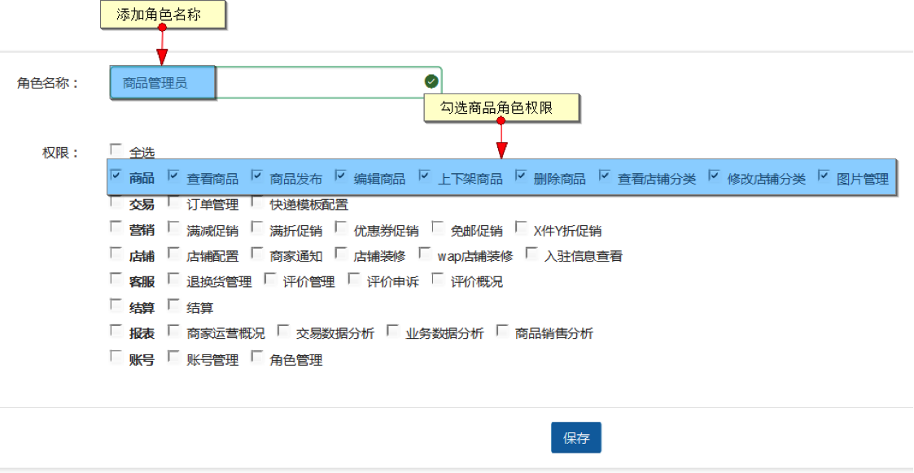
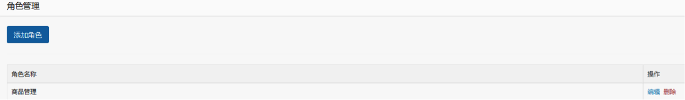
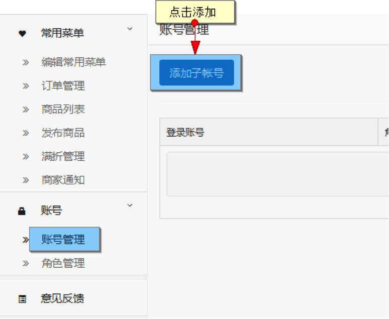
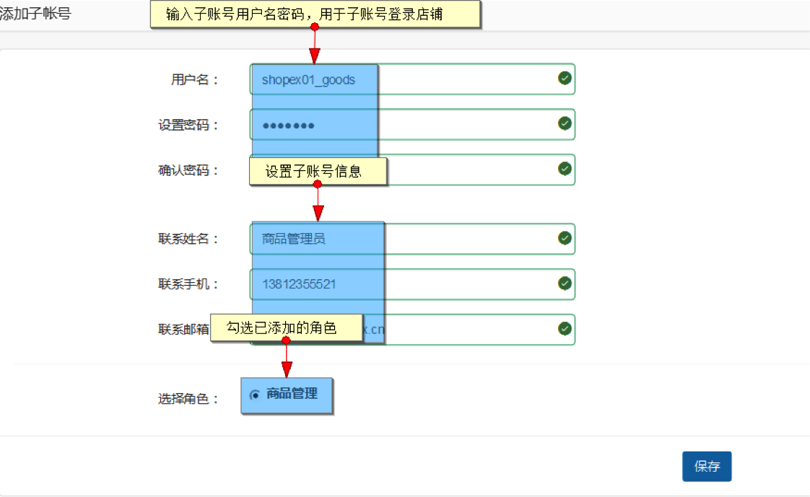
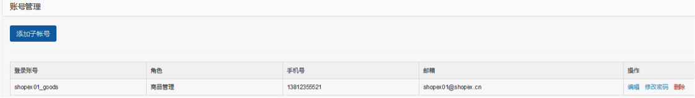
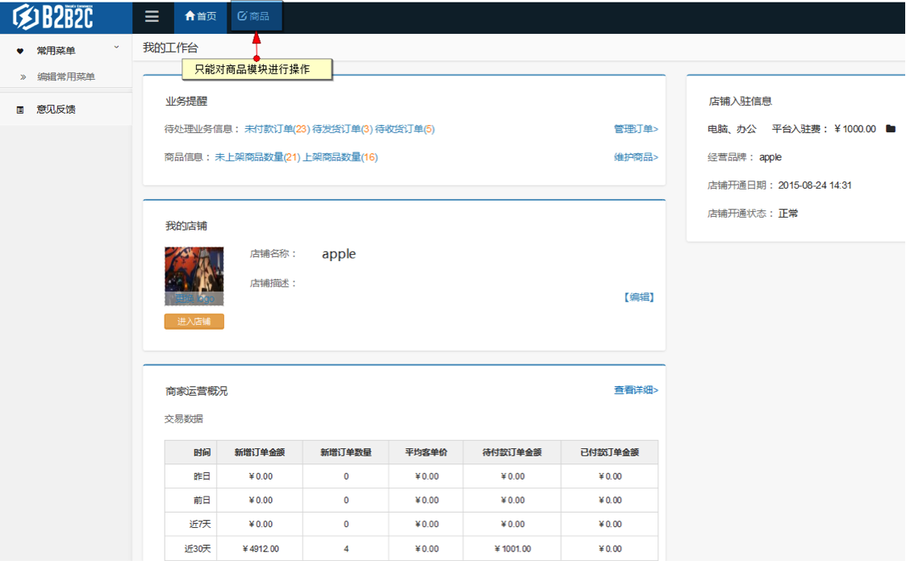

# 账号
商家可在账号功能模块添加角色，并根据角色添加子账号，来管理店铺管理员。

## 角色管理

在商家后台点击账号-角色管理，进入到角色列表页

点击添加角色

点击保存后相关角色数据会显示在列表内，可对其进行删除，编辑操作

## 账号管理

当店铺内存在已添加的角色数据时，可进行子账号添加

已添加的账号信息

 
使用添加的账号登录商家后台，只有相应功能模块的操作权限

当进行的操作超出权限时会有相应提示

 
