# 评价

当用户订单状态变为已完成时，可对订单进行评价，评价内容包括商品评论与店铺评分
 
## 订单评价

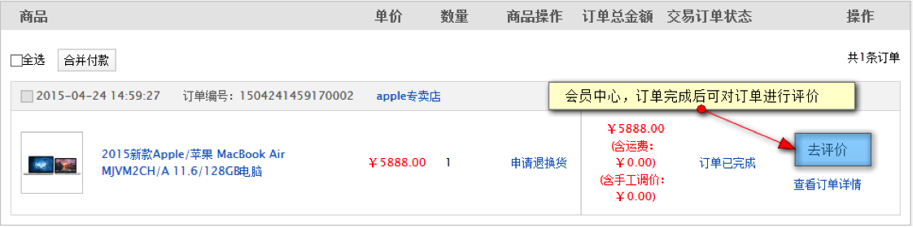

点击“去评价”链接

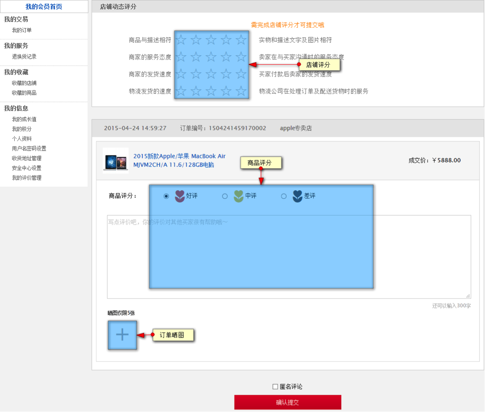

评分页面包含店铺动态评分，商品评分，已经晒图，可进行匿名评论
 
评论结果后的商城展示

商品详情页

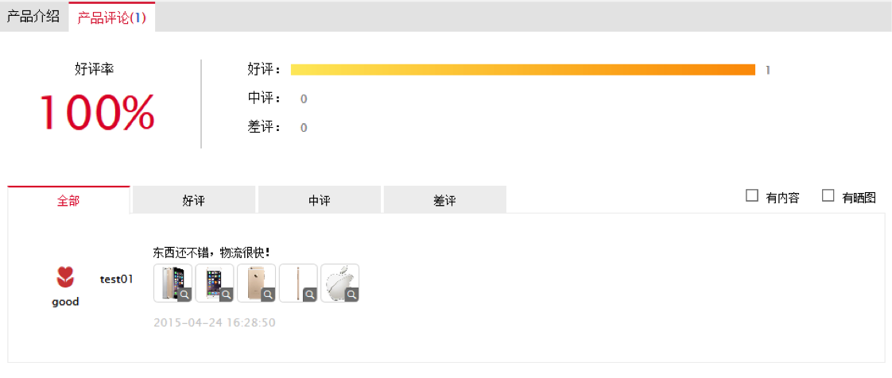
 
店铺评价展示

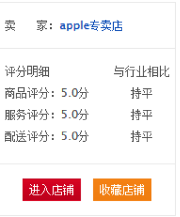
 
## 订单评价申诉

当买家对订单进行恶意评价时，商家可以有权利向运营平台进行申诉，当申诉通过后，可以对评价进行删除，或修改操作

进入商家中心，客服服务，评价列表，对好评以下的评价进行申诉

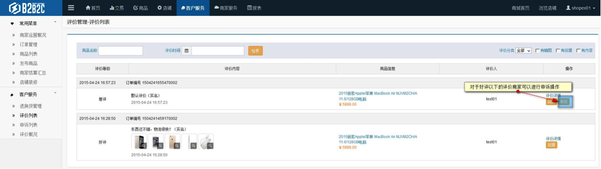

在申请页面，商家可以选择申请对评论进行删除或修改

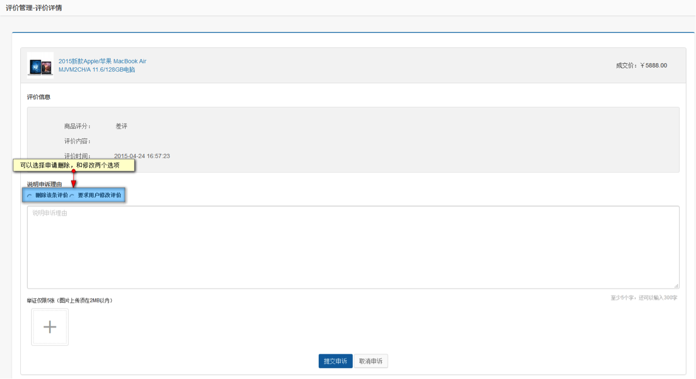
 
申诉后可在申诉列表内查看申诉进度

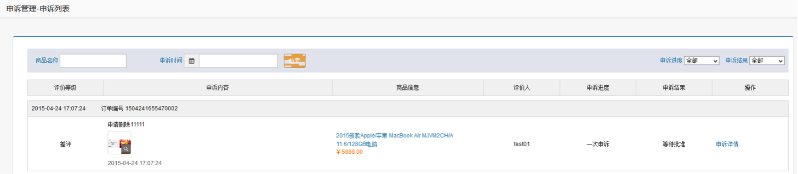
 
当申诉提交后，运营商可对申诉进行审批

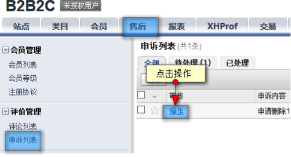

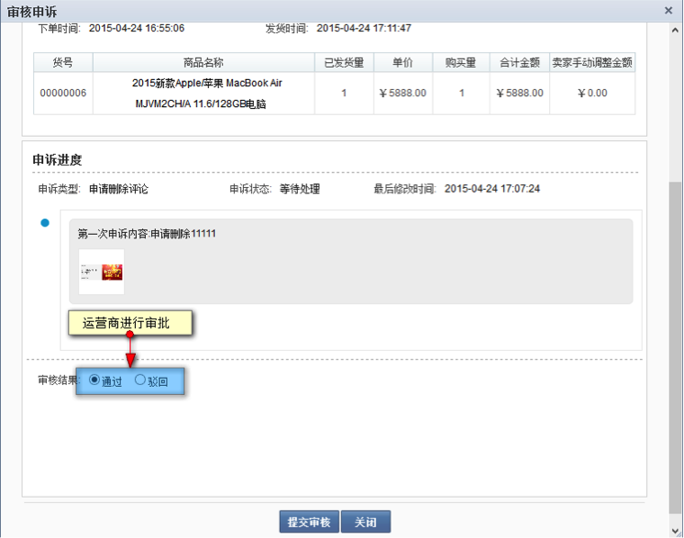
 
当运营商审批通过后，该评论即被删除。

当运营商商驳回申诉后，商家可进行二次申诉，流程与第一次申诉相同。

## 追加评论

在初次评价成功后，买家可对订单进行追评，在我的评价管理列表进行追评

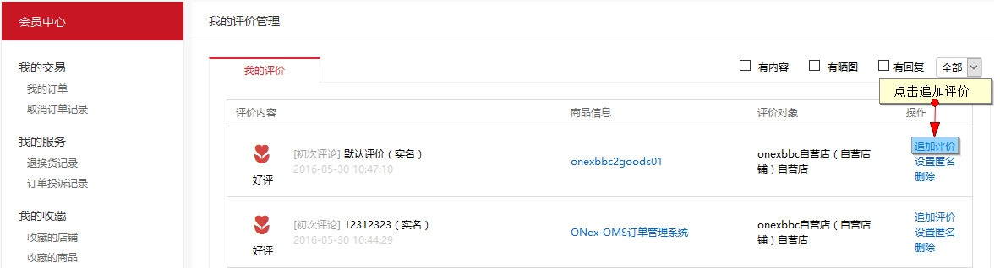

填写追评内容

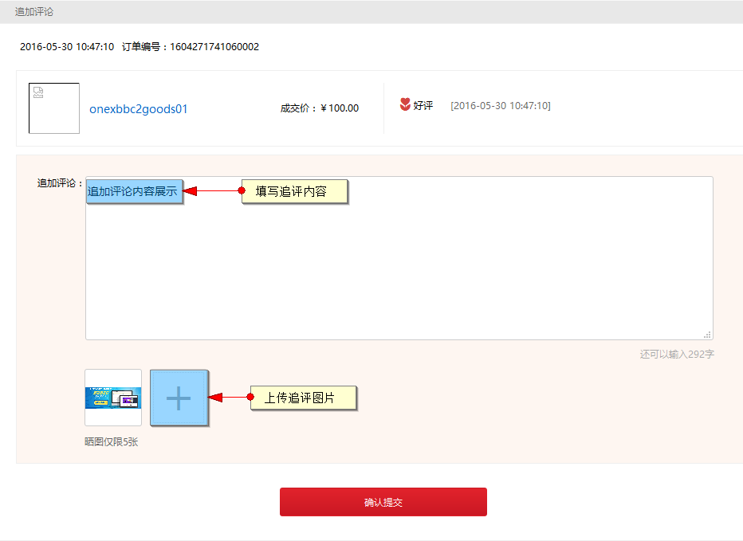

添加后在商品评价处的显示

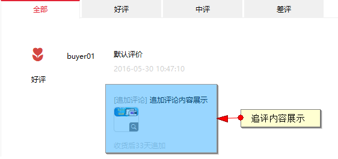

在买家追评后，商家可对追评进行解释操作

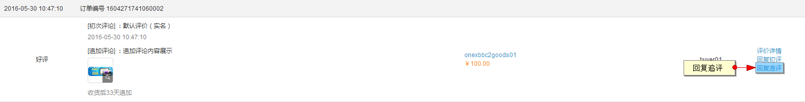

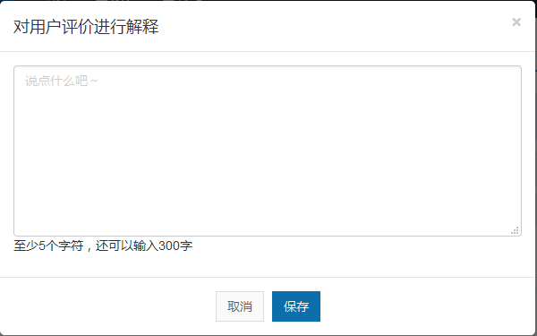

商家解释后的显示如下

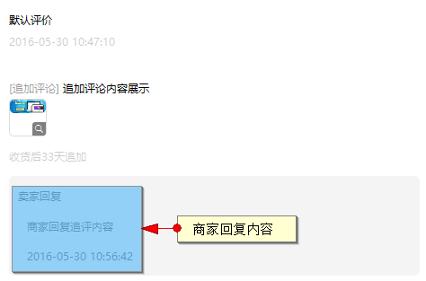

运营商可对买家追评做删除操作

运营商在基本设置处，可设置追评的有效期限，超出期限无法追评

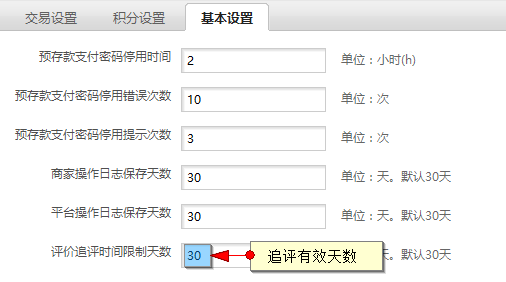

