# 会员参加平台活动

* [1 PC端](#1)
* [1.1 查看平台活动](#1.1)
* [1.2 查看预告中的活动](#1.2)
* [1.3 查看开售中的活动](#1.3)
* [1.4 对感兴趣的活动设置开售提醒](#1.4)
* [1.5 购买平台活动商品](#1.5)
* [2 WAP端](#2)
* [2.1 查看平台活动](#2.1)
* [2.2 查看预告中的活动](#2.2)
* [2.3 查看开售中的活动](#2.3)
* [2.4 对感兴趣的活动设置开售提醒](#2.4)
* [2.5 购买平台活动商品](#2.5)

## <h2 id="1">PC端</h2>

### <h3 id="1.1">查看平台活动</h3>
您可以在平台活动列表页中查看所有预告中、开售中的活动，点击任意活动图片都可以进入活动的详情页

_ _ _

#### <h3 id="1.2">查看预告中的活动</h3>
在活动详情页中点击任意活动商品的‘去看看’，可以查看该活动商品详情

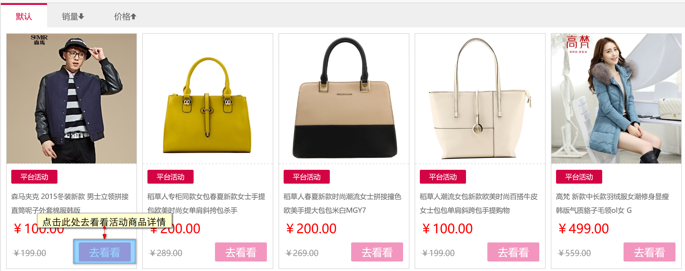

由于活动只是预告尚未开售，所以暂时无法购买，您可以将喜欢的商品加入收藏页或者购物车。您还可以对活动设置开售提醒，当活动将要开始时，平台会发送提醒给你。如何设置开售提醒？请点击[此处](#1.4)查看。
当然如果您实在喜欢一件商品，不想等到活动开始再买，也可以进行原价购买，早买早享受！

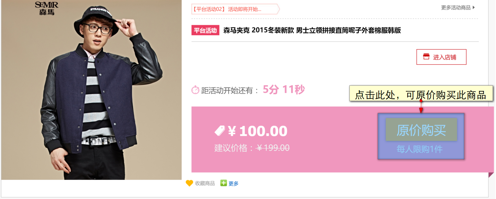

_ _ _

#### <h3 id="1.3">查看开售中的活动</h3>
在活动详情页中点击任意活动商品的‘马上抢’，可以查看该活动商品详情

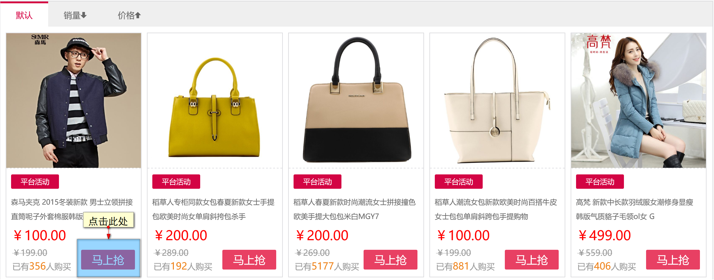

想要购买商品的话，点击此页面的‘马上抢’就可以去购买商品啦！

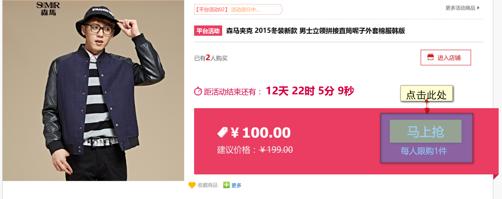

_ _ _

### <h3 id="1.4">对感兴趣的活动设置开售提醒</h3>
如果看到中意的商品参加活动了，可以对活动设置开售提醒，平台将会以短信或者邮件的方式发送提醒给您。

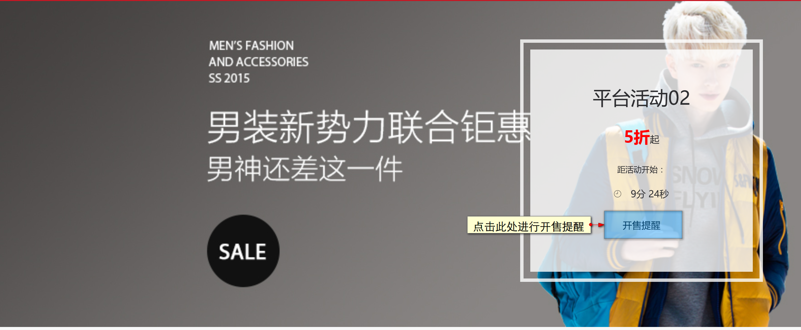

邮箱提醒
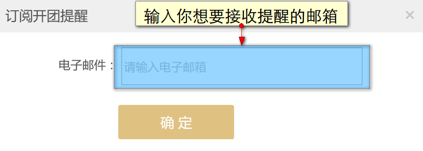

手机提醒
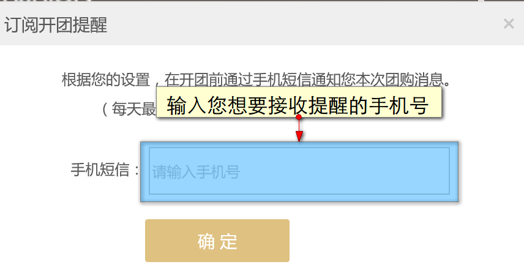

_ _ _

### <h3 id="1.5">购买平台活动商品</h3>
活动开始了，您可以去活动页挑选自己心仪的商品下单。
当然您之前已经将要购买的商品加入进收藏或者购物车的话可以更快购买到哦！

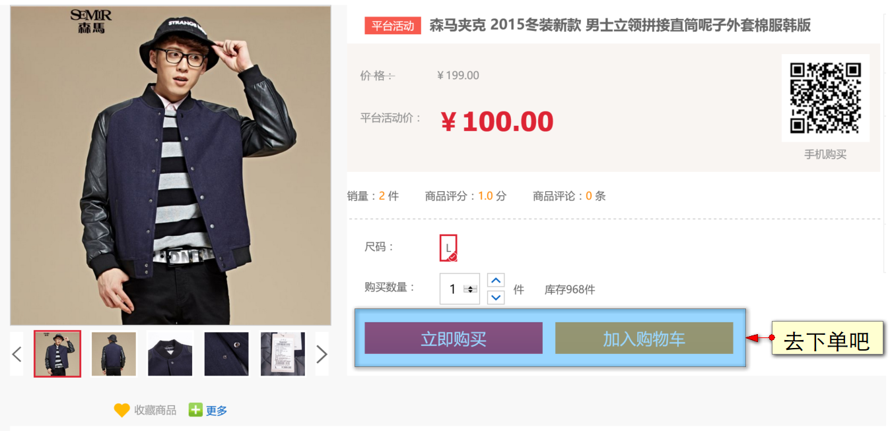

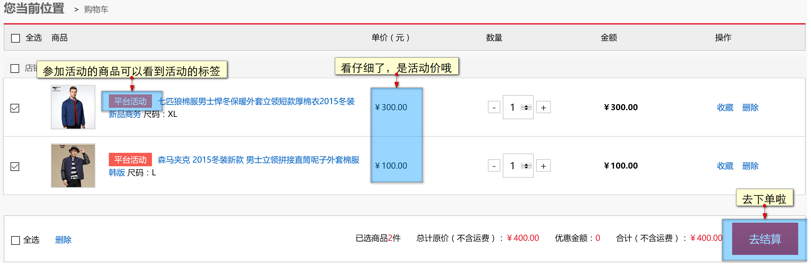

## <h2 id="2">WAP端</h2>
### <h3 id="2.1">查看平台活动</h3>
您可以在平台活动列表页中查看所有预告中、开售中的活动，点击任意活动图片都可以进入活动的详情页

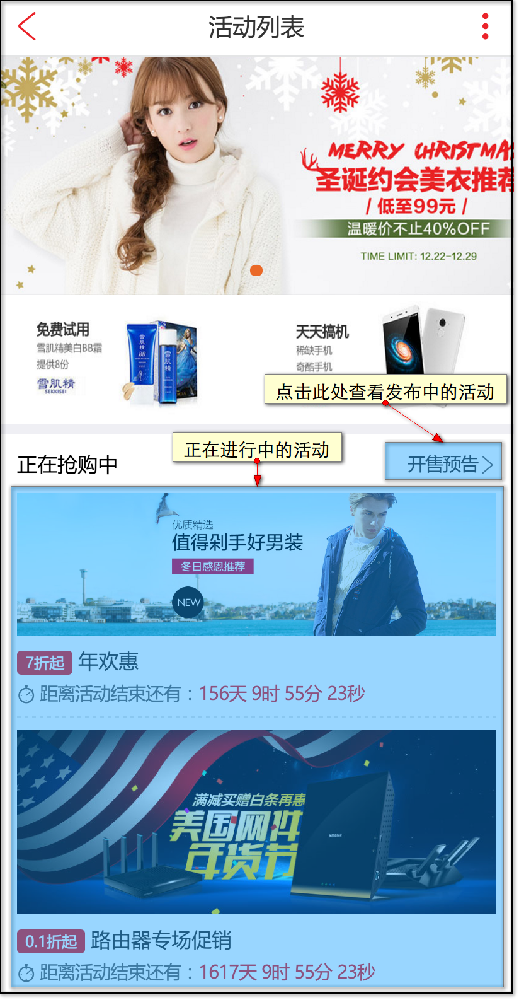

_ _ _

#### <h3 id="2.2">查看预告中的活动</h3>
在平台活动首页中的‘开售预告’可以查看正在预告中的活动
点击任意活动的活动图片可以进入该活动的详情页
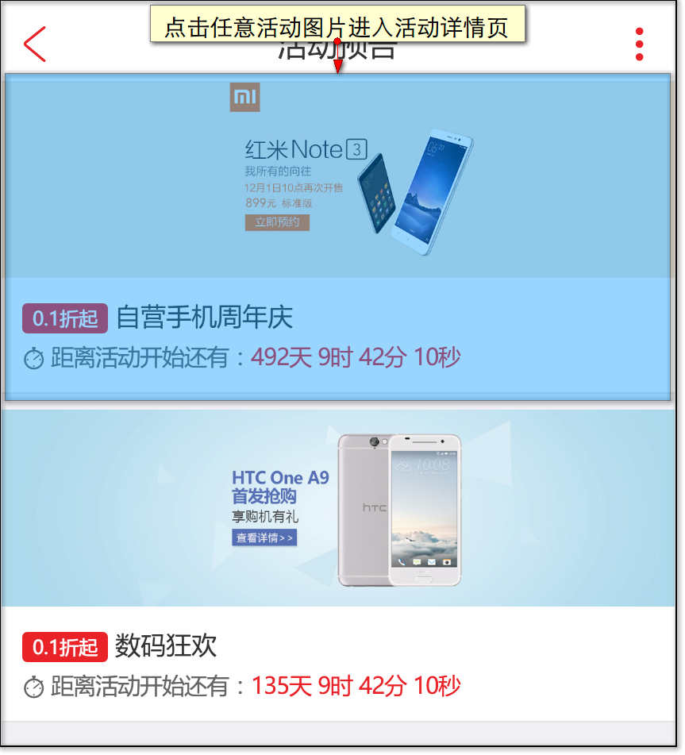

在活动详情页中点击任意活动商品的图片，可以查看该活动商品详情

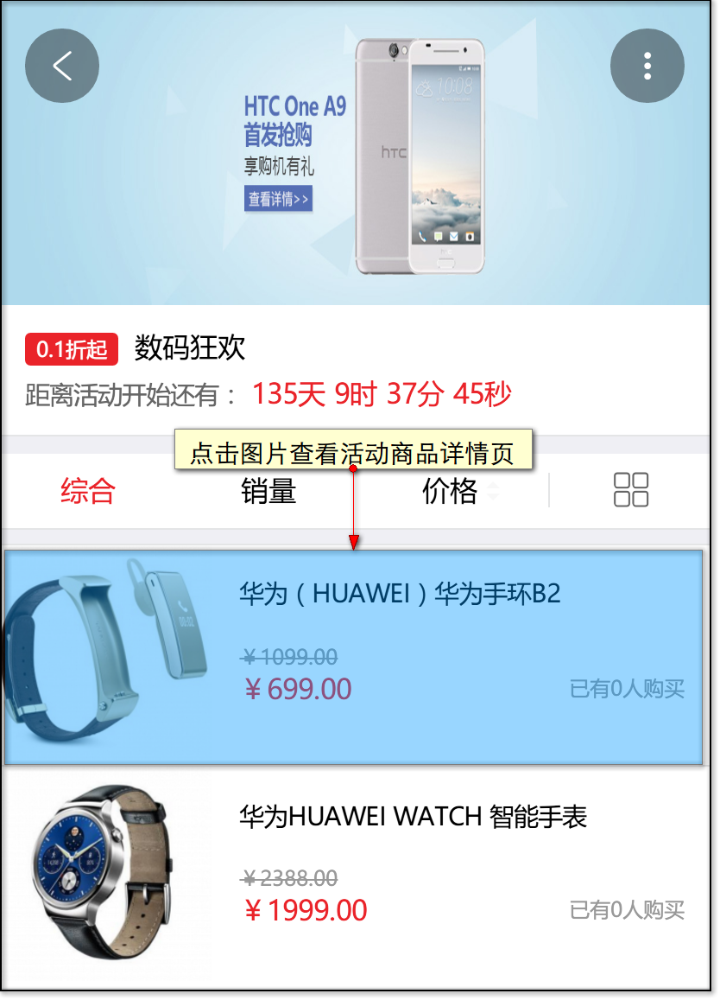

由于活动只是预告尚未开售，所以暂时无法购买，您可以将喜欢的商品加入收藏页或者购物车。您还可以对活动设置开售提醒，当活动将要开始时，平台会发送提醒给你。如何设置开售提醒？请点击[此处](#2.4)查看。
当然如果您实在喜欢一件商品，不想等到活动开始再买，也可以进行原价购买，早买早享受！

#### <h3 id="2.3">查看开售中的活动</h3>
在活动详情页中点击任意活动商品的图片，可以查看该活动商品详情

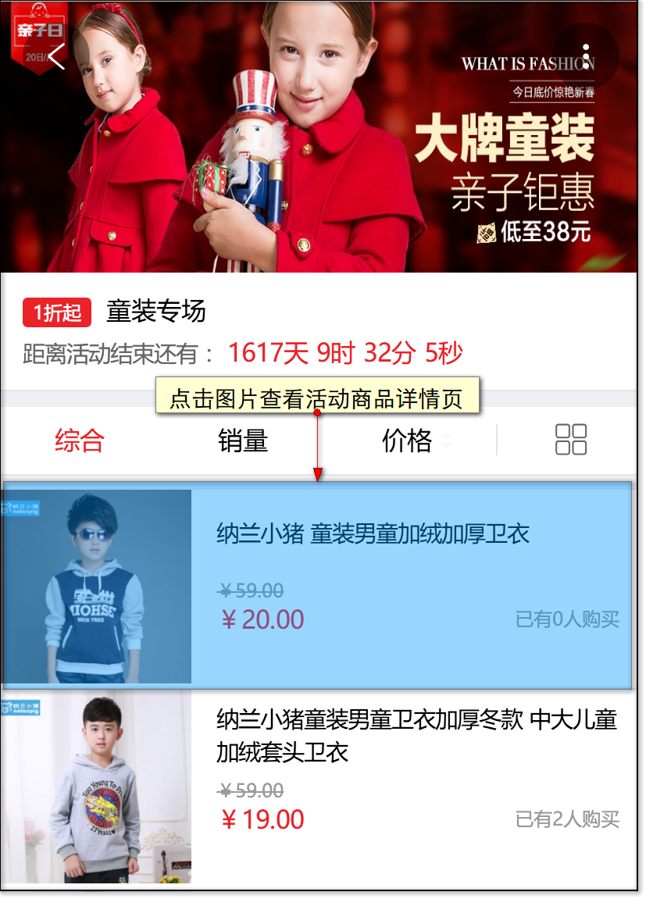

想要购买商品的话，点击此页面的‘马上抢’就可以去购买商品啦！

### <h3 id="2.4">对感兴趣的活动设置开售提醒</h3>
如果看到中意的商品参加活动了，可以对活动设置开售提醒，平台将会以短信或者邮件的方式发送提醒给您。进入任意一个处于预告中的活动，点击任意活动商品，就可以看到‘开售提醒’。

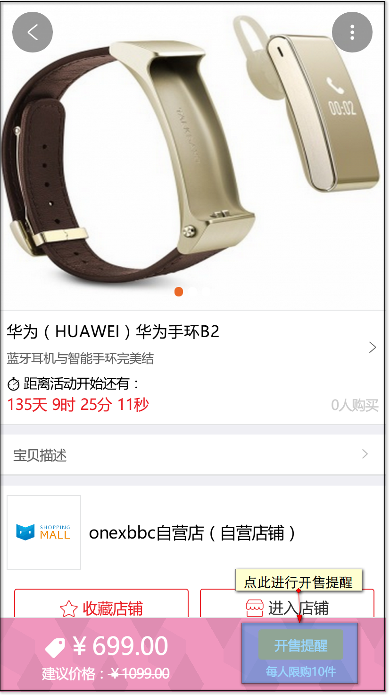

邮箱提醒
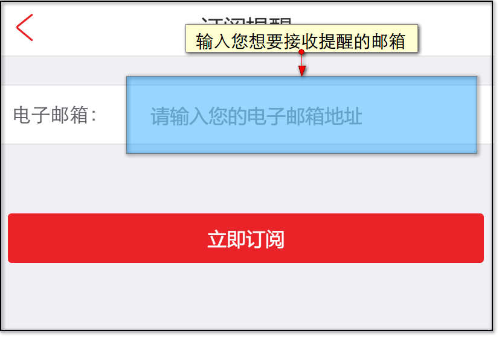

手机提醒
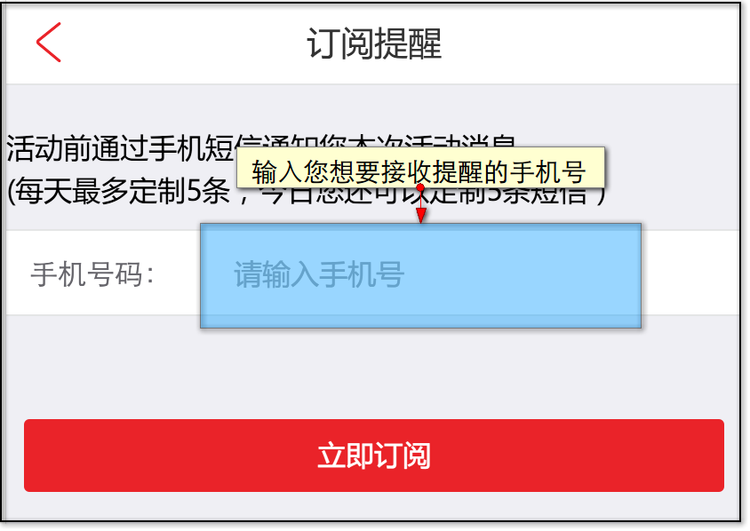

### <h3 id="2.5">购买平台活动商品</h3>
活动开始了，您可以去活动页挑选自己心仪的商品。
当然您之前已经将要购买的商品加入进收藏或者购物车的话可以更快购买到哦！

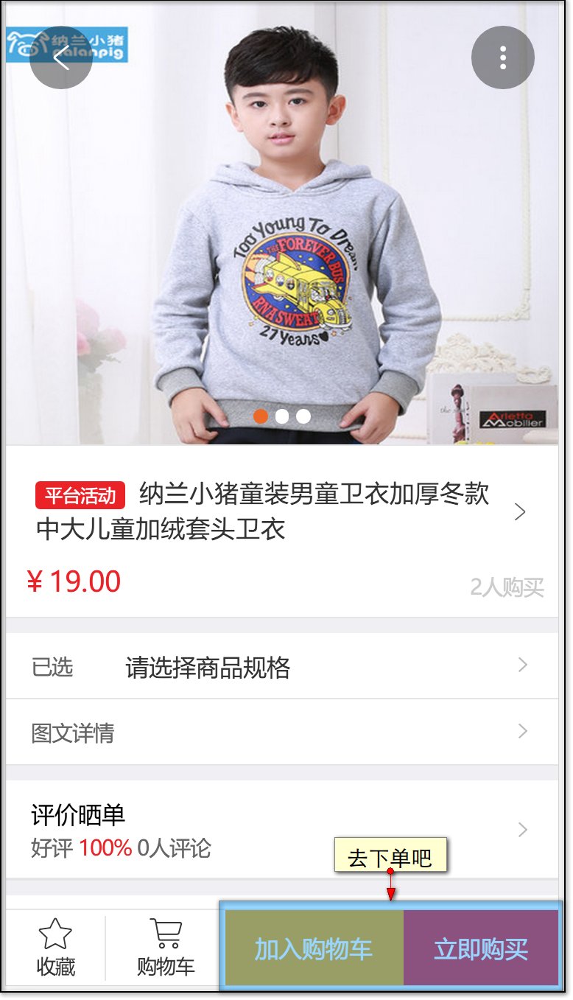

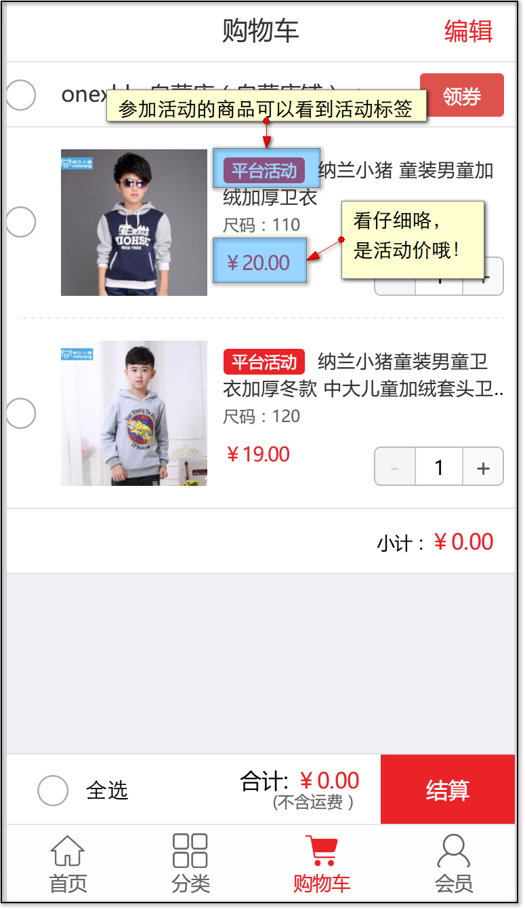

