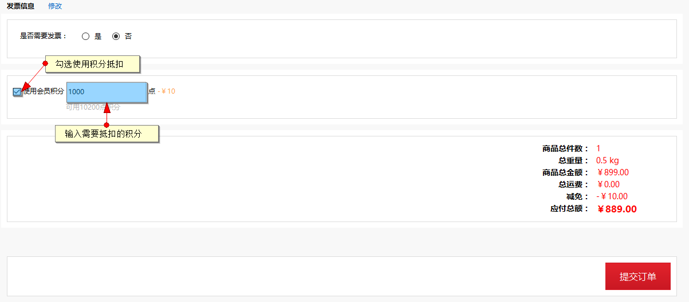
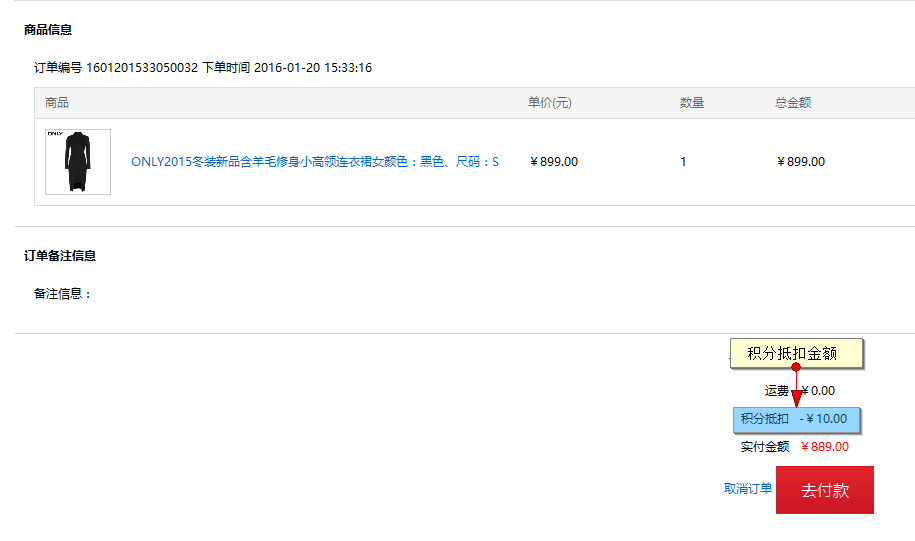
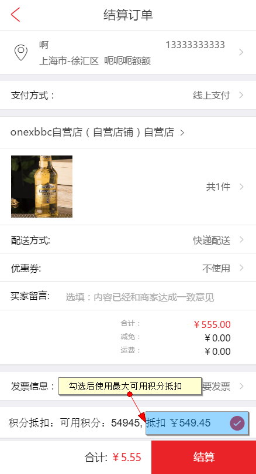

# 订单积分抵扣

当运营商开启积分抵扣后，会员可使用积分抵扣订单金额

## 订单确认页

###PC端使用

电脑端订单确认页面，勾选使用会员积分，勾选后可在使用积分处填写需要抵扣的积分数量，应用运营商设置的积分使用规则

下单后用户可在订单详情页查看到积分抵扣的详情

###WAP端使用

WAP端订单确认页面，同样可以勾选使用积分，但与电脑端不同的是无法填写使用的积分数额，系统将默认使用最大可用积分

