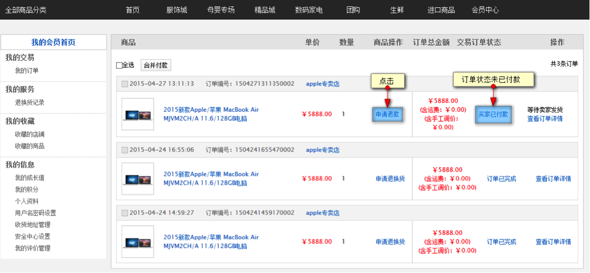
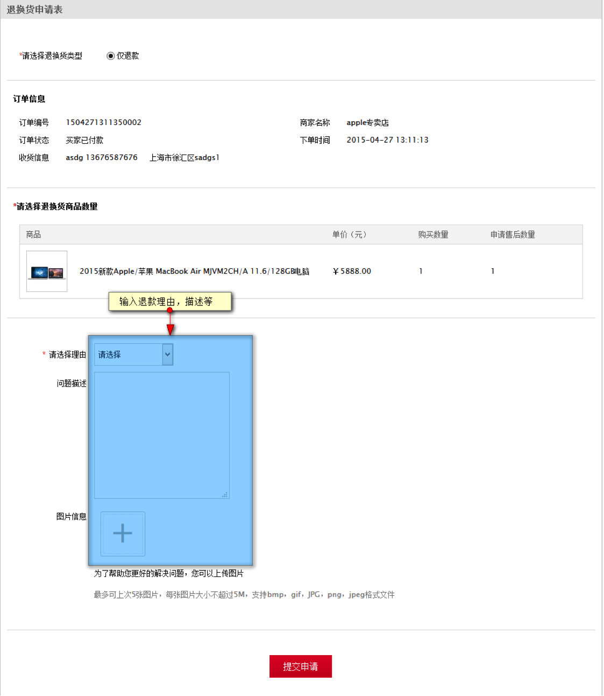
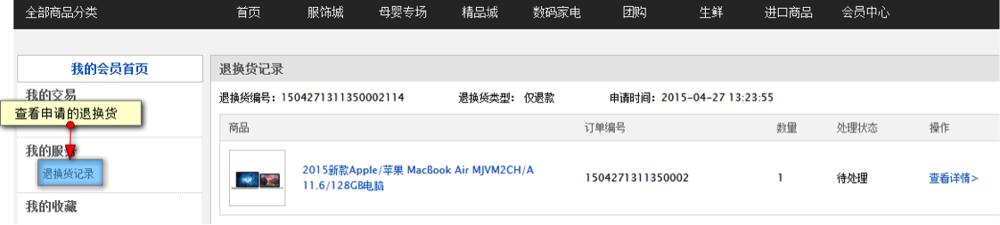
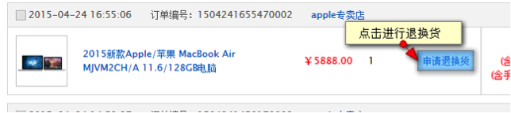
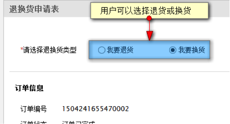
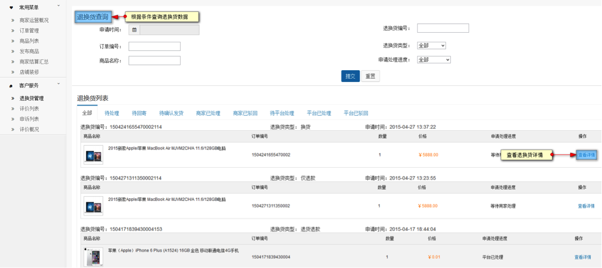
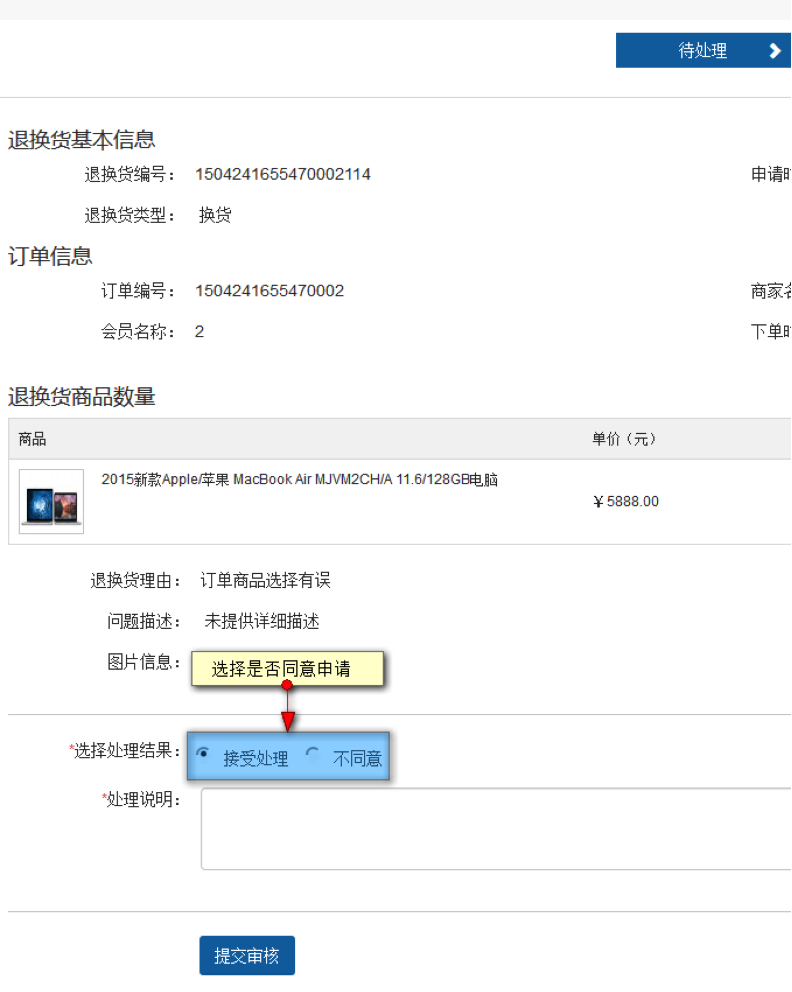
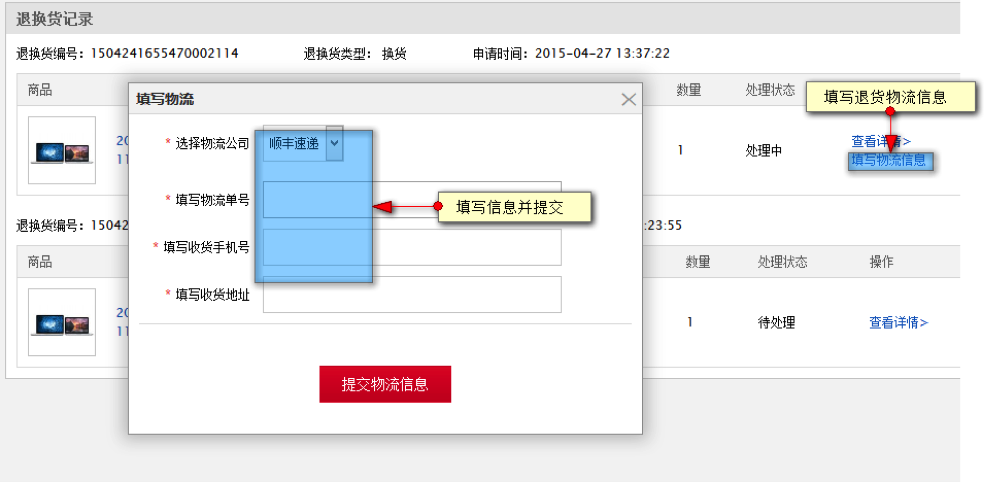
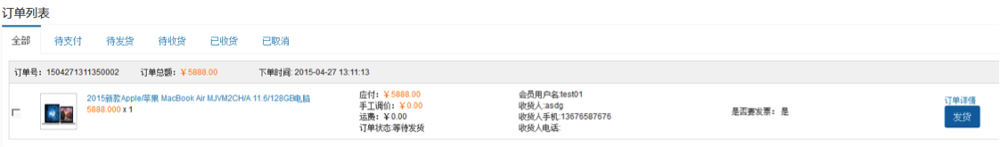

# 售后

## 售后服务功能使用说明

售后服务主要是顾客收到货物后的反馈，比如某个商品有问题，需要退或换，此时可在会员中心申请售后服务.售后服务会让用户感觉更专业，顾客必须注册为会员后才能使用售后服务。
 
本小节分2部分，通过本节操作，您可以了解客户申请售后服务，并让商家和平台能处理售后服务请求。

### 会员使用售后服务

用户下单付款后，在商家还未发货时申请退款

会员进入会员-我的交易，对已付款未发货的订单进行“申请退款”操作，点击后进入退换货处理页面

输入相关内容点击提交申请后，在会员中心，我的服务-退换货记录内查看到这条售后记录

 
发货后申请退换货

当卖家已发货，买家收到的货物不满意时，可进行退/换货申请

用户可以根据实际情况选择退货或者换货申请

### 商家处理售后服务

当用户提交了售后申请后，商家可在商家中心-客户服务-退换货中心内看到买家申请的退款，退换货申请

点击查看详情，查看售后信息

如此次售后申请的是换货，当商家确认处理后，在买家的会员中心订单操作会出现填写物流信息功能，点击填写退货物流信息。

最后商家收到货物再次进行换货发货

 
此时买家将该订单再次发货，发货后订单变为已完成状态

