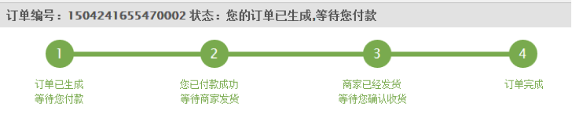
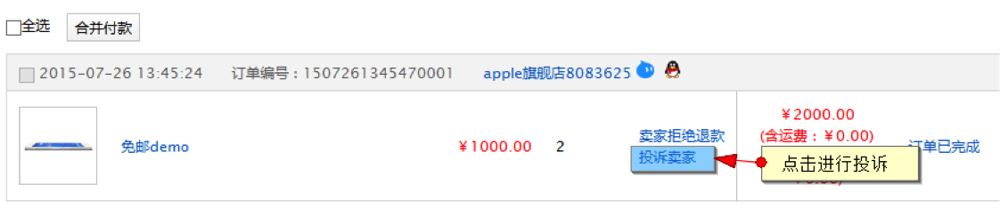
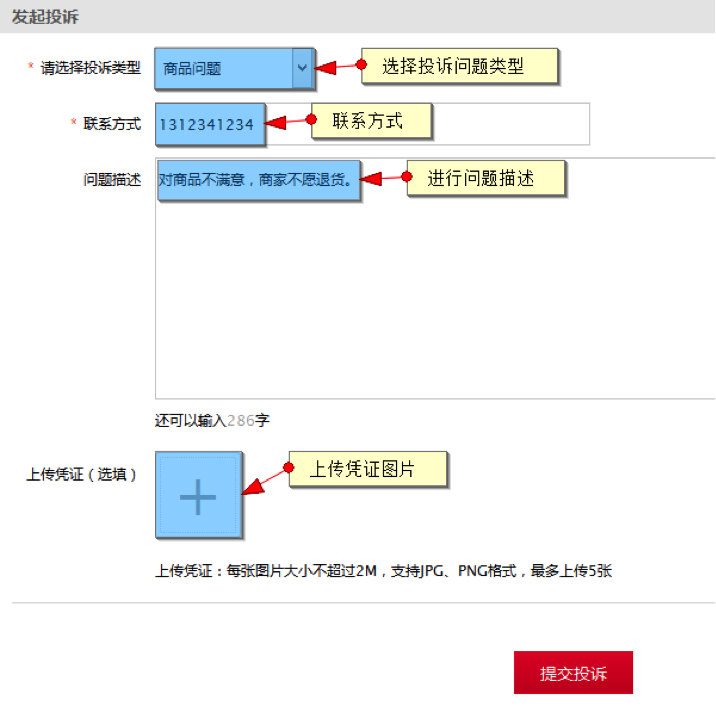
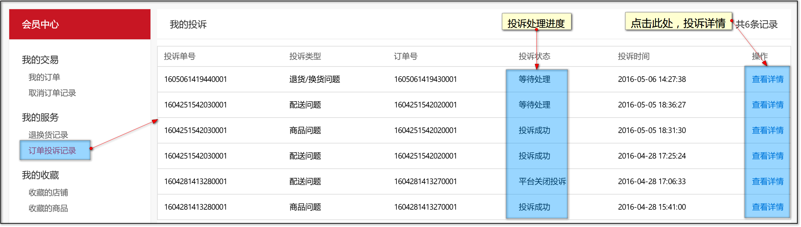
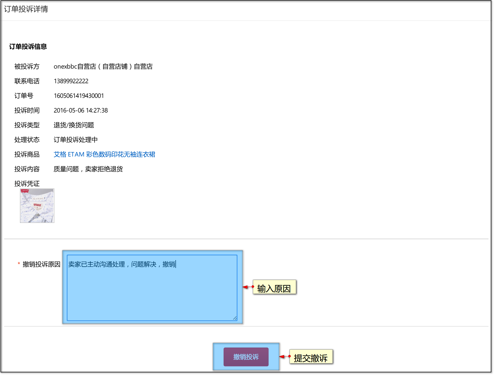
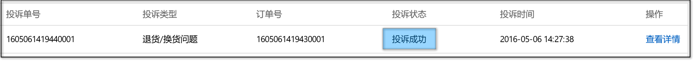
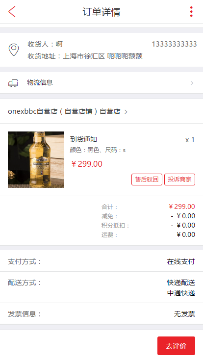
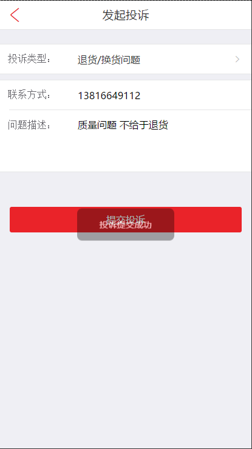
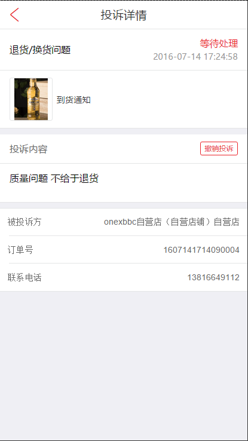

# 订单投诉

## PC端订单投诉

> 本段针对会员的订单投诉操作流程，关于运营平台方的投诉处理，[详见此处](../200.platform/600.shop-orders-manager.md)。

_ _ _

当买家用户申请退换货被商家拒绝后，买家可在订单列表中选择“投诉卖家”向平台进行商家投诉操作

点击后进入投诉详情页面

输入投诉投诉原因，联系方式等信息后，提交投诉

提交投诉后，可在【会员中心】-【订单投诉记录】页中跟踪投诉处理进度

若您在平台处理投诉前已经与商家取得和解，可进行撤诉操作。

在【订单投诉记录】页中找到之前的投诉记录，点击【查看详情】

在投诉详情的底部，输入撤销投诉的原因，点击【撤销投诉】即可撤诉。

一旦您看到投诉被平台受理（投诉成功）

您可以前往【我的订单】页，找到您投诉的订单，对商品重新进行售后申请。

## wap订单投诉

wap端同时也支持订单投诉，流程与pc端流程一致

当订单状态为售后拒绝状态时

 
点击投诉商家

当投诉状态为未处理状态时，可以对投诉进行撤诉操作

