# 促销

* [1 满减管理](#1)
* [2 满折管理](#2)
* [3 优惠券使用](#3)
* [4 免邮优惠](#4)
* [5 X件Y折](#5)
* [6 组合促销](#6)
* [7 促销详情页](#7)
* [8 购物车中促销展示](#8)

## <h2 id=1>满减优惠</h2>

当商家成功添加满减规则（第三章 3.8.1），且进入规则有效期内，用户购买该商品满足条件可享受相应满减优惠。

在商品详情页显示

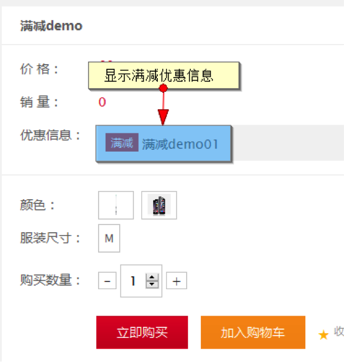

将商品加入购物车后，在购物车即可选择满减规则享受优惠

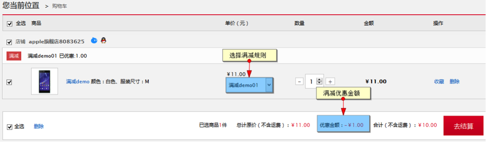
 
订单确认页的满减展示

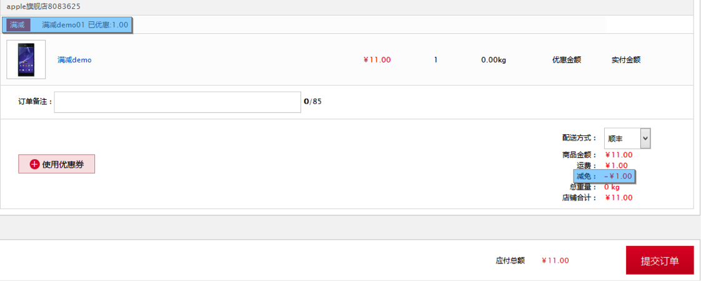
 
## <h2 id=2>满折优惠</h2>

当商家成功添加满减规则（第三章 3.8.2），且进入规则有效期内，用户购买该商品满足条件可享受相应满折优惠。

在商品详情页显示

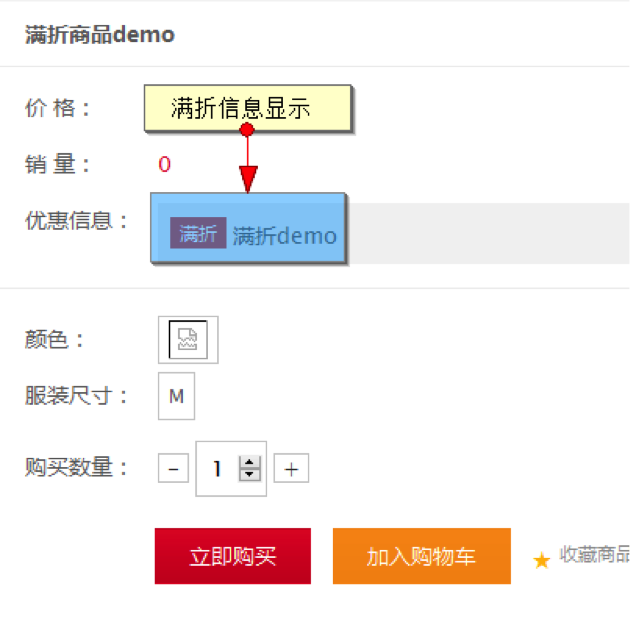

将商品加入购物车后，在购物车即可选择满折规则享受优惠

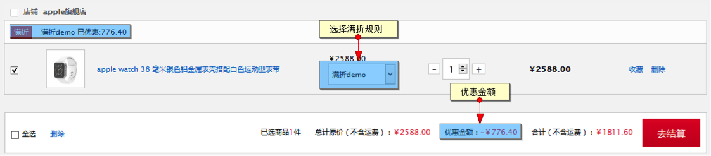

订单确认页的满折展示

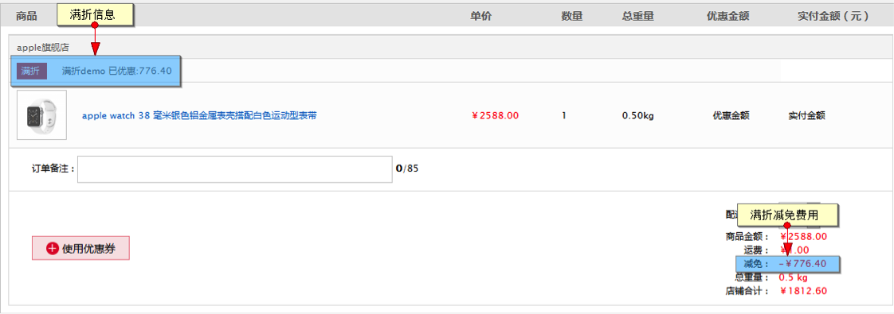
 
## <h2 id=3>优惠券使用</h2>

当商家成功添加优惠券（第三章 3.8.3），且进入优惠券可领取时间段，用户可在店铺首页（pc，wap端）领取优惠券

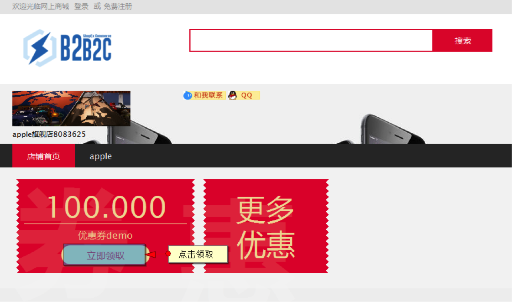
 
领取成功后会出现领取成功提示

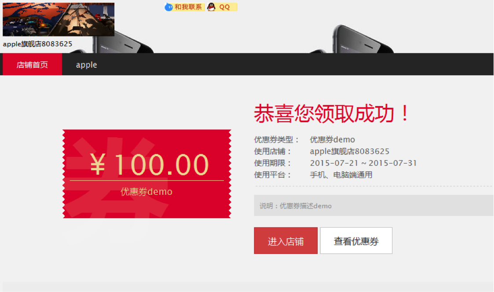
 
在成功页面点击查看优惠券

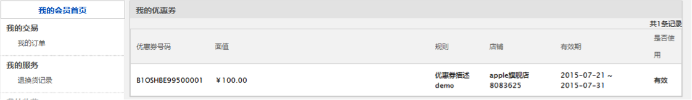

在会员中心的我的优惠券可查看领取成功的优惠券，及优惠券的状态。
 
当用户购买了加入优惠券的商品，在订单确认页点击使用优惠券

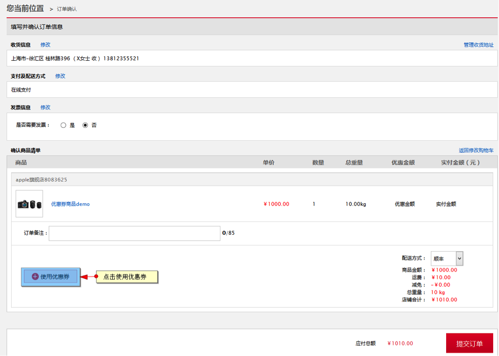

点击后选择需要使用的优惠券

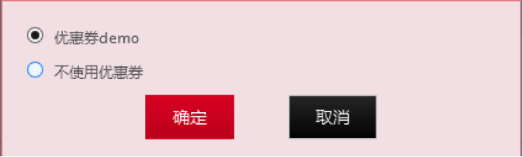
 
确定后优惠券即生效

 
注：当用户使用优惠券后优惠券状态变为失效，在未支付情况下取消订单，优惠券状态会恢复为有效，但当支付后售后优惠券不会返还。
 
## <h2 id=4>免邮优惠</h2>

当商家成功添加满减规则（第三章 3.8.4），且进入规则有效期内，用户购买该商品满足条件可享受相应免邮优惠。

在商品详情页展示

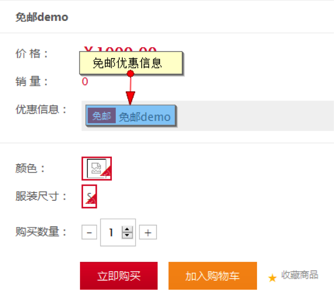

将商品加入购物车后，在购物车即可选择包邮规则享受优惠

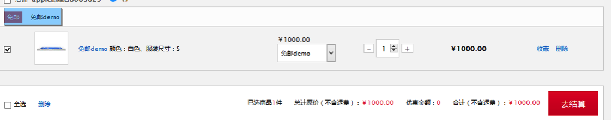

订单确认页免邮显示

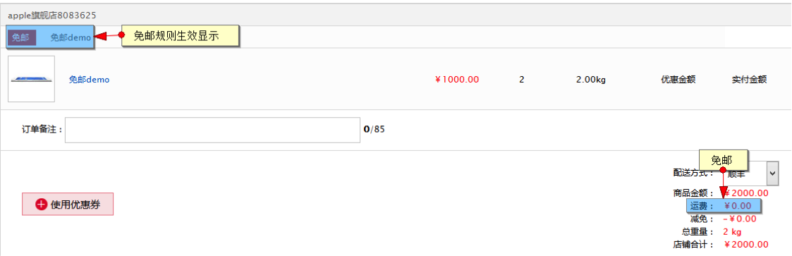
 
## <h2 id=5>X件Y折</h2>

当商家成功添加XY规则（第三章 3.8.5），且进入规则有效期内，用户购买该商品满足条件可享受相应XY折优惠。

在商品详情页展示

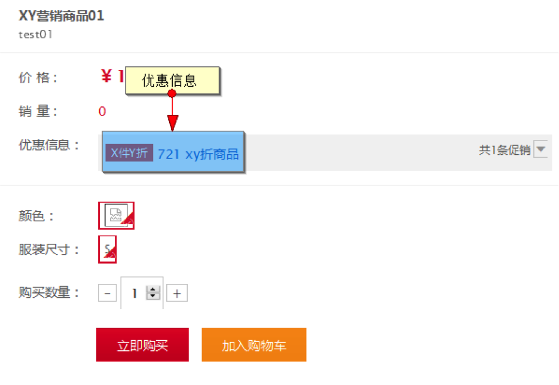

将商品加入购物车后，在购物车即可选择XY规则享受优惠

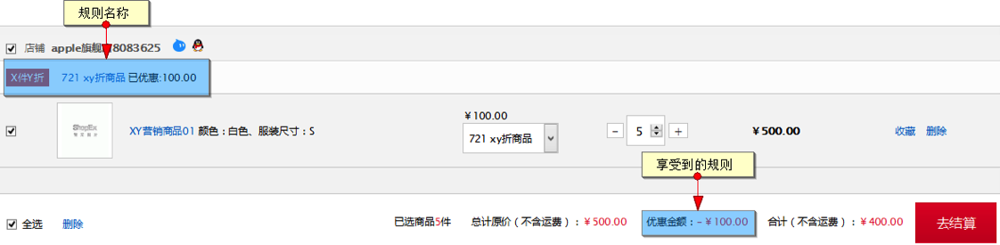

订单确认页优惠显示

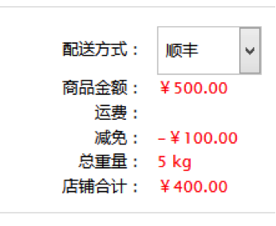
 

## <h2 id=6>组合促销</h2>

当某个商品参加了组合促销，会员就可以在该商品的详情页中购买组合促销商品

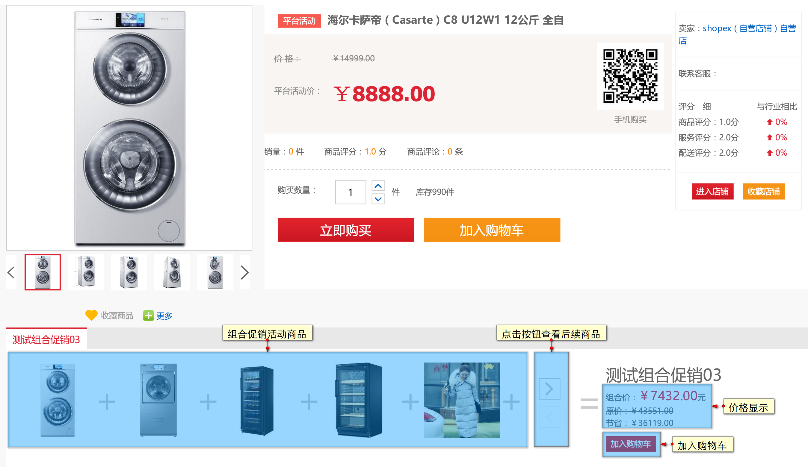

点击'加入购物车'会弹出组合促销商品的具体明细，会员可在此页面进行数量选择，再正式加入购物车

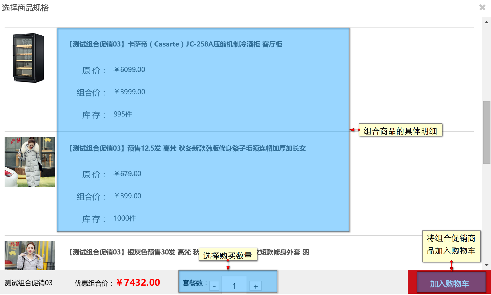

购物车中，组合促销商品会作为一个商品集显示。

结算页中，组合促销商品的重量为所有商品重量的总和，选择好配送方式，下单购买吧！

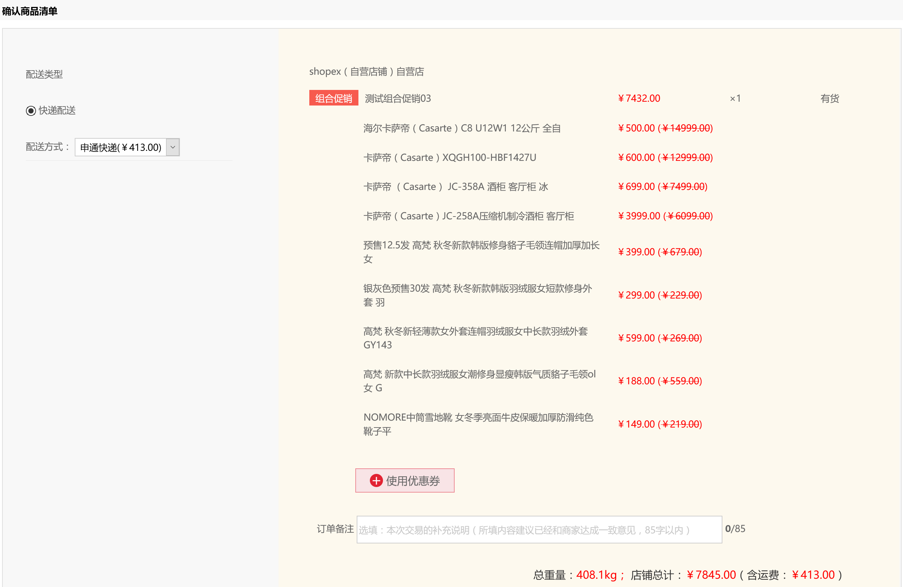

## <h2 id=7>促销详情页</h2>

目前所有的促销规则都有详情页，进入方式为商品详情页点击链接

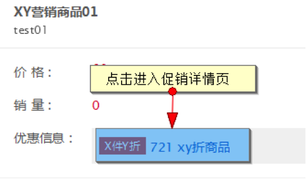

详情页显示该活动的描述以及活动时间，下方展示规则中生效的商品

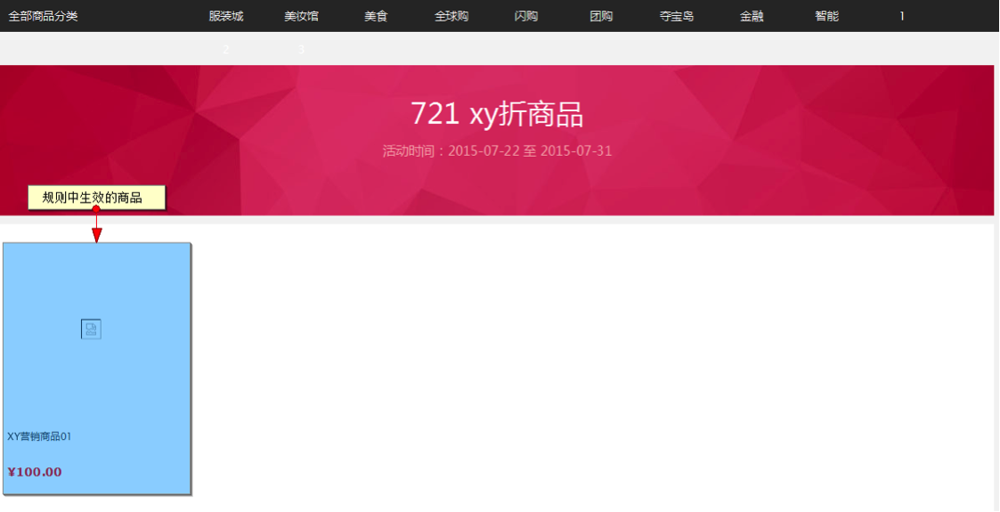
 
## <h2 id=8>购物车中促销展示</h2>

购物车中，当规则满足生效条件时才会显示促销信息，否则则不显示

例：

当不满足条件时

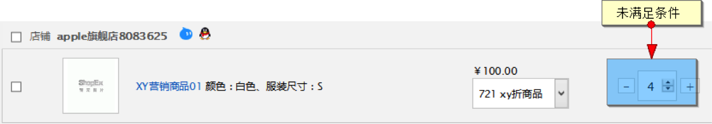
 
满足条件时

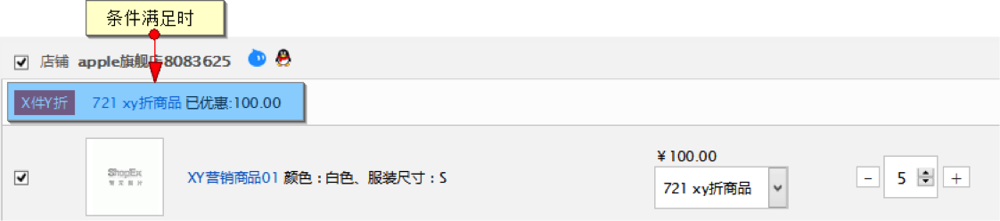
