# 会员中心

* [1 安全中心设置](#1)
* [2 会员签到](#2)
* [3 我的奖品](#3)
* [4 我的购物券](#4)

## <a id="1">安全中心设置</a>

* [1.1 修改密码](#1.1)
* [1.2 手机绑定](#1.2)
* [1.3 邮箱绑定](#1.3)

- - -

安全中心包含设置项，修改密码，绑定手机，绑定邮箱

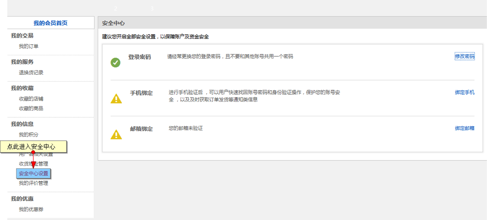

### <a id="1.1">修改密码</a>

用户可以在安全中心-登录密码内设置自己的登录密码

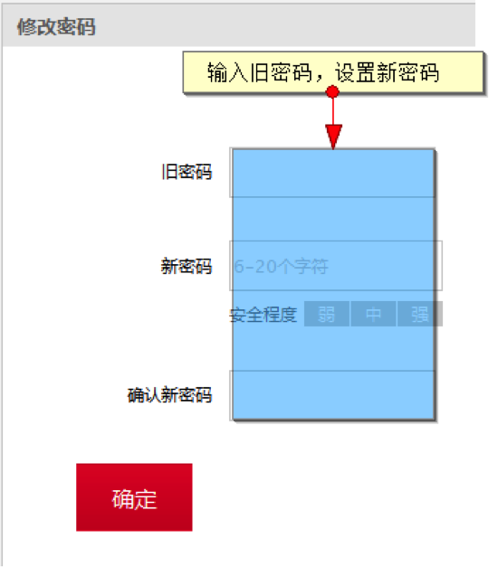

确定后，用户密码即更新成功

### <a id="1.2">手机绑定</a>

绑定手机可以进一步保障账户的安全，点击绑定手机

第一步输入登录密码验证身份

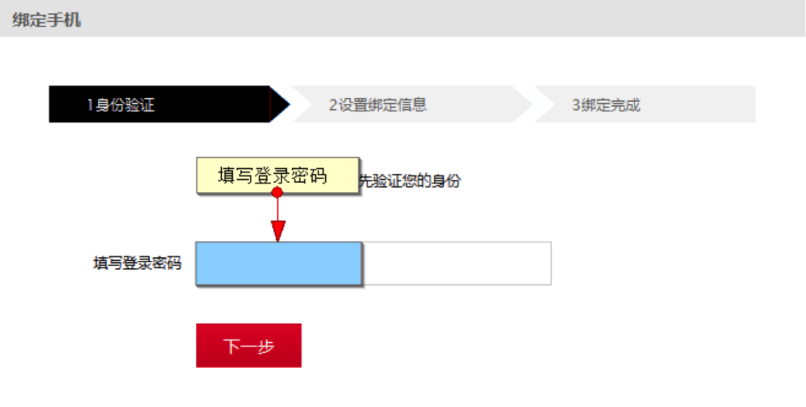

第二步验证手机，获取验证码

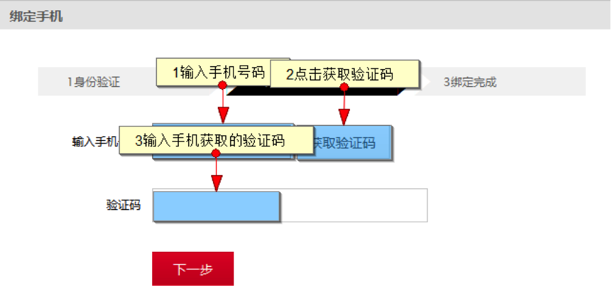

点击下一步后验证绑定成功
 
### <a id="1.3">邮箱绑定</a>

绑定邮箱可以进一步保障账户的安全，点击绑定邮箱

第一步输入登录密码验证身份

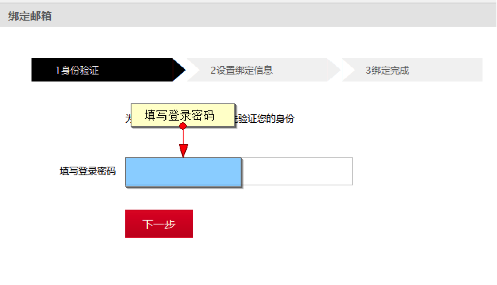

第二步输入绑定邮箱，发送验证邮件

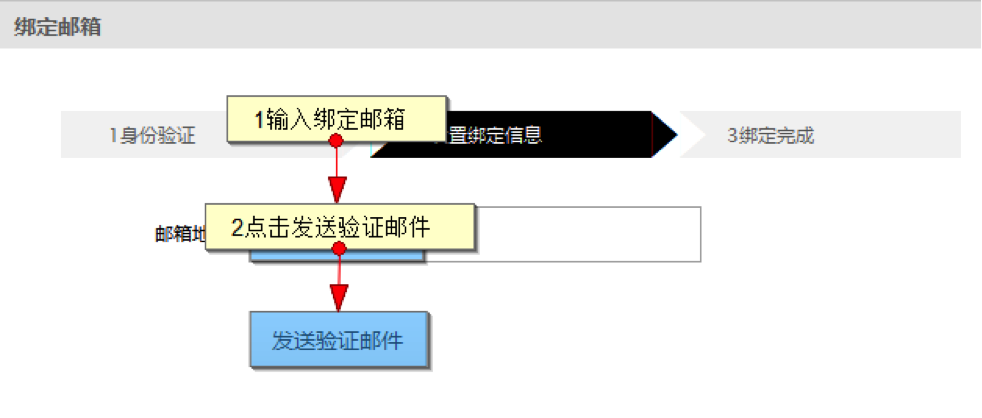

最后进入邮箱点击验证链接即可绑定成功

## <a id="2">会员签到</a>

如果平台开启了签到，您就可以在会员中心中看到签到按钮，点击按钮即可完成签到，平台会为您的每次签到提供一些奖励，如积分等，不过每天只能签到一次哦。

PC端签到按钮

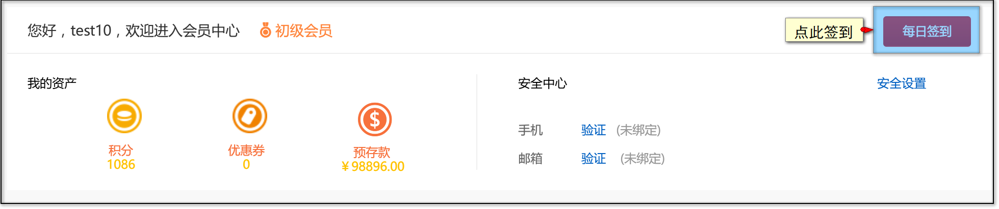

WAP端签到按钮

## <a id="3">我的奖品</a>

当会员在转盘抽奖活动中获得奖品，可以在【会员中心】-【我的奖品】页中查看自己获得的奖品信息

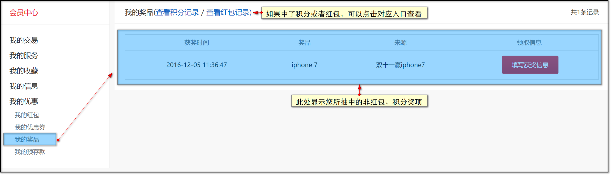

如果中了实体奖品需要配送，可以在对应获奖信息处填写收货地址。

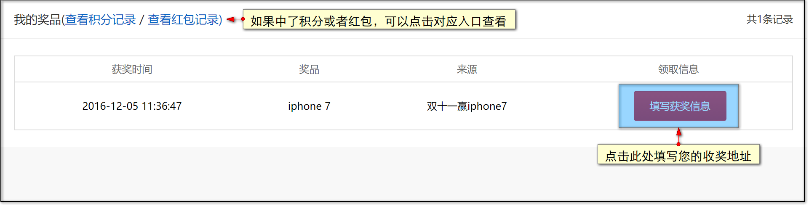

## <a id="4">我的购物券</a>

会员可以通过前台挂件领取到购物券.

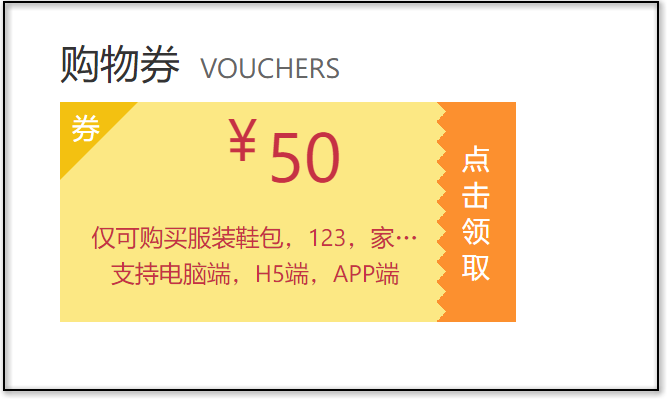

在【会员中心】-【我的购物券】列表中可以查看到所领取的购物券,点击'立即使用'可以查看改购物券对应的所有商品.

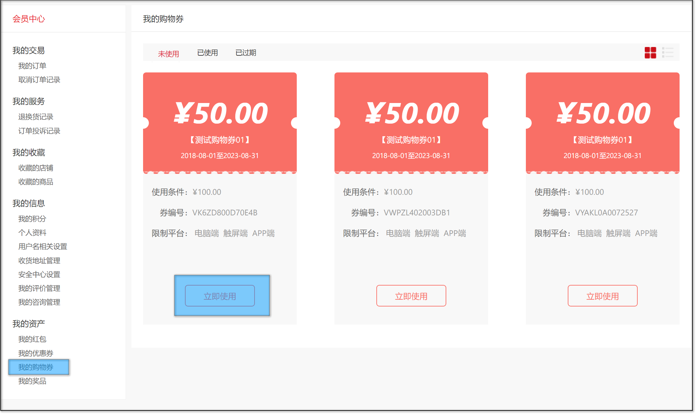

选择需要购买的商品后,进入订单结算页面,在页面下方点击'使用购物券'可以选择所持有的购物券.

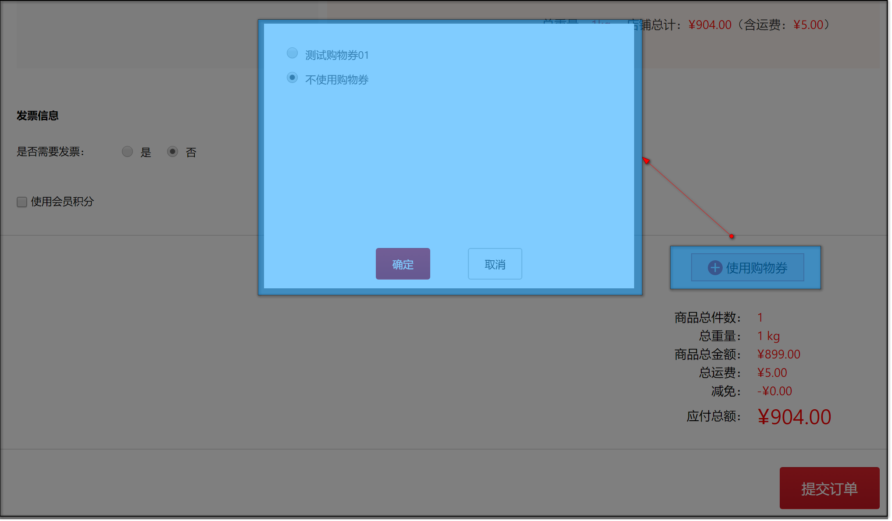

