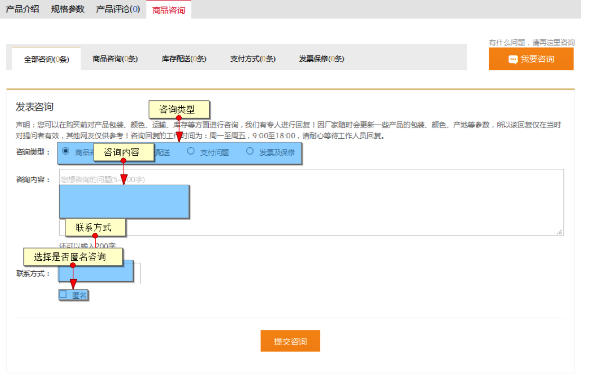
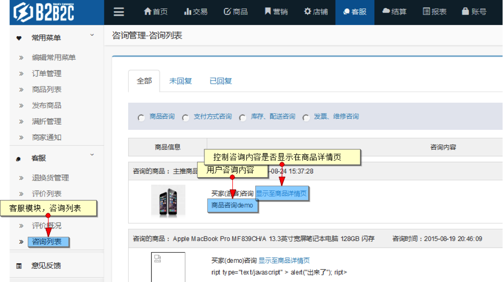
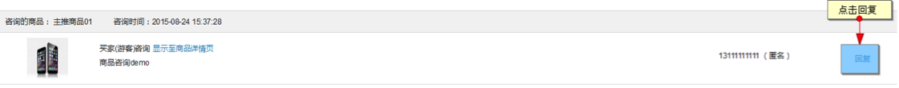
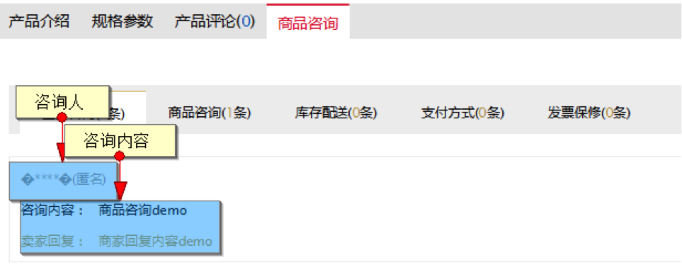
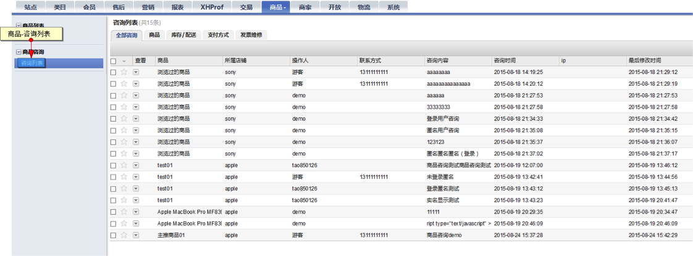
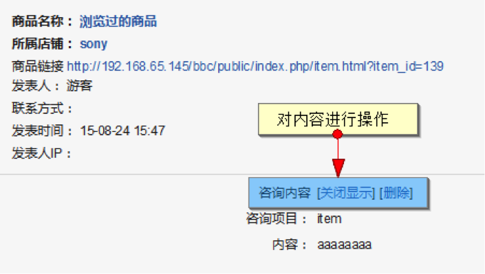

# 商品咨询

买家可在商品详情页对意向商品进行咨询，商家可对咨询做回复及控制显示操作

## 买家咨询

在商品详情页，点击咨询标签

填写相关咨询数据后，点击提交咨询

## 商家处理咨询

当用户提交咨询成功后，在商家的客户，咨询列表可查看到用户提交的咨询

商家可对咨询进行是否显示到详情页操作

也可对咨询进行回复，同样可以选择商家回复的内容是否显示到详情页

 
## 运营商处理咨询

运营商可在商品-咨询列表内查看所有店铺的咨询数据

 
对咨询内容进行关闭显示，以及删除操作

