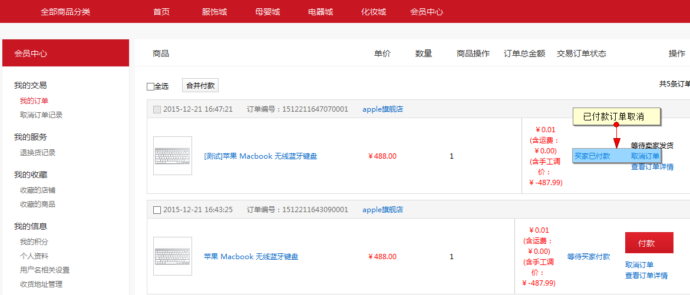
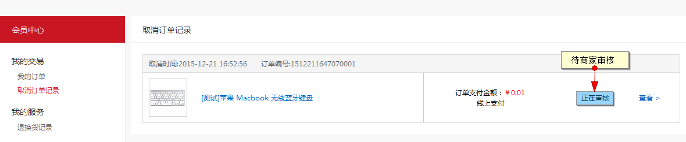
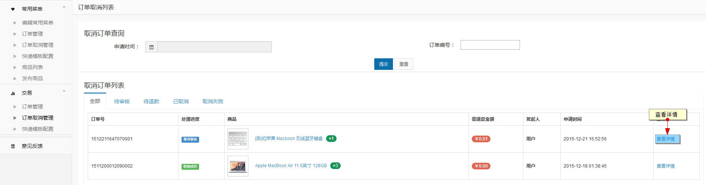
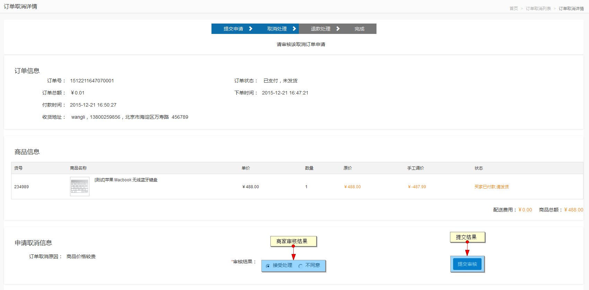
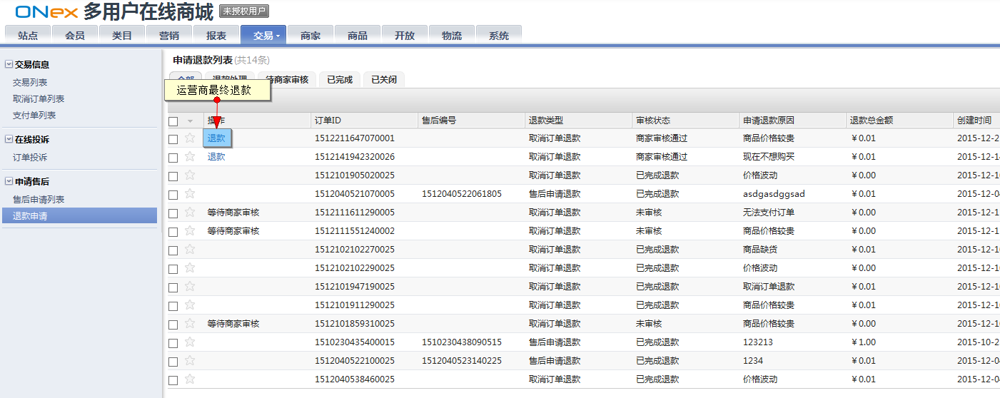

# 订单取消

买家可在下单后对订单进行取消操作，也可对已付款的订单进行取消

## 未支付取消

用户可在会员中心，订单列表内对未支付的订单直接取消，取消后订单即为关闭状态

## 已支付订单取消

当订单状态为已支付未发货的情况下，也可进行取消申请

对已付款订单进行取消

提交后状态为待商家审核

商家在订单，取消订单列表内可以看到取消订单的申请

商家可以拒绝或者通过，拒绝后订单则继续走发货流程，审核通过后则走退款流程

运营商在交易退款申请内进行退款操作

