# 系统连通

## B2B2C & OMS系统绑定

目前B2B2C只支持自营店铺与OMS系统对接，对接步骤如下

在运营商后台，开放－开发者列表内新增开发者账号

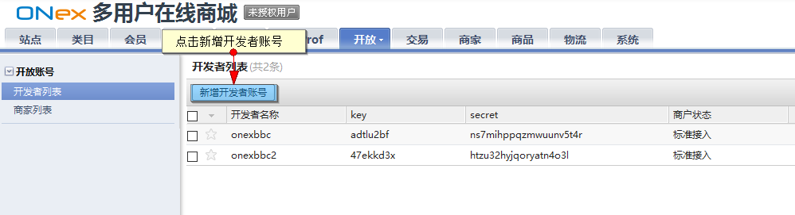

添加开发者

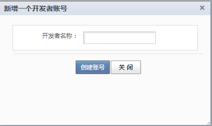

添加后开发者会生成对应的key和sercet

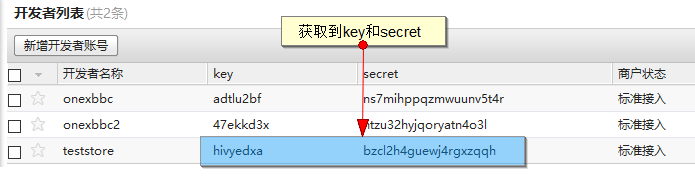

自营店铺在商家中心填写生成的key和sercet，并进行申请绑定

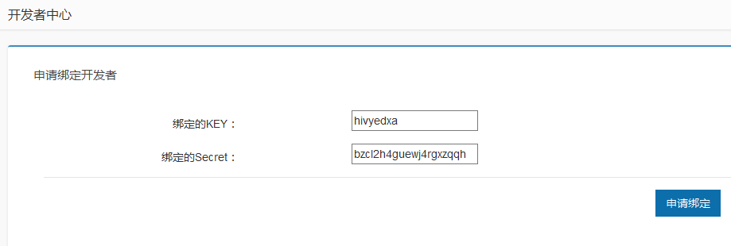

运营商可在“平台”商家列表内对自营店铺的申请进行审核

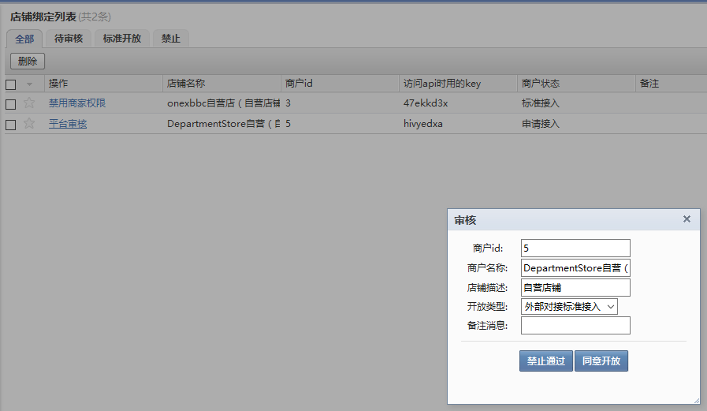

可审核开放或禁止通过

当审核通过后,在商家中心可进行参数配置选择“开发者模式”或“编辑模式”

开发者模式：与OMS连通使用，订单交付给OMS处理

编辑模式：订单仍在B2B2C操作，不交给OMS处理

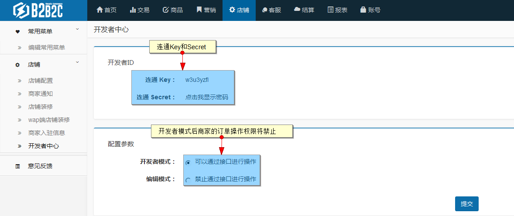

在B2B2C申请完成后，需在OMS系统的前端店铺管理内继续申请绑定

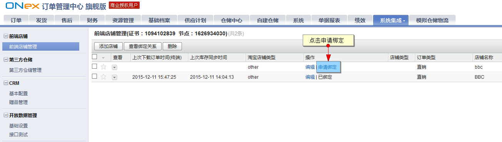

店铺类型选择“BBC商城”，平台地址输入开放平台地址，appkey与secret输入商家获取到的开发者ID，点击“BBC登录”

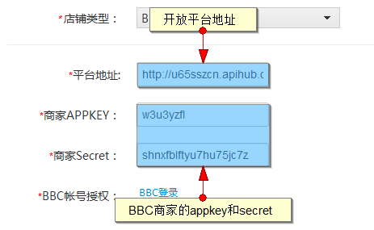

使用自营的商家登录

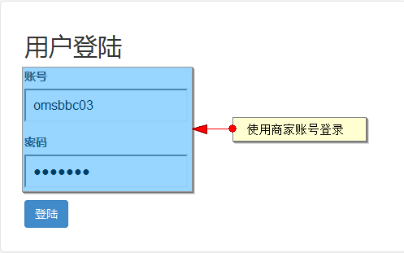

登录成功后点击下一步继续绑定

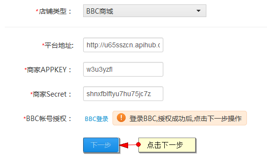

输入店铺名称，点击绑定

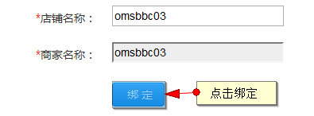

在OMS前端店铺可以查看绑定绑定状态

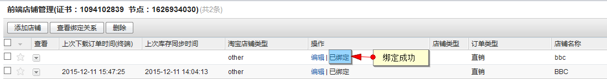
