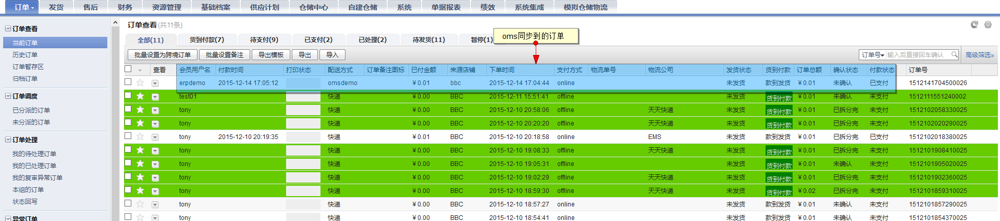
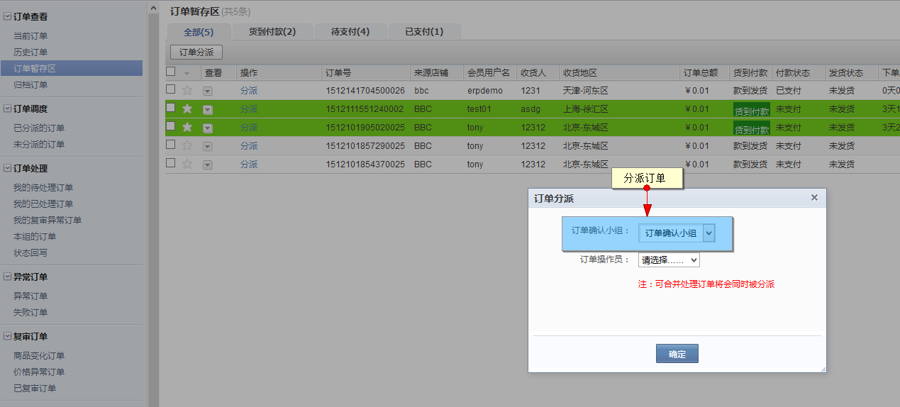
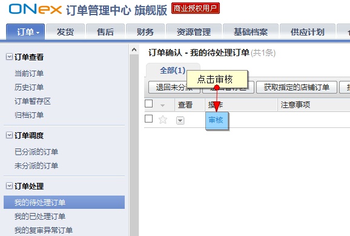
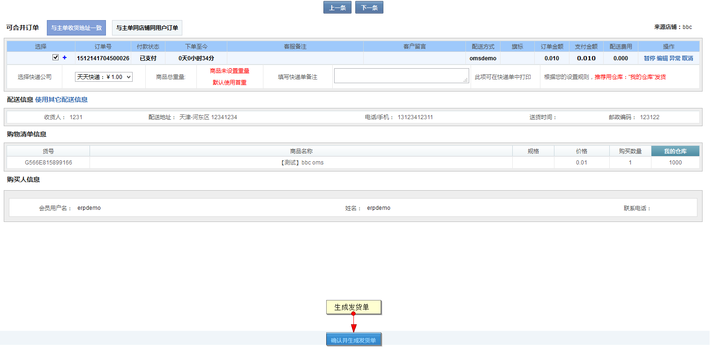
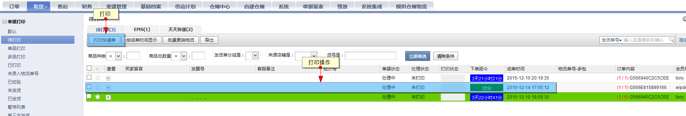
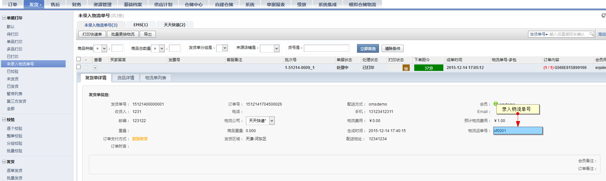
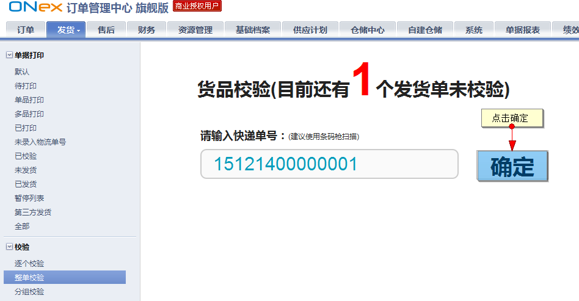
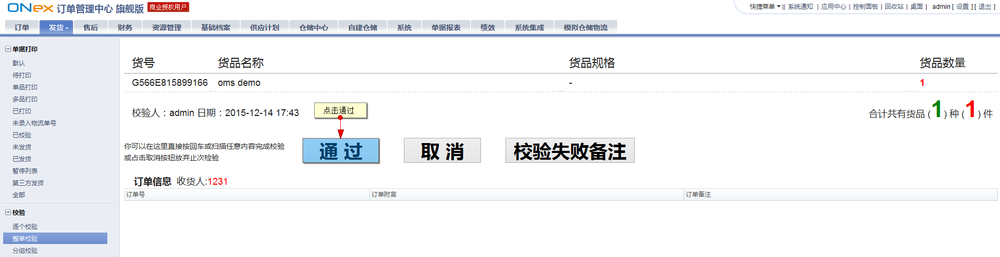
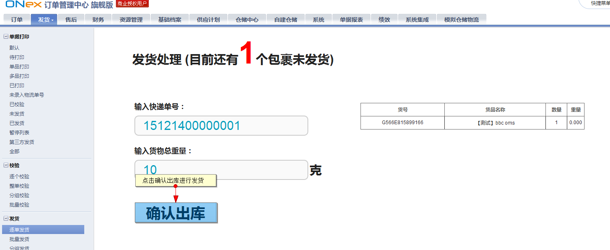
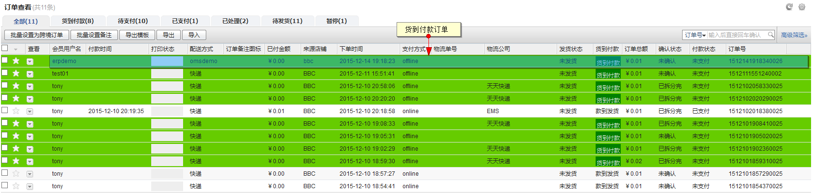

# 订单发货

## 在线支付订单

OMS对B2B2C系统的在线支付订单操作如下：

B2B2C下单

每5分钟平台会获取一次B2B2C的订单并推送至OMS

订单分派

订单处理－订单审核

确认生成发货单

发货单生成后进行订单打印

打印后输入物流单号

进行货品校验

订单发货

B2B2C订单状态更新

## 货到付款订单

货到付款订单也可同步至OMS系统

货到付款订单在OMS处理流程与在线支付相同，略。
