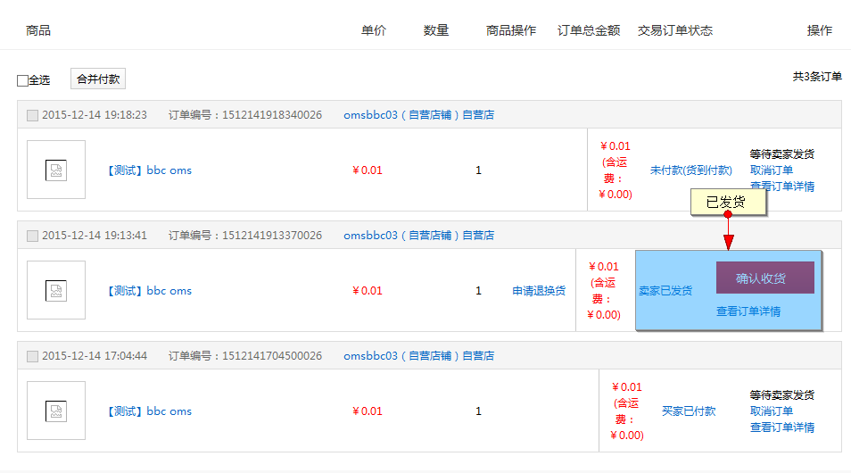
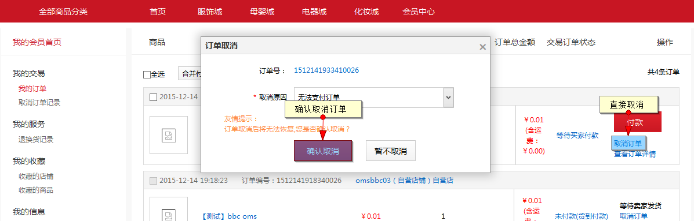
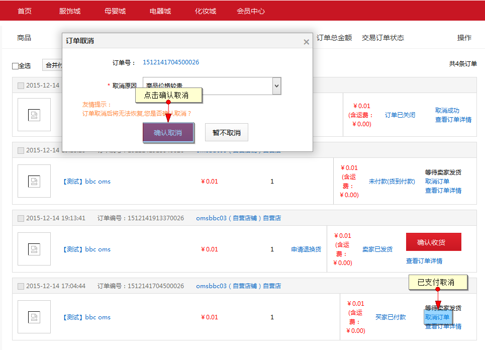
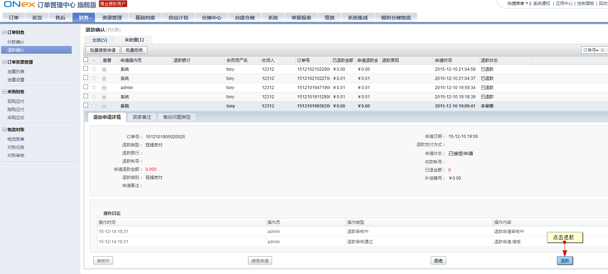
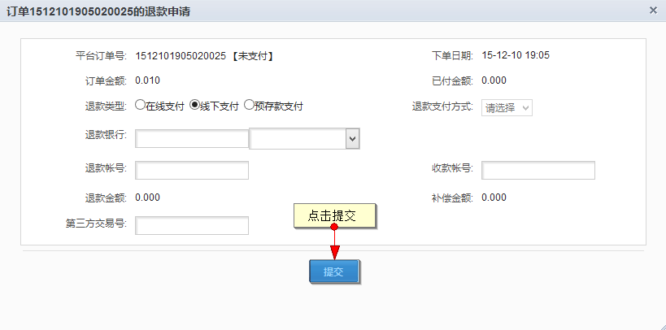
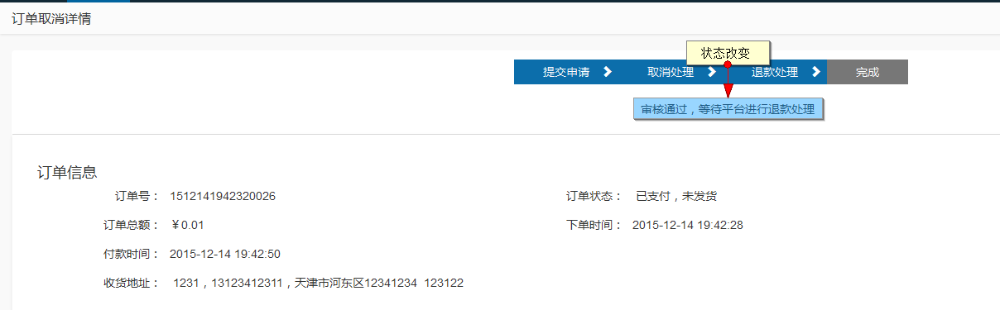
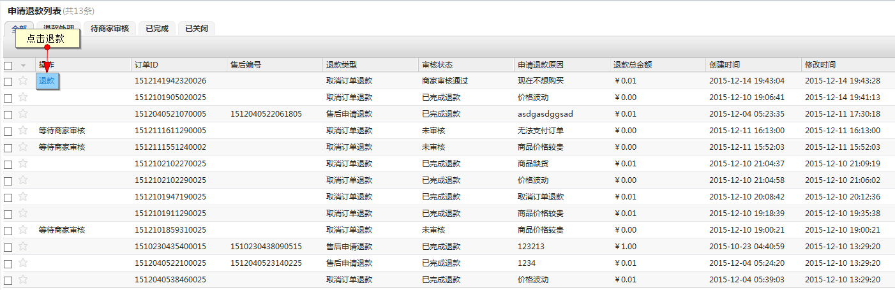
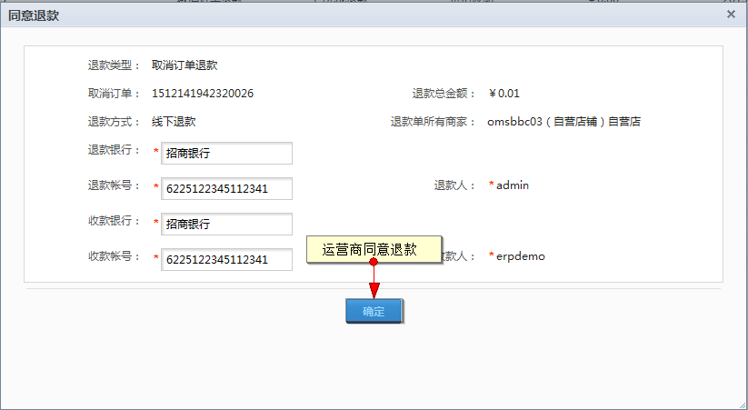

# 订单取消

## 未付款订单取消

连通OMS后，在B2B2C只有下单用户才有权限进行订单取消，商家的取消禁止，需在OMS进行操作

取消后取消状态会同步至OMS

## 已付款订单取消

已付款订单取消后，商家的审核操作放在OMS管理，商家在B2B2C的权限已禁止

当用户在B2B2C申请取消后，需在OMS的财务，退款进行审核

点击提交退款申请（审核）

提交后为商家审核通过，退款状态会同步至B2B2C

最终运营商需在B2B2C进行退款操作

退款成功后订单更改为取消状态
