# 订单售后
在bbc系统与oms连通后，售后流程交由oms售后模块处理

## 退货订单
买家对确认收货的订单进行售后操作

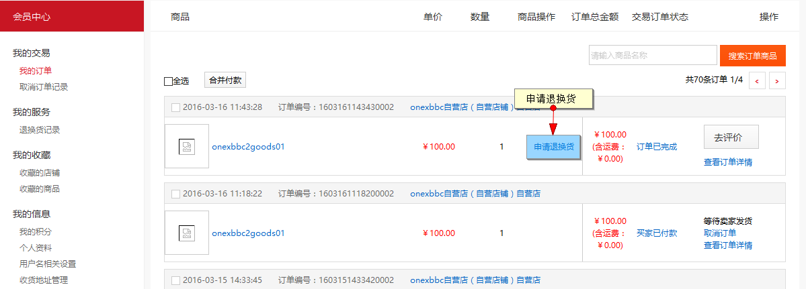

售后申请会同步至oms的售后，售后申请列表内

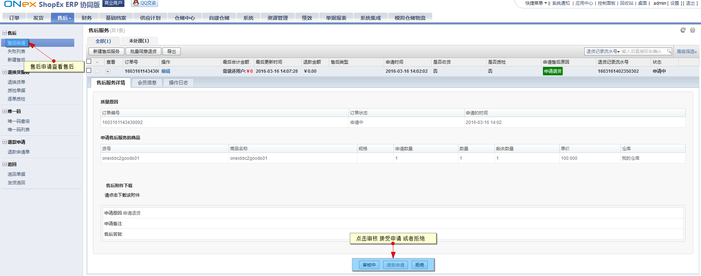

当oms对售后申请做了接受申请操作后，表示商家接受了售后请求，买家可在售后详情处填写回寄物流信息

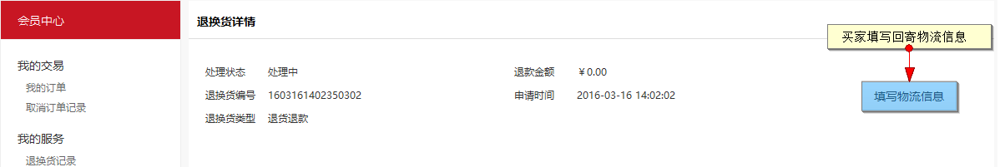

当买家回寄后在oms的售后申请详情内可查看买家填写的物流信息

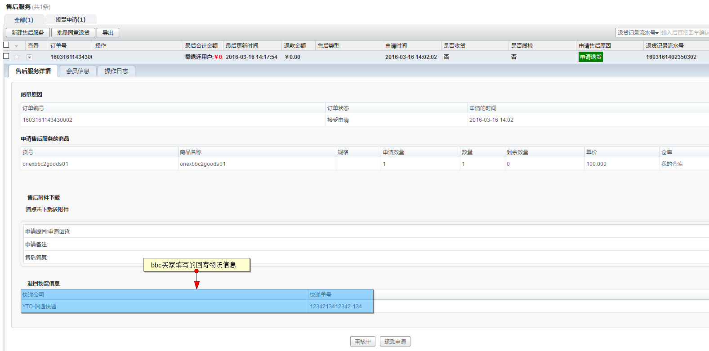

oms在退换货单列表内对退货单进行编辑

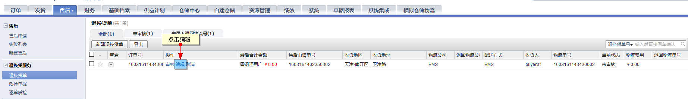

编辑界面对售后商品进行差价计算，并审核通过

（当审核拒绝时会将状态会写至bbc，此售后状态即变为商家驳回状态）

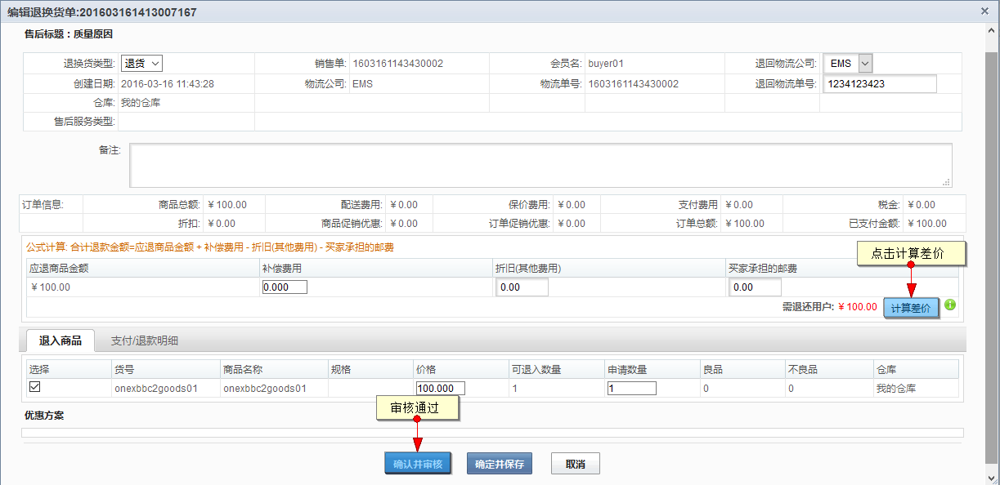

当退货单审批通过后会进入质检单据列表，oms可对单据进行质检/收货操作

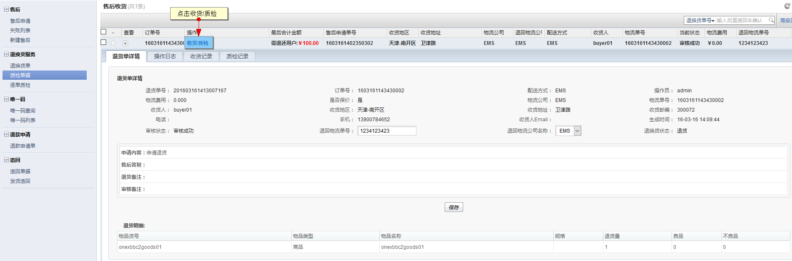

oms进行质检审核

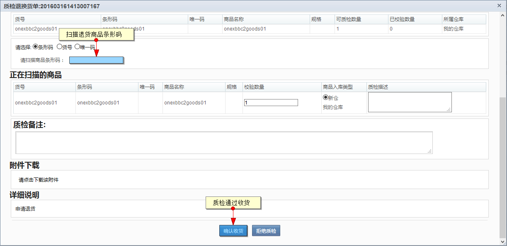

当仓库进行质检/收货操作成功后，oms在财务，退款确认处对退款进行确认操作

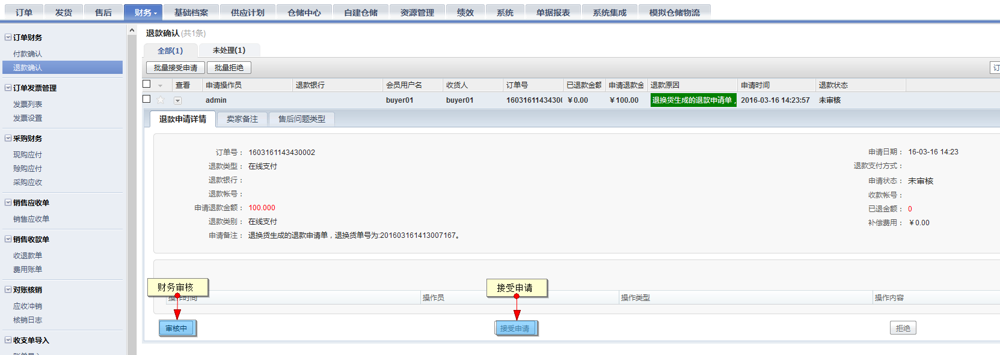

进行退款确认

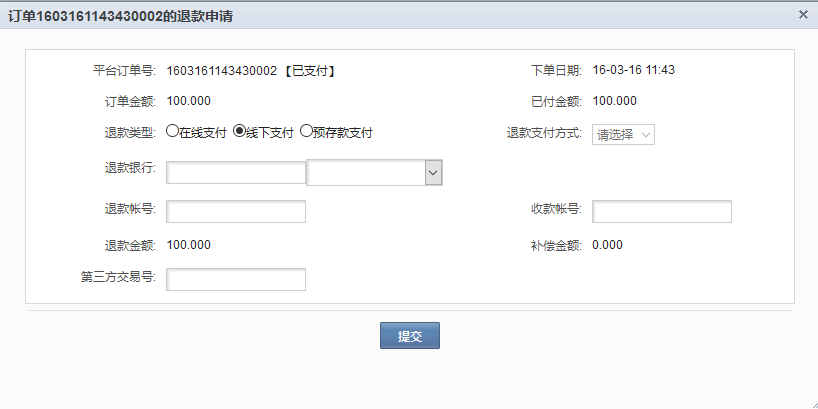

当oms退款确认后，会将状态同步至bbc，买家的售后详情内展示

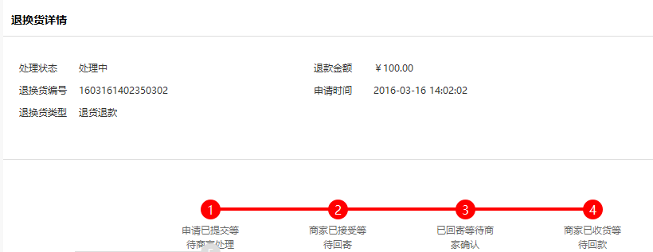

最终由bbc平台后台交易－退款申请处进行退款

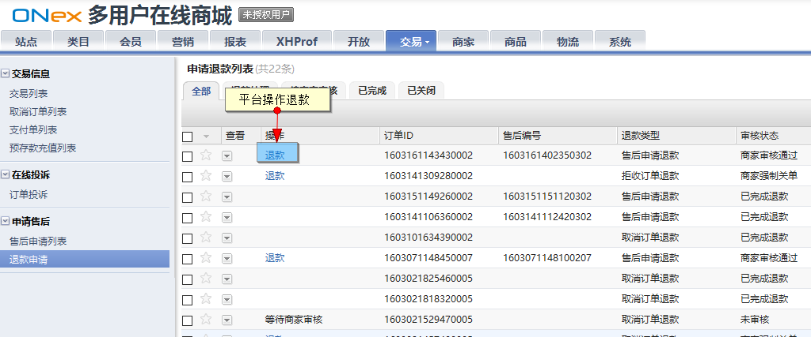

当bbc最终退款后，退款状态会回传至oms，在oms的历史订单内可查看订单的售后状态

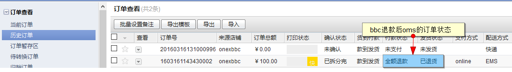

## 换货订单

换货订单在oms的售后审核时需选择换货商品

审核通过后oms进行质检/收货操作

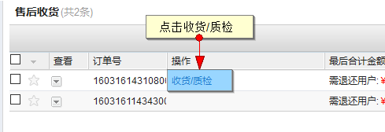

操作后bbc的换货状态更新

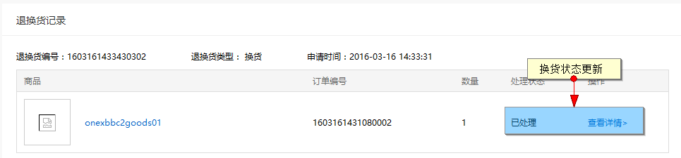

oms在换货完成时会在oms生成一笔换货的待发货订单，数据会同步展示在售后详情内

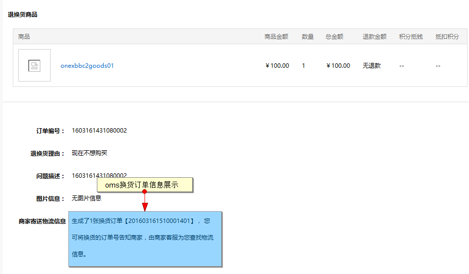