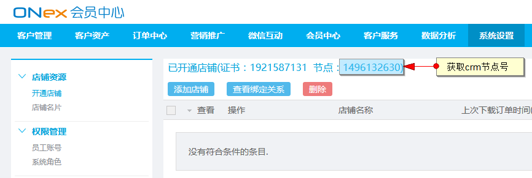
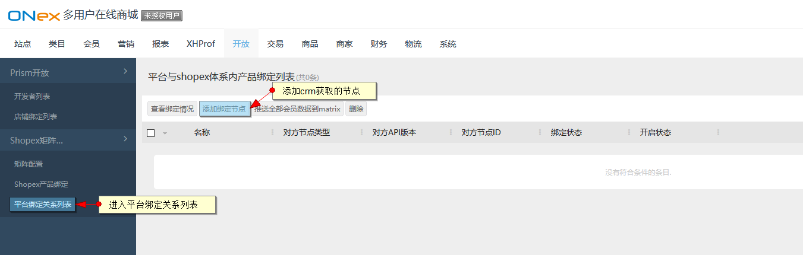
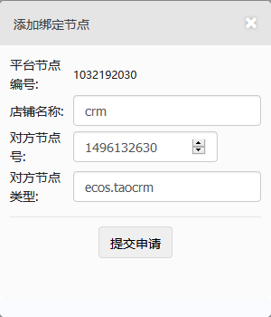
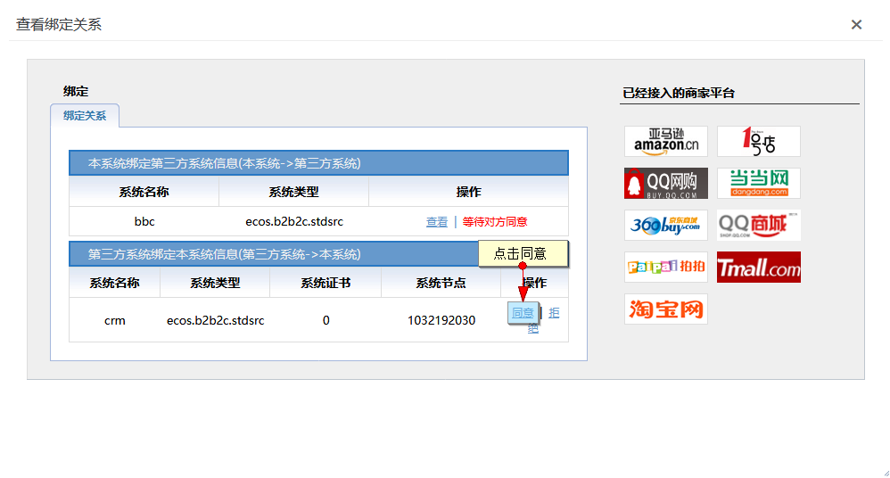
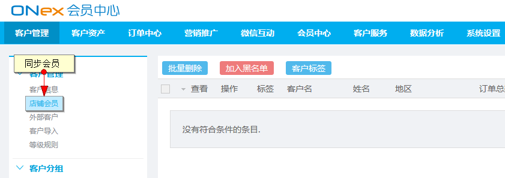
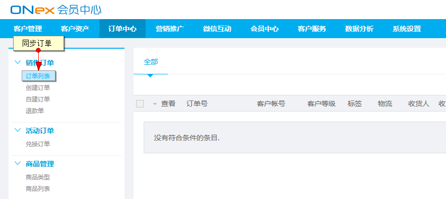

# 系统连通

## B2B2C & CRM系统绑定

对接步骤如下

进入CRM系统，系统设置-店铺资源-开通店铺，复制CRM的节点号

复制后进入B2B2C运营后台，开放-平台绑定关系列表

点击添加绑定节点，添加复制的CRM的节点号

添加后，进入CRM系统，系统设置-店铺资源内，查看绑定关系，同意绑定请求

同意后即绑定成功，绑定后在B2B2C注册的用户及用户下的订单即可同步至CRM系统

